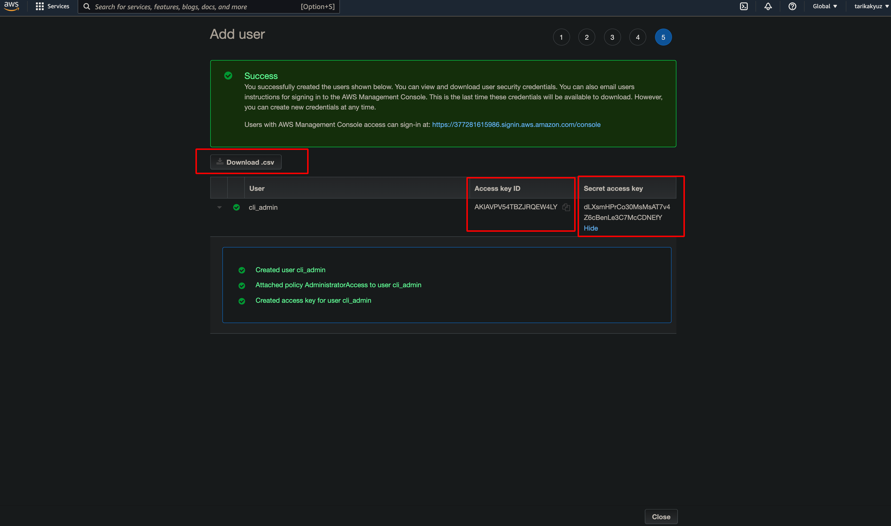

# 1. Command Line Setup

**1-) Run below code to install amplify**
```console
curl -sL https://aws-amplify.github.io/amplify-cli/install | bash && $SHELL
```

> Because we're installing the Amplify CLI globally, you might need to run the command above with <code>sudo</code>

**2-) Configure amplify by running the following command**

```console
amplify configure
```

> <code>amplify configure</code> will ask you to sign into the AWS Console.

**3-) Check your working aws region from website and give a user name**


**4-) Create a user with AdministratorAccess to your account to provision AWS resources for you like AppSync, Cognito etc.**


**5-) Once the user is created, Amplify CLI will ask you to provide the <code>accessKeyId</code> and the <code>secretAccessKey</code> to connect Amplify CLI with your newly created IAM user.**




**6-) Later you can check user profile info by running the following command**

```console
aws sts get-caller-identity
```

**7-) Amplify for Android is distributed as Apache Maven packages. You need to add the packages and other required directives to the build configuration.**

> Under <code>Gradle Scripts</code>, <code>open build.gradle (Module: X)</code>

**Add the following lines:**

```
android {
    compileOptions {
        // Support for Java 8 features
        coreLibraryDesugaringEnabled true
        sourceCompatibility JavaVersion.VERSION_1_8
        targetCompatibility JavaVersion.VERSION_1_8
    }
}

dependencies {
    // Amplify core dependency
    implementation 'com.amplifyframework:core:1.30.0'

    // Support for Java 8 features
    coreLibraryDesugaring 'com.android.tools:desugar_jdk_libs:1.1.5'
}
```

> To support Coroutine, You need to add the following also:

```
dependencies {
    // Add the below line in `dependencies`
    implementation 'com.amplifyframework:core-kotlin:0.14.0'
}
```

> Take a note that, you need to import <code>com.amplifyframework.kotlin.core.Amplify</code> instead of 
<code>com.amplifyframework.core.Amplify</code> to use coroutine functions.

* Set <code>coreLibraryDesugaringEnabled, sourceCompatibility</code> and <code>targetCompatibility</code> to allow your application to make use of Java 8 features like Lambda expressions.

* Android Studio requires you to sync your project with the new configuration. When it is completed, you must see _CONFIGURE SUCCESSFUL_ in the output in the _Build_ tab at the bottom of the screen.

**8-) Navigate the directory to directory of root project of Android and run**

```console
amplify init
```

> <code>Enter a name for the project</code> should be the same as Android app name.


**Enter the following when prompted:**
```console
? Enter a name for the project
    `X`
? Initialize the project with the above configuration?
    `No`
? Enter a name for the environment
    `dev`
? Choose your default editor:
    `Android Studio`
? Choose the type of app that you're building
    `android`
? Where is your Res directory:
    `app/src/main/res`
? Select the authentication method you want to use:
    `AWS profile`
? Please choose the profile you want to use
    `default`
```


**9-) Result**


> Upon successfully running amplify init, you will see a configuration file created in ./app/src/main/res/raw/ called amplifyconfiguration.json.

</br>

# 2. Initialize Amplify in the application

* Create an <code>Application</code> class and add the Amplify initialization into its <code>onCreate()</code> to initialize Amplify once in your application.

1) Create new kotlin class named as <em>YourAppName</em>App in your project.
2) Extend the class from android.app.Application by adding <code>: Application()</code> to the class.
3) Add the following code to your project:

```Kotlin
override fun onCreate() {
    super.onCreate()

    try {
        Amplify.configure(applicationContext)
        Log.i("MyAmplifyApp", "Initialized Amplify")
    } catch (error: AmplifyException) {
        Log.e("MyAmplifyApp", "Could not initialize Amplify", error)
    }
}
```

4) Configure your application to use your new custom <code>Application</code> class in AndroidManifest.xml.

````
<?xml version="1.0" encoding="utf-8"?>
<manifest xmlns:android="http://schemas.android.com/apk/res/android"
    package="com.example.MyAmplifyApp">

    <!-- Add the android:name attribute to the application node -->
    <application
        android:name=".YourAppNameApp"
        ...
    </application>
</manifest>
```

5) Build and run the application. In logcat, you will see a log line indicating success:

```
com.example.YourAppNameApp I/YourAppNameApp: Initialized Amplify
```