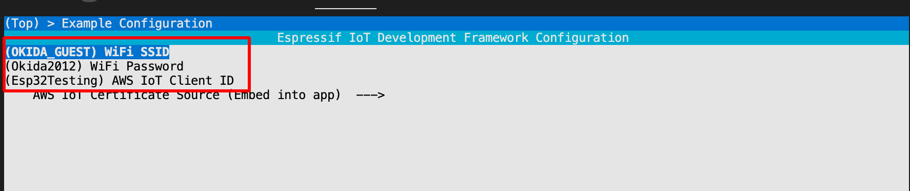
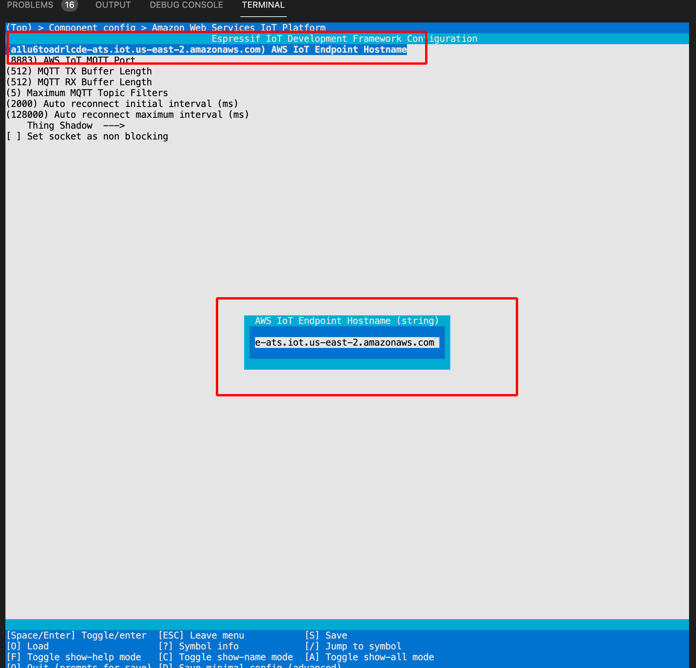
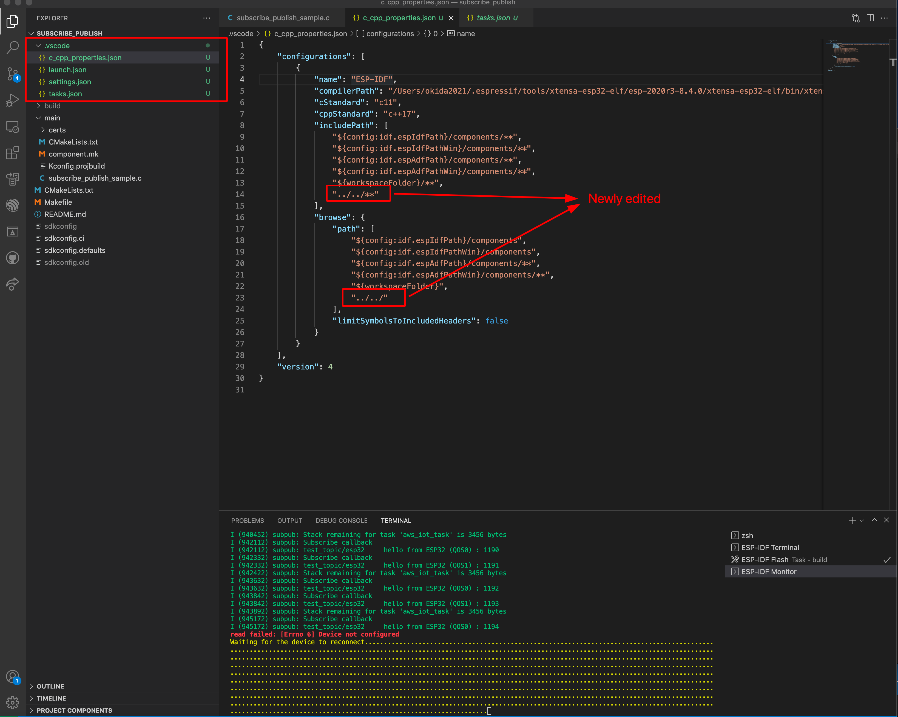

**1-) Clone the ESP-AWS-IoT repository**

```
git clone --recursive https://github.com/espressif/esp-aws-iot
```
**2-) Configure <code>WIFI_SSID, Wifi Password and AWS IoT Client ID</code>**



> Note that here: If you will connect to AWS IoT with JITR, you need to set up AWS IoT Client ID according the attached <code>Policy</code>

**3-) Write the AWS IoT Endpoint Hostname**

> You can find your Endpoint from <code>AWS Iot > Settings > Device data point</code>




**3-) You can add <code>.vscode</code> folder to enable to navigate another library. Note that here 2 lines added to navigate aws-iot-device-sdk library**


