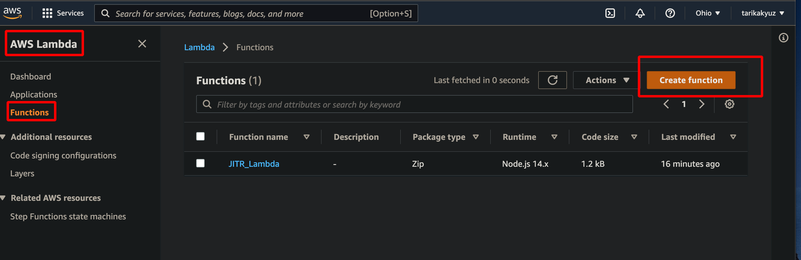
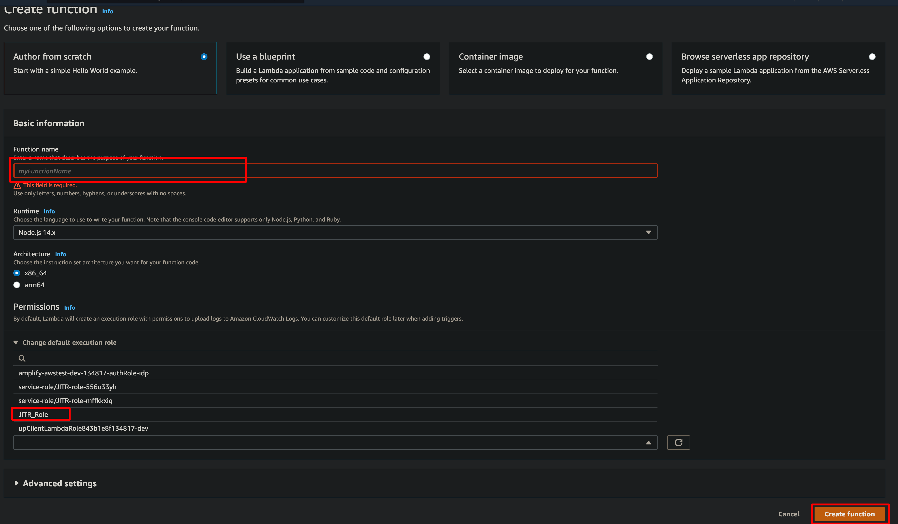

# AWS IoT Core Policies

AWS IoT Core policies are JSON documents. They follow the same conventions as IAM policies. AWS IoT Core supports named policies so many identities can reference the same policty document. Named policies are versioned so they can be easily rolled back.

AWS IoT Core policies allow you to control access to the AWS IoT Core data plane. The AWS IoT Core data plane consists of operations that allow you to connect to the AWS IoT Core message broker, send and receive MQTT messages, and get or update a thing's Device Shadow.

An AWS IoT Core policy is a JSON document that contains one or more policy statements. Each statement contains:

- **Effect**, which specifies whether the action is allowed or denied.
- **Action**, which specifies the action the policy is allowing or denying.
- **Resource**, which specifies the resource or resources on which the action is allowed or denied.

Changes made to a policy can take a few minutes to become effective because of how AWS IoT caches the policy documents.

# AWS IoT Core Policy actions

The following policy actions are defined by AWS IoT Core:

***iot:Connect:***</br>
Represents the permission to connect to the AWS IoT Core message broker. The **iot:Connect** permission is checked every time a CONNECT request is sent to the broker.
 The message broker doesn't allow two clients with the same client ID to stay connected at the same time. After the second client connects, the broker closes the existing connection. Use the **iot:Connect** permission to ensure only authorized clients using a specific client ID can connect.

 ***iot:Publish:***</br>
Represents the permission to publish an MQTT topic. This permission is checked every time a **PUBLISH** request is sent to the broker. You can use this to allow clients to publish to specific topic patterns.

 ***iot:Receive:***</br>
Represents the permission to receive a message from AWS IoT Core. The **iot:Receive:** permission is confirmed every time a message is delivered to a client. Because this permission is checked on every delivery, you can use it to revoke permissions to clients that are currently subscribed to a topic.

***iot:Subscribe:***</br>
Represents the permission to subscribe to a topic filter. This permission is checked every time a SUBSCRIBE request is sent to the broker. Use it to allow clients to subscribe to topics that match specific topic patterns.


# AWS IoT Core action resources

To specify a resource for an AWS Iot Core policy action, you must use the ARN of the resource. All resource ARNs are of the following form.

> arn:aws:iot:**region:AWS-account-ID:Resource-type/Resource-name**

The following image shows the resource to specify for each action type:


# Authorization with Amazon Cognito identities

There are two types of Amazon Cognito identities: unauthenticated and authenticated.  If your app supports unauthenticated Amazon Cognito identities, no authentication is performed so you don't know who the user is. For these users, you grant permission by attaching an IAM role to an unauthenticated identity pool. We recommend you only grant access to those resources you want available to unknown users.

When your app supports authenticated Amazon Cognito identities, in order to authenticate users, you need to specify a policy in two places. <u>Attach an IAM policy to the authenticated Amazon Cognito Identity pool</u> and <u>attach an AWS IoT Core policy to the Amazon Cognito Identity</u>.


Authenticated and unauthenticated users are different identity types. If you don't attach an AWS IoT policy to the Amazon Cognito Identity, an authenticated user fails authorization in AWS Iot and doesnt have access to AWS IoT resources and actions. 


Using your own certificate with AWS IoT is a two-step process:
- The first step is to register the CA certificate that signed and issued the device certificates.
- After registration, any device certificate that signed by CA certificate can be registered with AWS IoT and used for authentication thereafter.

Now, with support for just-in-time-registration(JITR) of CA-signed certificates, AWS IoT eliminates the second step.

In this blog post, how JITR works and how it can be used to set up a workflow that activates device certificates and attaches policies to them automatically will be discussed. Also other topics deactivating a CA certificate and revoking device certificates will be discussed.

We will do the following:
- Create, register and activate a CA certificate that will be used to sign your device certificate,
- Enable auto-registration of certificates,
- Create device certificates signed by the CA and install them on your device,
- Create and attach a rule with and AWS Lambda action that activates the certificate, and then creates and attaches policies to the certificate,
- Connect to AWS IoT using the device certificate.

When the device connect to AWS IoT with the device certificate for the first time, the service will detect an unknown certificate signed by a registered CA and will auto-register the device certificate. AWS IoT will publish a registration event on a reserved MQTT topic and disconnect the client. This MQTT registration event will trigger the attached AWS Lambda rules engine action, which will complete the provisioning of the certificate. After these steps, the device certificate will be ready to connect and authenticate with AWS IoT.


> First you should read use_your_own_certificate.md blog post. After creating of CA certificate that will be used to sign device certificate, you will be ready to read this post.

- Activate and enable auto-registration status of CA certificate.

- Check the current status of the ca certificate you will used for JITR:
```console
foo@bar:~$ aws iot describe-ca-certificate --certificate-id <certificateId>
```

## Device Certificate Registration Event and Action


- When a device attemps to connect with an X.509 certificate that is not known to AWS IoT but was signed by a CA that was registered with AWS IoT, the device certificate will be auto-registered by AWS IoT in a new PENDING_ACTIVATION state. PENDING_ACTIVATION state means that the device certificate was auto-registered and is awaiting activation. Only AWS IoT can mark the status of certificate as PENDING_ACTIVATION. If you connect with a certificate in PENDING_ACTIVATION state, a TLS handshake failure will occur because only ACTIVA certificates are authenticated with AWS IoT. For this reason, you need to change the status of the registered certificate from PENDING_ACTIVATION to ACTIVE so that it can be successfully authenticated.

- When AWS Iot auto-registers a certificate or when a certificate in PENDING_ACTIVATION status connects, it publishes a message to the following MQTT topic.

```console
$aws/events/certificates/registered/<caCertificateID>
```

- Where the caCertificateID is the ID of CA certificate that issused the device certificate.

- The message published to this topic has the following structure:

```console
{
  "certificateId": "<certificateID>",
  "caCertificateId": "<caCertificateId>",
  "timestamp": "<timestamp>",
  "certificateStatus": "PENDING_ACTIVATION",
  "awsAccountId": "<awsAccountId>",
  "certificateRegistrationTimestamp": "<certificateRegistrationTimestamp>"
}
```


- You can see the status of certificate as PENDING state in certificate section. Note that you can also activate the device certificate and attach a policy. After these steps your device will connect successfully.


- You can <u>subscribe</u> or <u>attach any AWS IoT rule</u> to the registration topic. The attached AWS IoT rule can then take some action based on the messages received. For example an AWS IoT rule in the account can listen on the <code>$aws/events/certificates/registered/+</code> topic to build an Amazon DynamoDB table of all the registered certificates. The general recommendation is to attach an AWS IoT rules engine action to the registration topic that will perform the bootstrapping or provisioning steps (like consulting the Certificate revocation list) and then activate/deactivate/revoke the certificate, create and attach the policies to the certificate, and so on.

## Create the AWS Lambda function

- Next we will create a topic rule with an AWS Lambda action on the registration topic that will activate the certificate and create and attach a policy.

- - > **1-) Go AWS Lambda and <code>Create a new function</code>**


- - > **2-) Fill Function name, select runtime as Node.js and click <code>IAM console</code> to create new role**


- - > **3-) Select Lambda because we will allow lambda functions to call AWS services that we will select next page. Click <code>Next: Permissions</code>**


- - > **4-) Click to <code>Create policy</code> to attach permissions to the role**


- - > **5-) Click to <code>JSON</code> and update the content with the codes given below**
```console
{  
   "Version":"2012-10-17",
   "Statement":[  
      {  
         "Effect":"Allow",
         "Action":[  
            "logs:CreateLogGroup",
            "logs:CreateLogStream",
            "logs:PutLogEvents"
         ],
         "Resource":"arn:aws:logs:*:*:*"
      },
      {  
         "Effect":"Allow",
         "Action":[  
            "iot:UpdateCertificate",
            "iot:CreatePolicy",
            "iot:AttachPrincipalPolicy"
         ],
         "Resource":"*"
      }
   ]
}
```


- - > **6-) Fill the name and click the <code>Create policy</code>**


- - > **7-) Return the Create role Page and select the policy that just created and proceed**


- - > **8-) Fill the role name and click <code>Create role</code>**


- - > **9-) Select <code>Use an existing role</code> and select the role that just created and click  <code>Create function</code>**


- - > **10-) Replace the existing code with https://github.com/aws-samples/aws-iot-examples/blob/master/justInTimeRegistration/deviceActivation.js, save the code by clicking file and save file, finally click <code>Deploy</code> to restart the app on the cloud**
- - > **Pay attention to the policy field. You can connect and send messages the endpoints it allows.**
- - > **Also Pay attention If you don't format policy document it should be, you will get an error <code>"Policy document is Malformed: etc. in CloudWatch</code> **


- - > **11-) You can view the console.log outputs**


- - > **12-) Check Permissions in the Configuration tab**


## Creating an AWS Lambda Rule

Next we will create a rule that invokes the function.

- - > **1-) In the rules, Select  <code>Create Rules</code>**


- - > **2-) Enter the following settings for the rule**
```console
SELECT * FROM '$aws/events/certificates/registered/#'
```


- - > **3-) Choose  <code>Sen a message to a Lambda function</code> and select lambda function we just created above**


- You also need to grant permissions to the AWS IoT service to invoke the AWS Lambda function on your behalf when the MQTT message is published on the registration topic.

- - > **1-) First check AWS Lambda in permissions**


- - > **Permission should be like below:**


- - > **You can also add new permission with command line**

- - > **1-) Find ruleArn**
```console
aws iot get-topic-rule --rule-name <Rule Name>
```

- - > **2-) Get AWS Accout Id**

- - Replace the missing fields of below commnand

aws lambda add-permission --function-name < lambda-function-name > --region us-east-1 --principal iot.amazonaws.com \
--source-arn < rule-arn > --source-account < your-aws-account > --statement-id Id-123 --action "lambda:InvokeFunction"

- - Finally It will look like below:
```console
aws lambda add-permission --function-name JITR_Lambda --region us-east-2 --principal iot.amazonaws.com \
--source-arn arn:aws:iot:us-east-2:377281615986:rule/JITR_Rule --source-account 377281615986 --statement-id Id-12323 --action "lambda:InvokeFunction"
```

## Auto-registration of a Device Certificate Signed by the CA Certificate

What we have done so far is:
- **1-) Create, register and activate a sample CA certificate with auto-registration-status enabled**
- **2-) Configure a rule with an AWS Lambda action to activate the certificate and attach policies**

Next we will create a device certificate by using the CA certificate and auto-register it when it first connects to AWS IoT.

> Enter the following commands in the terminal to create a device certificate:

```console
$ openssl genrsa -out deviceCert.key 2048
$ openssl req -new -key deviceCert.key -out deviceCert.csr
$ openssl x509 -req -in deviceCert.csr -CA sampleCACertificate.pem -CAkey sampleCACertificate.key -CAcreateserial -out deviceCert.crt -days 365 -sha256
```

> At the time of connection, we need to send both the device certificate and its registered CA certificate.

```console
$ cat deviceCert.crt sampleCACertificate.pem > deviceCertAndCACert.crt
```

You will see a TLS failure after the registration of the device, beause AWS IoT disconnects the connection after the registration of the certificate. AWS IoT has registered the certificate in the PENDING_ACTIVATION state and won’t let it connect and authenticate unless the certificate is marked ACTIVE. The client or device should implement an automatic reconnect strategy when it is disconnected due to the TLS error. TThe device should also implement a back-off strategy (that is, increase the time between retries) to avoid unnecessary network.

> The commands to connect to AWS IoT with the device certificate whose CA has been registered will lead to the auto-registration of the device certificate during the TLS handshake. An MQTT registration event will be published on the registration topic and trigger the attached Lambda rule action to activate the certificate and attach the policy to it. This will complete the registration and provisioning of the device certificate. It can now be used for authentication and authorization with AWS IoT. After a device certificate is registered with AWS IoT, you can interact with it in a way that’s similar to a device certificate generated by AWS IoT. You can activate/deactivate /revoke certificates, attach policies, and associate things to your device certificates. In addition, you can manage the lifecycle of that device certificate in AWS IoT by deactivating, revoking, or activating the certificate in your AWS account.


## Deactivate the CA Certificate

During device certificate registration, AWS IoT will check if the associated CA certificate is active. If the CA certificate is inactive, AWS IoT will not allow the device certificate to be registered. This feature provides you with the flexibility to manage the lifecycle of device certificates signed by the registered CA that are yet to be registered with AWS IoT. By marking the status INACTIVE, you prevent any new device certificates issued by the compromised CA to be registered in your account.

> Note: Running this command will not deactivate all of your registered device certificates. It will prevent new device certificates from being registered.
