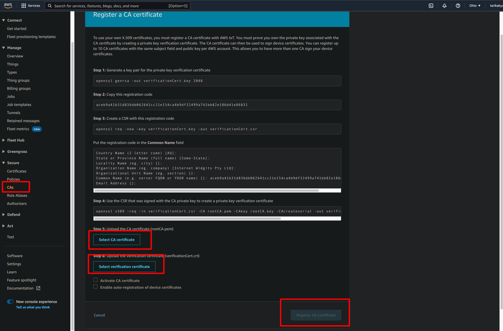
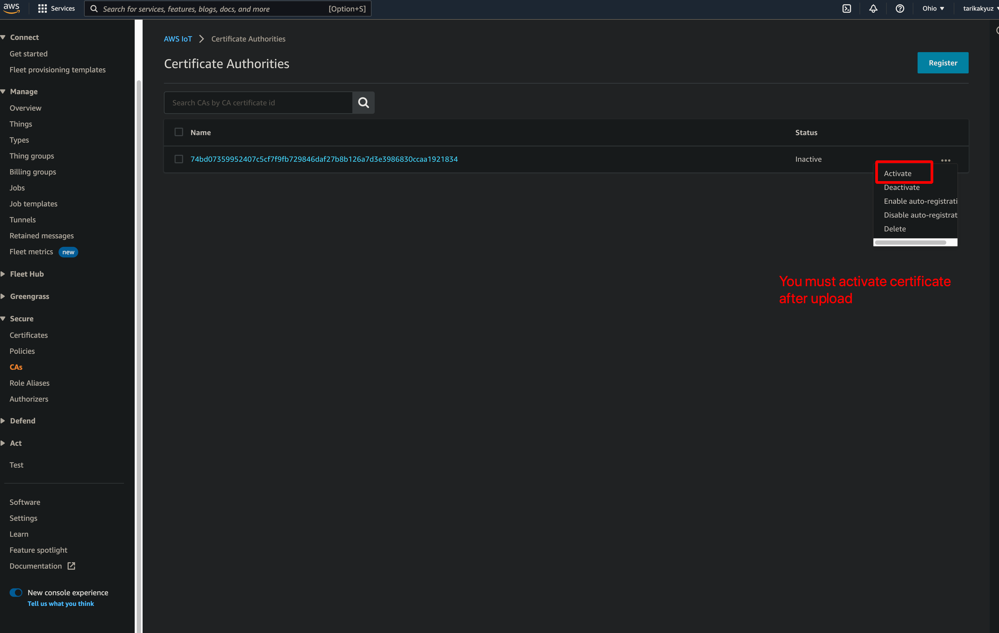
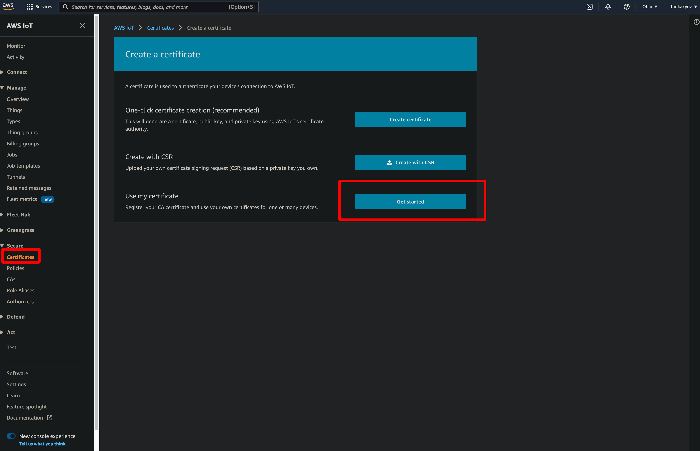
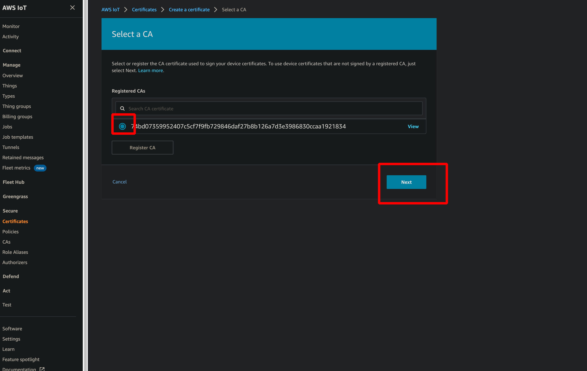
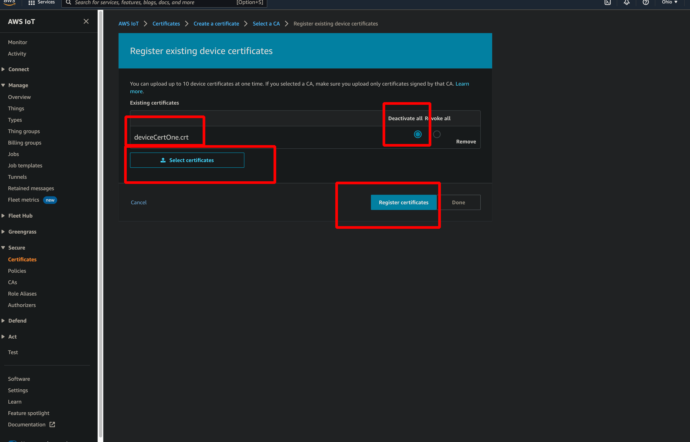

# Introduction

.crt = Signed certificate </br>
.csr = Certificate signing request </br>
.pem = indicates that the content(can be a key, certificate) is Base64 encoded.

Amazon allows users to use their own certificates signed by their preferred Certificate Authority(CA). This is in addition to the support for AWS IoT generated certificates. The CA certificate is used to sign and issue device certificates, while the device certificates are used to connect a client to AWS IoT. The certificates is used for authentication.

- With this feature, customers with existing devices in the field, or new devices with certificates signed by a CA other than AWS IoT can seamlessly authenticate with AWS IoT.

- It also provides manufacturers the ability to provision device certificates using their current processes and then register those device certificates to AWS IoT.

In this blog, You will:
- Generate a CA certificate that will be used the sign your device certificate
- Register the CA certificate and then register the device certificates

After the steps specified above, your device certificate will be ready to connect AWS IoT service.

</br>

# Registering Your First CA Certificate
In production step, the CA certificate should buy from vendors such as Verisign, Symantec etc. In order to use your own X.509 certificates that have been signed by your CA certificate, <u>AWS IoT first needs to verify that you not only own the CA certificate but that you also have access to the private key for that certificate.(The process of validating ownership of a CA certificate)</u>


- Lets begin by creating our first sample CA certificate using openssl in a terminal, In reality, you would have the signing certificate issued by your CA vendor in the place of this sample CA. This sample CA certificate is used later to sign a device certificate that you register with AWS IoT. 
- For simplicity, we are creating and registering the root CA certificate. In reality, the signing or intermediate certificates would be issused by CA vendors. In that case, you will register the intermediate CA certificate with AWS IoT.
</br></br>
- - Create a 2048-bit RSA private key
```console
foo@bar:~$ openssl genrsa -out sampleCACertificate.key 2048
```
- - If we dont set basicConstraints extension as true, amazon gives the error <code>The CA certificate does not have the basicConstraints extension as true</code>.
- - Create a file named as <code>rootConfig.conf</code> in same directory and paste content:
```
[ req ]
distinguished_name       = req_distinguished_name
extensions               = v3_ca
req_extensions           = v3_ca

[ v3_ca ]
basicConstraints         = CA:TRUE

[ req_distinguished_name ]
countryName              = Country Name (2 letter code)
countryName_default      = TR
countryName_min          = 2
countryName_max          = 2
organizationName         = Organization Name (eg, company)
organizationName_default = OKIDA
```
- - Now we can create a self-signed certificate with just a private key specify file name as <code>-config rootConfig.conf</code>. Also we have to specify <code>v3_ca</code> as extension.
```console
foo@bar:~$ openssl req -x509 -new -nodes -key sampleCACertificate.key -sha256 -days 365 -out sampleCACertificate.pem -config rootConfig.conf -extensions v3_ca
```
- Now we have created a sample CA certificate, later we wil register it with AWS IoT. When registering a CA certificate with AWS IoT, we must follow a workflow to verify that we have access to both the CA certificate and the private key associated with the CA certificate. To verify ownership of the private key, we generate a verification certificate using the CA certificate, the private key, and a registration code generated from AWS IoT.

- To generate registration code using AWS Cli
```console
foo@bar:~$ aws iot get-registration-code
```
- Above command, get-registration-code, returns a randomly generated unique registration code that is bound to our AWS account. The registration code is long-lived and doesnt expire until you delete it. 
- Next we will create private key and csr pollulated with registration code

```console
foo@bar:~$ openssl genrsa -out privateKeyVerification.key 2048
foo@bar:~$ openssl req -new -key privateKeyVerification.key -out privateKeyVerification.csr
```
- During the csr process, you should enter the registratino code into the command name field.

```console
... Organization Name (eg, company) []: Organizational Unit Name (eg, section) Common Name (e.g. server FQDN or YOUR name) []: XXXXXSAMPLEREGISTRATIONCODEXXXXX EMAIL ADDRESS []: 
```
- Sign the csr using the CA certificate we first created. 
```console
foo@bar:~$ openssl x509 -req -in privateKeyVerification.csr -CA sampleCACertificate.pem -CAkey sampleCACertificate.key -CAcreateserial -out privateKeyVerification.crt -days 365 -sha256
```
- When you register your CA certificate to AWS IoT, the belows are used to verify ownership of the CA private key.
    - - The combination of the registration code,
    - - Verification certificate signed with the CA private key,
    - - the CA certificate


> **1-) Register CA certificate and verification certificate**



> **2-) Activate certificate**



## Registering A Device Certificate Signed by Your CA Certificate

- Now we have created, registered and activated a sample CA certificate, let's use the CA certificate to create new device certificate and upload the device certificate into AWS IoT.
```console
foo@bar:~$ openssl genrsa -out deviceCertOne.key 2048
foo@bar:~$ openssl req -new -key deviceCertOne.key -out deviceCertOne.csr
foo@bar:~$ openssl x509 –req –in deviceCertOne.csr –CA sampleCACertificate.pem –CAkey sampleCACertificate.key –CAcreateserial –out deviceCertOne.crt –days 365 –sha256 
```

> **1-) Create a new device certificate**



> **2-) Select CA certificate. It must be activated.**



> **3-) Upload certificate and activate**




# Scenario 1: Working with Multiple CA Certificates

- Using AWS IoT, we can register one or more CA certificates to AWS account. We can also register, activate, deactive or delte CA certificates assocociated to AWS account <code>without affecting the device certificates that previously registered with AWS IoT.</code>. Even though we have deactivated or deleted CA certificate, the associated device certificate is still active. Once a device certificate has been registered with AWS IoT, the lifecycle of that device certificate is independent from the changes made to the associated CA certificate.

> We can create as many CA certificates as we want with the above steps.
