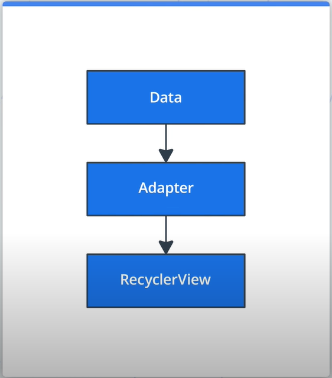
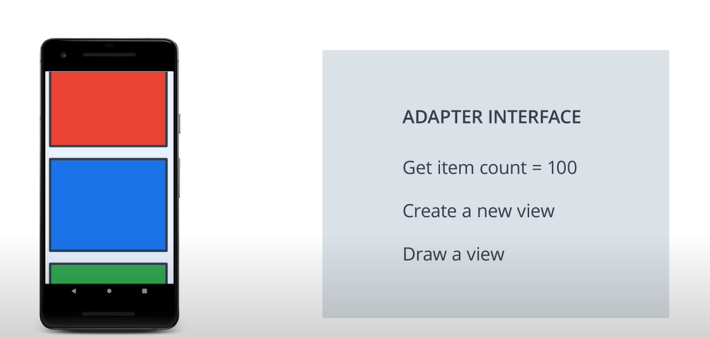
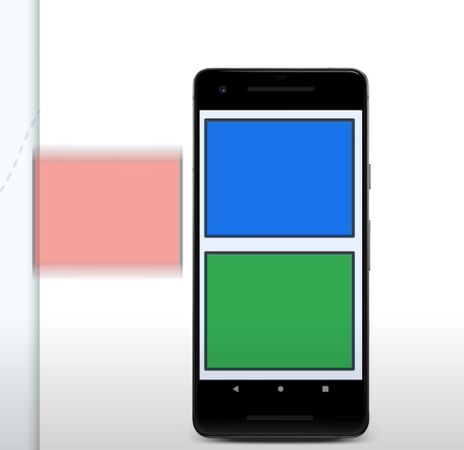
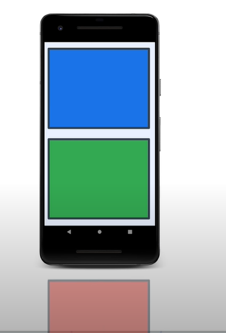

RecyclerView is designed to be efficient even when displaying extremely large lists also displays complex items. You can configure it horizontally or vertically. If the default options arent enough, you can even build your own layout manager to make recyclerview display any design you dream up.

1. By default it will only do work to process or draw items that are currently visible on the screen. That means if your list have 1000 elements but 10 are visible, it will only do enough for it to draw the first 10 items on the screen until the user scrolls. When the user scrolls, RecyclerView will figure out what new items should be on the screen. 
2. Another way that RecyclerView is efficient is by reusing or recycling as much as it can. When an items scrolls off the screen, it's recycled. That means it will reuse the views it allocated for the next item that will scroll onto the screen. It turns out this saves a lot of processing time and it helps making sure your list scroll fluidly. 
3. When an item changes in RecyclerView, instead of redrawing the entire list, it just updates that one single item. This is a huge efficiency gain when displaying lists of complex items.

#### RecyclerView is not the only way to display a list of things on Androids. Android also ships with other options for displaying lists:
1. Listview
2. GridView
3. LinearLayout

Both of them work for displaying a small list of items that arent too complex, like 100 items. They are not nearly as efficient as RecyclerView. 

> Adapter Pattern: is one of the first design patterns. The adapter pattern in software engineering helps an object to work together nicely with another API just like how a power adapter lets your laptop charge when you are traveling. 

- How does this addepter pattern fit in the RecyclerView?
- - In the case of the RecyclerView we have our appts data which we want to display as a list. We dont want to change the way our app stores, just put it onto the screen. We built an adaptor which adapts our data in something that can be used by RecyclerView. Concretely, our data is stored in a room database. We ll build an adapter that adapts the data from the room database into something that RecyclerView knows how to display.
- - By using an adapter, the details of recycling, scrolling and even how to actually display the information dont require any changes to our view model or room database. 
- - No matter how you store you data, if it can be presented in a way that recycler view can use, you can build an adapter to convert it.



#### RecyclerView adapters must provide a few methods for RecyclerView to understand how to display the data on the screen.
1) In order to know how far to scroll, the adapter needs to tell the recycler view how many items are available.
2) Provide a way for the RecyclerView to draw a specific item. RecyclerView use this anytime an item enters the screen
3) You must provide RecyclerView with a new way to create a new view for an item. 

In summary:
1) Get item count = 100
2) Create a new item
3) Draw a view
it will repeat 2 and 3. steps until it doesnt need any more views to fill screen. Then the recyclerView is done. it wont look at other items in the list untils the user scrolls to list on the screen. 







To implement recycling and support multiple type of views, RecyclerView doesnt directly interact with the views but instead ViewHolders. ViewHolders know things like the last position the items have in the list, which is important when you are animating list changes. 


To add recyclerView and CardView to project add following lines to project specific gradle file:

```Gradle
implementation "androidx.recyclerview:recyclerview:1.2.1"
implementation "androidx.cardview:cardview:1.0.0"
```

### in your xml:

```XML
<androidx.recyclerview.widget.RecyclerView
    android:id="@+id/myList"
    android:layout_width="0dp"
    android:layout_height="0dp"
    app:layoutManager="androidx.recyclerview.widget.LinearLayoutManager"/>
```
> Use <code>app:layoutManager</code> to say we want the LinearLayoutManager. This tells RecyclerView how to actually position the elements of the list.

### Adapter Class:

```Kotlin
class MyAdapter: RecyclerView.Adapter<MyAdapter.MyViewHolder>() {
    var data = listOf<MyModel>()
    set(value) {
        field = value
        notifyDataSetChanged()
    }

    class MyViewHolder private constructor(itemView: View): RecyclerView.ViewHolder(itemView) {
        private val nameTextView: TextView = itemView.findViewById(R.id.textView)

        fun bind(item: MyModel) {
            val res = itemView.context.resources
            nameTextView.text = item.name
        }

        companion object {
            fun from(parent: ViewGroup): MyViewHolder {
                val view = LayoutInflater.from(parent.context).inflate(R.layout.list_item_my_lists, parent, false)
                return MyViewHolder(view)
            }
        }
    }

    override fun onCreateViewHolder(parent: ViewGroup, viewType: Int): MyViewHolder {
        return MyViewHolder.from(parent)
    }

    override fun onBindViewHolder(holder: MyViewHolder, position: Int) {
        holder.bind(data[position])
    }

    override fun getItemCount(): Int {
        return data.size
    }
}
```

> <code>notifyDataSetChanged()</code> will call the RecyclerView to immediately redraw everything on screen based on new data. It is important to tell RecyclerView about the change immediately like this, so it doesnt try to draw items from the old list which might crash. Since it tells the RecyclerView that the entire list is updated, the RecyclerView has to immediately redraw everything on the screen. If your items is more complex than textboxes, this can be a pretty slow operation. Even if the item that has been updated isnt even on the screen right now. This might show up as a flicker to the user as the screen updates. More likely this will show up as a hiccup while scrolling. We need to tell recyclerView only draw the changes needed to update any views that changed on screen. RecyclerView has a rich API for updating a single element.

> RecyclerView has a class called DiffUtil. it is helper for RecyclerView adapters that calculates changes in lists and minimizes modifications. it will take an old list and the new list and figure out what's diffirent. it will use an algorithm called Myers diff to figure out the minimum number of changes to make from the old list to produce the new list.

### MainActivity Class:
```Kotlin
val adapter = MyAdapter()
myList.adapter = adapter

myViewModel.model.observe(viewLifecycleOwner, Observer{ it ->
    it?.let {
        adapter.data = it
    }
})
```

