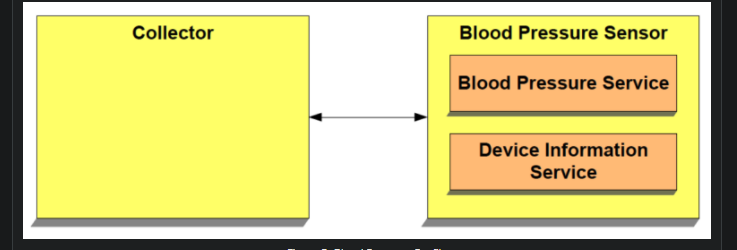

> Since many Internet of Things (IoT) systems involve small devices and sensors, BLE has become the more common protocol of the two (versus Bluetooth Classic) in IoT

## Technical Facts About BLE

- The frequency spectrum occupied is 2.400 - 2.4835 GHz.
- The frequency spectrum is segmented into 40 “2 MHz”-wide channels.
- The maximum data rate supported by the radio (introduced in Bluetooth version 5) is 2 Mbps.
- Power consumption also varies widely. It depends on the implementation of the
application, the different BLE parameters, and the chipset used. The peak current
consumption of a BLE chipset during radio transmission is typically under 15 mA.
- For all encryption operations, BLE uses AES CCM with a 128-bit key.
- BLE is designed for low-bandwidth data transfer applications. Implementing BLE for high-bandwidth applications will significantly compromise the low power consumption promise. So, minimizing radio usage as much as possible achieves the optimal power consumption.
- Bluetooth versions (when it relates to BLE) are backwards compatible with each other. However, the communication may be limited to the features of the older version of the two communicating devices. For example, a Bluetooth 5 BLE device can communicate with a Bluetooth 4.1 BLE device, but 5-specific features wonʼt be supported. On the other hand, Connections, Primary Advertisements, discovering Services, discovering Characteristics, and reading/writing to these Characteristics are all possible between two BLE devices regardless of their supported Bluetooth version (since they were supported by the initial version of BLE).

## Limitations of BLE

> BLE is always in sleep mode unless a connection is established. As a result, it uses relatively little power. BLE uses about 100 times less electricity than Bluetooth.

- GATT defines the protocol of transferring data between two Bluetooth Low Energy devices. Application data is uniquely identified through a small entity known as an Attribute. Group of Attributes form Characteristics which adds additional properties such as permission and rules of interaction for a unique set of data. A group of Characteristics form a Large entity known as Service which adds a larger blueprint for a given feature or functionality. For Example, Battery Service includes a Battery Level Characteristic which includes the battery level of a given device.
- Attribute Protocol(ATT) defines the protocol of transferring the attribute data. This includes GATT related functionality such as <code>Write Request, Write Response, Notification, Read Response.</code>
- Logical Link Control and Adaptation Protocol (L2CAP) is responsible for Quality of Service (QoS), routing, fragmentation and reassembly of packets for higher layer protocols such as ATT, Security Management Protocol (SMP) and etc.
- Link Layer (LL) handles the transfer of L2CAP Packets while ensuring guaranteed delivery and integrity of data.

## BLE Packet
A BLE packet containing application and transferred over the air has the following structure:

GATT stands for **Generic Attribute Profile**. GATT specifies how two Bluetooth Low Energy (BLE) devices send and receive standard messages. To understand what GATT is, We first need to understand the underlying framework for GATT: the Attribute Protocol. The GATT only comes into play after a connection has been established between two BLE devices.

# Generic Access Profile(GAP)

GAP is what makes your device visible to the outside world and determines how to devices can interact with each other. It provides a framework that any BLE implementation must follow to allow devices to discover each other, broadcast data, establish secure connections

## Device Roles
GAP defines various roles for devices, but the two key concepts to keep in mind are **Central** devices and **Peripheral** devices.
- **Peripheral** devices are small, low power, resource contrained devices that can connect to a much more powerful **central** device. **Peripheral** devices are things like a heart rate monitor, a BLE enabled proximity tag, etc.
- **Central** devices are usually the mobile phone or tablet that you connect to with far more processing power and memory.

## Advertising and Scan Response Data
There are two ways to send advertising out with GAP. The *Advertising Data* payload and the *Scan Response* payload.

Both payloads are identical and can contain up to 31 bytes of data, but only the advertising data payload is mandatory, since this is the payload that will be constantly transmitted out from the device to let central devices in range know that it exists. The scan response payload is an optional secondary payload that central devices can request, and allows device designers to fit a bit more information in the advertising payload such a strings for a device name, etc.

## Advertising Process
The following illustration should explain the advertising process and how the advertising payloads and scan response payloads work.

A peripheral will set a specific advertising interval, and every time this interval passes, it will retransmit its main advertising packet. A longer delays saves power but feels less responsive if the device only advertises itself once every 2 seconds instead of every 20ms.

If a listening device is interested in the scan response payload (and it is available on the peripheral) it can optionally request the scan response payload, and the peripheral will respond with the additional data.

# The Generic Attribute Profile (GATT)

In constract with GAP, which defines the low-level interactions with devices, GATT deals only with actual data transfer procedures and formats. GATT uses the Attribute protocol (ATT) as its transport protocol to exchange data between devices.

> It is worth mentioning once more that GATT roles are both completely independent of GAP roles and also concurrently compatible with each other. That means that both a GAP central and a GAP peripheral can act as a GATT client or server, or even act as both at the same time.

## Attribute Protocol (ATT)
Att defines how a server exposes its data to a client and how this data is structured. There are two roles within the ATT:

- Server:  
   It is the device that accepts incoming commands from a peer device and sends reponses, notifications and indications. For example, a thermometer device will behave as a server when it exposes the temperature of its surrounding environment, the unit of measurement, its battery level, and possibly the time invervals at which the thermometer reads and records the temperature.
> It can also notify the client (defined later) when a temperature reading has changed rather than have the client poll for the data waiting for a change to occur.

- Client:  
    This is the device that interfaces with the server with the purpose of reading the server's exposed data and/or controlling the server's behavior. It is the device that sends commands and requests and accepts incoming notifications and indications. In the previous example, a mobile device that connects to the thermometer and reads its temperature value is acting in the Client mode.

The data that the server exposes is structured as **attributes**. An attribute is the generic term for any type of data exposed by the server and defines the structure of this data.

- **Attribute Type(Universally Unique Identifier or UUID)**  
    This is a 16-bit number(in the case of Bluetooth SIG-Adopted Attributes), or 128-bit number(in the case of custom attribute types defined by the developer, also sometimes referred to as vendor-specific UUIDs).For example the UUID for a SIG-adopted temperature measurement value is **0x2A1C** SIG-adopted attribute types(UUIDs) share all but 16 bits of a special 128-bit base UUID:00000000-0000-1000-8000-00805F9B34FB. The published 16-bit UUID value replaces the 2 bytes in bold in the base UUID. A custom UUID can be any 128-bit number that does not use the SIG-adopted base UUID. For example, a developer can define their own attribute type(UUID) for a temperature reading as: <code>F5A1287E-227D-4C9E-AD2C-11D0FD6ED640</code>. One benefit of using a SIG-adopted UUID is the reduced packet size since it can be transmitted as the 16-bit representation instead of the full 128-bit value.

A universally unique identifier (UUID) is a 128-bit (16 bytes) number that is guaranteed (or has a high probability) to be globally unique. UUIDs are used in many protocols and applications other than Bluetooth, and their format, usage, and generation is specified in ITU-T Rec. X.667, alternatively known as ISO/IEC 9834-8:2005.

For efficiency, and because 16 bytes would take a large chunk of the 27-byte data payload length of the Link Layer, the BLE specification adds two additional UUID formats: 16-bit and 32-bit UUIDs. These shortened formats can be used only with UUIDs that are defined in the Bluetooth specification (i.e., that are listed by the Bluetooth SIG as standard Bluetooth UUIDs).

To reconstruct the full 128-bit UUID from the shortened version, insert the 16- or 32-bit short value (indicated by xxxxxxxx, including leading zeros) into the Bluetooth Base UUID:    

`xxxxxxxx-0000-1000-8000-00805F9B34FB`

- **Attribute Handle**  
  This is a 16-bit value that the server assings to each of its attributes. This value is used by the client to reference a specific attribute and is guaranteed by the server to uniquely identify the attribute during the life of the connection between two devices. The range of handles is 0x0001-0xFFFF, where the value of 0x0000 is reserved.

- **Attribute Value**  
    The attribute value holds the actual data content of the attribute. There are no restrictions on the type of data it can contain (you can imagine it as a non-typed buffer that can be cast to whatever the actual type is, based on the attribute type), although its maximum length is limited to 512 bytes by the specification.
- **Attribute Permissions**  
  Permissions determine whether an attribute can be read or written to, whether it can be notified or indicated, and what security levels are required for each of these operations. These permissions are not defined or discovered via Attribute Protocol (ATT) but rather defined at a higher layer (GATT layer or Application layer).

Now that we have covered the concept of **attributes**, we'll go over there important concepts in BLE that you will come across very often:
- Services
- Characteristics
- Profiles

## Services 

A service is a grouping of one or more attributes, some of which are characteristics. It's meant to group together related attributes that satisfy a specific functionality on the server. For example, the SIG-adopted **Battery Service** constains one characteristic called the **Battery Level**.

A service also contains other attributes(non-characteristics) that help structure the data within a service (such as service declarations, characteristic declarations and others).

From the figure, we can see the different attributes that a service is made up of:

- One or more include services
- One or more characteristics
    - Characteristic properties
    - A characteristic value
    - Zero or more characteristic descriptors

> Inside a service definition (that is to say, inside a service), you can add one or more references to another services, using include definitions. Include definitions consist of a single attribute (the include declaration) that contains all the details required for the client to reference the included service.

## Characteristics

A characteristic is always part of a service and it represents a piece of information/data that a server wants to expose to a client. For example, the battery level characteristic represents the remaining power level of a battery in a device which can be read by a client. The characteristic contains other attributes that help define the value it holds:

- **Properties**: represented by a number of bits and which defines how a characteristic value can be used. Some examples include: read, write, write without response, notify, indicate.

- **Descriptors**: Used to contain related information about the characteristic value. Some examples include: extended properties, user description, fields used for subscribing to notifications and indications, and a field that defines the presentation of the value such as the format and the unit of the value.

> For example, even though it’s technically possible — it does not make sense to create a service called the humidity service that includes both a humidity characteristic and a temperature characteristic. Instead, it would make more sense to have two separate services specific to each of these two distinct functionalities (temperature reading, and humidity reading).

## Example GATT

- There are two services defined:
    - Generic Access Profile (GAP) service with UUID: 0x1800 (SIG-adopted service).
    - Cable Replacement service with UUID: 0bd51666-e7cb-469b-8e4d-2742f1ba77cc (a custom or vendor-specific service).
- The Generic Access Profile service is mandatory per the spec, and it includes the following mandatory characteristics:
    - Name with UUID 0x2a00 and value: Bluegiga CR Demo.
    - Appearance with UUID 0x2a01 and value 0x4142.
- The Cable Replacement service has one characteristic named data
    - The data characteristic has a UUID: e7add780-b042-4876-aae1-112855353cc1
    - It has both writes and indications enabled.

## GATT Design Guidelines

- Make sure to implement the following mandatory service and its characteristics:
    - **Generic Access Profile(GAP)** service.
    - **Name and Appearance** characteristics within the GAP service.
> One thing to keep in mind is that vendor SDKs usually do not require you to explicitly implement this service, but rather they provide APIs for setting the name and appearance. The SDK then handles creating the GAP service and setting the characteristics according to the user-provided values.
- Utilize the Bluetooth SIG-adopted profiles, services, and characteristics in your design whenever possible. This has the following benefits:
    - You get the benefit of reducing the size of data packets involving UUIDs for services and characteristics (including advertisement packets, discovery procedures, and others) — since 16-bit UUID values are used instead of 128-bit values.
    - Group characteristics that serve related functionality within a single service.
    - Avoid having services with too many characteristics. A good separation of services makes it faster to discover certain characteristics and leads to a better GATT design that’s modular and user-friendly.