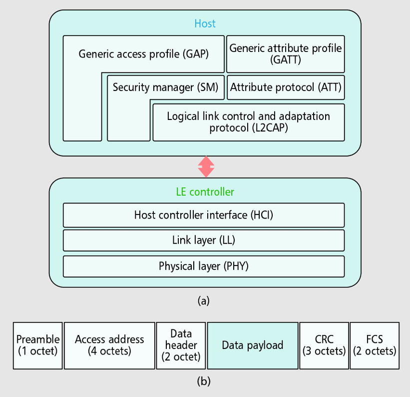
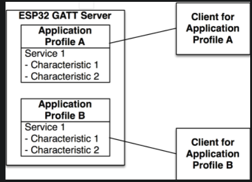

## Introduction


In this example we review the GATT SERVER example code which implements a Bluetooth Low Energy(BLE) Generic Attribute Profile(GATT) Server on ESP32. 
- This example is designed around two Application Profiles and a series of events that are handled in order to execute a sequence of configuration steps, such as defining advertising parameters, updating connection parameters and creating services and characteristics.
- Also this example handles read and write events, including a Write Long Characteristic request, which divides the *incoming data* into *chunks* so that the data can fit in the `Attribute Protocol(ATT)` message. 

## Includes

```C
#include <stdio.h>
#include <stdlib.h>
#include <string.h>
#include "freertos/FreeRTOS.h"
#include "freertos/task.h"
#include "freertos/event_groups.h"
#include "esp_system.h"
#include "esp_log.h"
#include "nvs_flash.h"
#include "bt.h"
#include "bta_api.h"
#include "esp_gap_ble_api.h"
#include "esp_gatts_api.h"
#include "esp_bt_defs.h"
#include "esp_bt_main.h"
#include "sdkconfig.h"
```

- `bt.h`: implements BT controller and VHCI configuration procedures from the host side.
- `esp_bt_main.h`:  implements initialization and enabling of the Bluedroid stack.
- `esp_gap_ble_api.h`: implements GAP configuration, such as advertising and connection parameters.
- `esp_gatts_api.h`: implements GATT configuration, such as creating services and characteristics.

## Main Entry Point
```C
void app_main() {
    esp_err_t ret;
    
    ret = nvs_flash_init();
    if ( ret == ESP_ERR_NVS_NO_FREE_PAGES || ret == ESP_ERR_NVS_NEW_VERSION_FOUND ) {
        ESP_ERROR_CHECK(nvs_flash_erase());
        ret = nvs_flash_init();
    }
    ESP_ERROR_CHECK(ret);

    esp_bt_controller_config_t bt_cfg = BT_CONTROLLER_INIT_CONFIG_DEFAULT();
    ret = esp_bt_controller_init(&bt_cfg);
    if ( ret ) {
        ESP_LOGE(GATTS_TAG, "%s initialize controller failed\n", __func__);
        return;
    }

    ret = esp_bt_controller_enable(ESP_BT_MODE_BLE);
    if ( ret ) {
        ESP_LOGE(GATTS_TAG, "%s enable controller failed\n", __func__);
        return;
    }

    ret = esp_bluedroid_init();
    if ( ret ) {
        ESP_LOGE(GATTS_TAG, "%s init bluetooth failed\n", __func__);
        return; 
    }

    ret = esp_bluedroid_enable();
    if ( ret ) {
        ESP_LOGE(GATTS_TAG, "%s enable bluetooth failed\n", __func__);
        return;
    }

    ret = esp_ble_gatts_register_callback(gatts_event_handler);
    if ( ret ) {
        ESP_LOGE(GATTS_TAG, "gatts register error, error code = %x", ret);
        return;
    }
    ret = esp_ble_gap_register_callback(gap_event_handler);
    if ( ret ) {
        ESP_LOGE(GATTS_TAG, "gap register error, error code = %x", ret);
        return;
    }
    ret = esp_ble_gatts_app_register(PROFILE_A_APP_ID);
    if ( ret ) {
        ESP_LOGE(GATTS_TAG, "gatts app register error, error code = %x", ret);
        return;
    }
    ret = esp_ble_gatts_app_register(PROFILE_B_APP_ID);
    if ( ret ) {
        ESP_LOGE(GATTS_TAG, "gatts app register error, error code = %x", ret);
        return;
    }
    esp_err_t local_mtu_ret = esp_ble_gatt_set_local_mtu(512);
    if ( local_mtu_ret ) {
        ESP_LOGE(GATTS_TAG, "set local  MTU failed, error code = %x", local_mtu_ret);
    }
    return;
}
```

The main function starts by initializing the non-volatile storage library. This library allows to save key-value pairs in flash memory and is used by some components such as the Wi-Fi library to save the SSID and password.

```C
ret = nvs_flash_init();
```

## BT Controller and Stack Initialization

The main also initializes the BT controller by first creating a BT controller configuration structure names `esp_bt_controller_config_t ` with default settings generated by the `BT_CONTROLLER_INIT_CONFIG_DEFAULT()` macro.

The BT controller implements the:
- Host Controller Interface(HCI)
- Link Layer(LL)
- Physical Layer(PHY)



> The BT Controller is invisible to the user applications and deals with the lower layers of the BLE stack. The controller configuration includes setting the *BT controller stack size*, *priority* and *HCI baud rate*. With the settings created, the BT controller is initialized and enabled with the `esp_bt_controller_init()` function:

```C
esp_bt_controller_config_t bt_cfg = BT_CONTROLLER_INIT_CONFIG_DEFAULT();
ret = esp_bt_controller_init(&bt_cfg);
```

Next the controller is enabled in BLE Mode.
```C
ret = esp_bt_controller_enable(ESP_BT_MODE_BLE);
```
> The controller should be enabled in ESP_BT_MODE_BTDM, if you want to use the dual mode (BLE + BT).

1.  ESP_BT_MODE_IDLE: Bluetooth not running
2.  ESP_BT_MODE_BLE: BLE mode
3.  ESP_BT_MODE_CLASSIC_BT: BT Classic mode
4.  ESP_BT_MODE_BTDM: Dual mode (BLE + BT Classic)

After the initialization of the BT controller, the Bluedroid stack, which includes the common definitions and APIs for both BT Classic and BLE, is initialized and enabled by using:

```C
ret = esp_bluedroid_init();
ret = esp_bluedroid_enable();
```

The Bluetooth stack is up and running at this point in the program flow, however the functionality of the application has not been defined yet. The functionality is defined by reacting to events such as what happens when another device tries to establish a connection and read or write parameters.

The two main managers of events are the GAP and GATT event handlers. The application needs to register a callback function for each event handler in order to let the application know which functions are going to handle the GAP and GATT events:

```C
esp_ble_gatts_register_callback(gatts_event_handler);
esp_ble_gap_register_callback(gap_event_handler);
```
> The functions gatts_event_handler() and gap_event_handler() handle all the events that are pushed to the application from the BLE stack.


## Application Profiles

The GATT Server example application is organized by using Application Profies as shown in the figure below. Each Application Profiles describes a way to group functionalities that are designed for one client application, such as a mobile app running on a smartphone or tablet. In this way, a single design, enabled by different Application Profiles, can behave differently when used by different smartphone apps, allowing the server to react differently according to the client app that is being used. In practice, each profile is seen by the client as an independent BLE service. 



Each profile is defined as a struct where the struct members depend on the services and characteristics that are implemented in that Application Profile. The members also include a GATT interface, Application ID, Connection ID and a callback function to handle profile events. Each profile is composed by:

- GATT interface
- Application ID
- Connection ID
- Service handle
- Service ID
- Characteristic handle
- Characteristic UUID
- Attribute permissions
- Characteristic properties
- Client Characteristic Configuration descriptor handle
- Client Characteristic Configuration descriptop UUID

It can be observed from this structure that this profile was designed to have one service and one characteristic, and that the characteristic has one descriptor. The service has *a handle and an ID*, in the same manner that each characteristic has *a handle, an UUID, attribute permissions and properties*. In addition, if the characteristic supports notifications or indications, it must implement *a Client Characteristic Configuration descriptor (CCCD)*, which is an additional attribute that describes if the notifications or indications are enabled and defines how the characteristic may be configured by a specific client. This descriptor also has *a handle and an UUID*.

The Application Profiles are stored in an array and corresponding callback functions `gatts_profile_a_event_handler()` and `gatts_profile_b_event_handler()` are assigned. Different applications on the GATT client use different interfaces, represented by the `gatts_if` parameter. For initialization, this parameter is set to `ESP_GATT_IF_NONE`, which means that the Application Profile is not linked to any client yet.

```C
static struct gatts_profile_inst gl_profile_tab[PROFILE_NUM] = {
    [PROFILE_A_APP_ID] = {
        .gatts_cb = gatts_profile_a_event_handler,
        .gatts_if = ESP_GATT_IF_NONE,
    [PROFILE_B_APP_ID] = {
        .gatts_cb = gatts_profile_b_event_handler,
        .gatts_if = ESP_GATT_IF_NONE,
    },
};
```

Finally, the Application Profiles are registered using the Application ID, which is an user-assigned number to identify each profile. In this way, multiple Application Profiles can run in one server.

```C
esp_ble_gatts_app_register(PROFILE_A_APP_ID);
esp_ble_gatts_app_register(PROFILE_B_APP_ID);
```

## Setting GAP Parameters

The register application event is the first one that is triggered during the lifetime of the program, this example uses the Profile A GATT event handle to configure the advertising parameters upon registration. This example has the option to use both standart Bluetooth Core Specification advertising parameters or a customized raw buffer. The option can be selected with the `CONFIG_SET_RAW_ADV_DATA` define. The raw advertising data can be used to implement `iBeacons, Eddystone or other proprietaries` and custom frame types such as the ones used for `Indoor Location Services` that are different from the standart specifications.

The function used to configure standard Bluetooth Specification advertisement parameters is `esp_ble_gap_config_adv_data()`, which takes a pointer to an `esp_ble_adv_data_t` structure. The `esp_ble_adv_data_t` data structure for advertising data has the following definition:

```C
typedef struct {
    bool set_scan_rsp;            /*!< Set this advertising data as scan response or not*/
    bool include_name;            /*!< Advertising data include device name or not */
    bool include_txpower;         /*!< Advertising data include TX power */
    int min_interval;             /*!< Advertising data show slave preferred connection min interval */
    int max_interval;             /*!< Advertising data show slave preferred connection max interval */
    int appearance;               /*!< External appearance of device */
    uint16_t manufacturer_len;    /*!< Manufacturer data length */
    uint8_t *p_manufacturer_data; /*!< Manufacturer data point */
    uint16_t service_data_len;    /*!< Service data length */
    uint8_t *p_service_data;      /*!< Service data point */
    uint16_t service_uuid_len;    /*!< Service uuid length */
    uint8_t *p_service_uuid;      /*!< Service uuid array point */
    uint8_t flag;                 /*!< Advertising flag of discovery mode, see BLE_ADV_DATA_FLAG detail */
} esp_ble_adv_data_t;
```

In this example, the structure is initialized as follows:

```C
static esp_ble_adv_data_t adv_data = {
    .set_scan_rsp = false,
    .include_name = true,
    .include_txpower = true,
    .min_interval = 0x0006,
    .max_interval = 0x0010,
    .appearance = 0x00,
    .manufacturer_len = 0, //TEST_MANUFACTURER_DATA_LEN,
    .p_manufacturer_data =  NULL, //&test_manufacturer[0],
    .service_data_len = 0,
    .p_service_data = NULL,
    .service_uuid_len = 32,
    .p_service_uuid = test_service_uuid128,
    .flag = (ESP_BLE_ADV_FLAG_GEN_DISC | ESP_BLE_ADV_FLAG_BREDR_NOT_SPT),
};

// scan response data
static esp_ble_adv_data_t scan_rsp_data = {
    .set_scan_rsp = true,
    .include_name = true,
    .include_txpower = true,
    //.min_interval = 0x0006,
    //.max_interval = 0x0010,
    .appearance = 0x00,
    .manufacturer_len = 0, //TEST_MANUFACTURER_DATA_LEN,
    .p_manufacturer_data =  NULL, //&test_manufacturer[0],
    .service_data_len = 0,
    .p_service_data = NULL,
    .service_uuid_len = sizeof(adv_service_uuid128),
    .p_service_uuid = adv_service_uuid128,
    .flag = (ESP_BLE_ADV_FLAG_GEN_DISC | ESP_BLE_ADV_FLAG_BREDR_NOT_SPT),
};

```

```C
static void gatts_profile_a_event_handler(esp_gatts_cb_event_t event, esp_gatt_if_t gatts_if, esp_ble_gatts_cb_param_t *param) {
    switch (event) {
        case ESP_GATTS_REG_EVT:
            ESP_LOGI(GATTS_TAG, "REGISTER_APP_EVT, status %d, app_id %d\n", param->reg.status, param->reg.app_id);
            gl_profile_tab[PROFILE_A_APP_ID].service_id.is_primary = true;
            gl_profile_tab[PROFILE_A_APP_ID].service_id.id.inst_id = 0x00;
            gl_profile_tab[PROFILE_A_APP_ID].service_id.id.uuid.len = ESP_UUID_LEN_16;
            gl_profile_tab[PROFILE_A_APP_ID].service_id.id.uuid.uuid.uuid16 = GATTS_SERVICE_UUID_TEST_A;

            esp_ble_gap_set_device_name(TEST_DEVICE_NAME);
#ifdef CONFIG_SET_RAW_ADV_DATA
            esp_err_t raw_adv_ret = esp_ble_gap_config_adv_data_raw(raw_adv_data, sizeof(raw_adv_data));
            if (raw_adv_ret){
                ESP_LOGE(GATTS_TAG, "config raw adv data failed, error code = %x ", raw_adv_ret);
            }
            adv_config_done |= adv_config_flag;
            esp_err_t raw_scan_ret = esp_ble_gap_config_scan_rsp_data_raw(raw_scan_rsp_data, sizeof(raw_scan_rsp_data));
            if (raw_scan_ret){
                ESP_LOGE(GATTS_TAG, "config raw scan rsp data failed, error code = %x", raw_scan_ret);
            }
            adv_config_done |= scan_rsp_config_flag;
#else
            //config adv data
            esp_err_t ret = esp_ble_gap_config_adv_data(&adv_data);
            if (ret){
                ESP_LOGE(GATTS_TAG, "config adv data failed, error code = %x", ret);
            }
            adv_config_done |= adv_config_flag;
            //config scan response data
            ret = esp_ble_gap_config_adv_data(&scan_rsp_data);
            if (ret){
                ESP_LOGE(GATTS_TAG, "config scan response data failed, error code = %x", ret);
            }
            adv_config_done |= scan_rsp_config_flag;
#endif
```

## GAP Event Handler

Once the advertising data have been set, the GAP event `ESP_GAP_BLE_ADV_DATA_SET_COMPLETE_EVT` is triggered. For the case of raw advertising data set, the event triggered is `ESP_GAP_BLE_ADV_DATA_RAW_SET_COMPLETE_EVT`.

```C
static void gap_event_handler(esp_gap_ble_cb_event_t event, esp_ble_gap_cb_param_t *param) {
    switch ( event ) {
#ifdef CONFIG_SET_RAW_ADV_DATA
        case ESP_GAP_BLE_ADV_DATA_RAW_SET_COMPLETE_EVT:
            adv_config_done &= (~adv_config_flag);
            if (adv_config_done==0){
                esp_ble_gap_start_advertising(&adv_params);
            }
            break;
        case ESP_GAP_BLE_SCAN_RSP_DATA_RAW_SET_COMPLETE_EVT:
            adv_config_done &= (~scan_rsp_config_flag);
            if (adv_config_done==0){
                esp_ble_gap_start_advertising(&adv_params);
            }
            break;
#else
        case ESP_GAP_BLE_ADV_DATA_SET_COMPLETE_EVT:
            adv_config_done &= (~adv_config_flag);
            if (adv_config_done == 0){
                esp_ble_gap_start_advertising(&adv_params);
            }
            break;
        case ESP_GAP_BLE_SCAN_RSP_DATA_SET_COMPLETE_EVT:
            adv_config_done &= (~scan_rsp_config_flag);
            if (adv_config_done == 0){
                esp_ble_gap_start_advertising(&adv_params);
            }
            break;
#endif
    }
}
```

In any case, the server can start advertising using `esp_ble_gap_start_advertising()` function, which takes a structure of type `esp_ble_adv_params_t` with the advertising parameters required by the stack to operate.

```C
/// Advertising parameters
typedef struct {
    uint16_t adv_int_min;
    /*!< Minimum advertising interval for undirected and low duty cycle directed advertising.
 					Range: 0x0020 to 0x4000
 					Default: N = 0x0800 (1.28 second)
					Time = N * 0.625 msec
					Time Range: 20 ms to 10.24 sec */
    uint16_t adv_int_max;
    /*!< Maximum advertising interval for undirected and low duty cycle directed advertising.
					Range: 0x0020 to 0x4000
					Default: N = 0x0800 (1.28 second)
					Time = N * 0.625 msec
					Time Range: 20 ms to 10.24 sec */
    esp_ble_adv_type_t adv_type;            /*!< Advertising type */
    esp_ble_addr_type_t own_addr_type;      /*!< Owner bluetooth device address type */
    esp_bd_addr_t peer_addr;                /*!< Peer device bluetooth device address */
    esp_ble_addr_type_t peer_addr_type;     /*!< Peer device bluetooth device address type */
    esp_ble_adv_channel_t channel_map;      /*!< Advertising channel map */
    esp_ble_adv_filter_t adv_filter_policy; /*!< Advertising filter policy */
} esp_ble_adv_params_t;
```

Note that `esp_ble_gap_config_adv_data()` configures the advertising data that will be advertised to the client and takes an `esp_ble_adv_data_t` structure(prepared inside `gatts_profile_a_event_handler()` callback function), while `esp_ble_gap_start_advertising()` makes server to actually start advertising and takes an `esp_ble_adv_params_t` structure(prepared inside `gap_event_handler()` callback function). The advertising data is the information that is shown to the client, while the advertising parameters are the configuration required by the GAP to execute.

```C
static esp_ble_adv_params_t test_adv_params = {
    .adv_int_min        = 0x20,
    .adv_int_max        = 0x40,
    .adv_type           = ADV_TYPE_IND,
    .own_addr_type      = BLE_ADDR_TYPE_PUBLIC,
    //.peer_addr        =
    //.peer_addr_type   =
    .channel_map        = ADV_CHNL_ALL,
    .adv_filter_policy  = ADV_FILTER_ALLOW_SCAN_ANY_CON_ANY,
};
```

- `ADV_IND`: not directed to a particular central device and connectable type.
- `BLE_ADDR_TYPE_PUBLIC` : its address type is public.
- `ADV_CHNL_ALL`: uses all channels.
- `ADV_FILTER_ALLOW_SCAN_ANY_CON_ANY`: allows both scan and connection requests from any central.


If the advertising started successfully, an `ESP_GAP_BLE_ADV_START_COMPLETE_EVT` event is generated, which is this example is used to check if the advertising status is indeed advertising. Otherwise, an error message is printed.

```C
    case ESP_GAP_BLE_ADV_START_COMPLETE_EVT:
    //advertising start complete event to indicate advertising start successfully or failed
         if ( param->adv_start_cmpl.status != ESP_BT_STATUS_SUCCESS ) {
             ESP_LOGE(GATTS_TAG, "Advertising start failed\n");
         }
         break;
```


## GATT Event Handlers

When an Application Profile is registered, an `ESP_GATTS_REG_EVT` event is triggered. The parameters of the `ESP_GATTS_REG_EVT` are:
```C
esp_gatt_status_t status;  /*!< Operation status */`
uint16_t app_id;           /*!< Application id which input in register API */`
```

In addition to the previous parameters, the event also contains the GATT interface assigned by the BLE stack. The event is captured by the `gatts_event_handler()`, which used to store the generated inteface in the profile table, and then the event is forwarded to the corresponding profile event handler.

```C
static void gatts_event_handler(esp_gatts_cb_event_t event, esp_gatt_if_t gatts_if, esp_ble_gatts_cb_param_t *param) {
    /* If event is register event, store the gatts_if for each profile */
    if ( event == ESP_GATTS_REG_EVT ) {
        if ( param->reg.status == ESP_GATT_OK ) {
            gl_profile_tab[param->reg.app_id].gatts_if = gatts_if;
        } else {
            ESP_LOGI(GATTS_TAG, "Reg app failed, app_id %04x, status %d\n", param->reg.app_id, param->reg.status);
            return;
        }
    }

    /* If the gatts_if equal to profile A, call profile A cb handler or so */
    do {
        int idx;
        for ( idx = 0; idx < PROFILE_NUM; idx++ ) {
            if ( gatts_if == ESP_GATT_IF_NONE || gatts_if == gl_profile_tab[idx].gatts_if )
                if ( gl_profile_tab[idx].gatts_cb ) {
                    gl_profile_tab[idx].gatts_cb(event, gatts_if, param);
                }
        }
    } while(0);
}
```

## Creating Services

The register event is also used to create a service by using the `esp_ble_gatts_create_service()`. When service creating is done, a callback event `ESP_GATTS_CREATE_EVT` is called to report status and service ID to the profile. The way to create service is:

```C
esp_ble_gatts_create_service(gatts_if, &gl_profile_tab[PROFILE_A_APP_ID].service_id, GATTS_NUM_HANDLE_TEST_A);
```

The number of handles is defined as 4:
```C
#define GATTS_NUM_HANDLE_TEST_A     4
```

The handles are:</br>
1. Service handle
2. Characteristic handle
3. Characteristic value handle
4. Characteristic descriptor handle

The service is defined as a primary service with a UUID length of 16 bits. The service ID is initialized with instance ID = 0 and UUID defined by `GATTS_SERVICE_UUID_TEST_A`.

The service instance ID can be used to differentiate multiple services with the same UUID. In this example, since there is only one service for each Application Profiles and the services have different UUIDs, the service instance ID can be defined as 0 in both profile A and B. However if there was only one Application Profile with two services using the same UUID, then it would be necessary to use different instance IDs to refer to one service or the other.

Application Profile B creates the service in the same way as Profile A:

```C
static void gatts_profile_b_event_handler(esp_gatts_cb_event_t event, esp_gatt_if_t gatts_if, esp_ble_gatts_cb_param_t *param) {
    switch (event) {
        case ESP_GATTS_REG_EVT:
            ESP_LOGI(GATTS_TAG, "REGISTER_APP_EVT, status %d, app_id %d\n", param->reg.status, param->reg.app_id);
            gl_profile_tab[PROFILE_B_APP_ID].service_id.is_primary = true;
            gl_profile_tab[PROFILE_B_APP_ID].service_id.id.inst_id = 0x00;
            gl_profile_tab[PROFILE_B_APP_ID].service_id.id.uuid.len = ESP_UUID_LEN_16;
            gl_profile_tab[PROFILE_B_APP_ID].service_id.id.uuid.uuid.uuid16 = GATTS_SERVICE_UUID_TEST_B;

            esp_ble_gatts_create_service(gatts_if, &gl_profile_tab[PROFILE_B_APP_ID].service_id, GATTS_NUM_HANDLE_TEST_B);
            break;
…
}
```

## Starting Services and Creating Characteristics

When a service is created successfully, an `ESP_GATTS_CREATE_EVT` event managed by the profile GATT handler is triggered, and can be used to start the service and add characteristics to the service. For the case of Profile A, the service is started and the characteristics are added as follow:

```C
case ESP_GATTS_CREATE_EVT:
    ESP_LOGI(GATTS_TAG, "CREATE_SERVICE_EVT, status %d, service_handle %d\n", param->create.status, param->create.service_handle);
    gl_profile_tab[PROFILE_A_APP_ID].service_handle = param->create.service_handle;
    gl_profile_tab[PROFILE_A_APP_ID].char_uuid.len = ESP_UUID_LEN_16;
    gl_profile_tab[PROFILE_A_APP_ID].char_uuid.uuid.uuid16 = GATTS_CHAR_UUID_TEST_A;  

    esp_ble_gatts_start_service(gl_profile_tab[PROFILE_A_APP_ID].service_handle);
    a_property = ESP_GATT_CHAR_PROP_BIT_READ | ESP_GATT_CHAR_PROP_BIT_WRITE | ESP_GATT_CHAR_PROP_BIT_NOTIFY;
    esp_err_t add_char_ret =  
    esp_ble_gatts_add_char(gl_profile_tab[PROFILE_A_APP_ID].service_handle,  
                        &gl_profile_tab[PROFILE_A_APP_ID].char_uuid,  
                        ESP_GATT_PERM_READ | ESP_GATT_PERM_WRITE,  
                        a_property,  
                        &gatts_demo_char1_val,  
                        NULL);
    if (add_char_ret){
        ESP_LOGE(GATTS_TAG, "add char failed, error code =%x",add_char_ret);
    }
    break;

```

- First the `service_handle` generated by the BLE stack is stored in the profile table, which will be used later by the application layer to refer to this service. Then, the UUID of the characteristic and its UUID length are set. The length of the characteristic UUID is again 16 bits. The service is started using the `esp_ble_gatts_start_service()` function with the service handle previously generated. An `ESP_GATTS_START_EVT` event, which is used to print information. The characteristic is added to the service by `esp_ble_gatts_start_service()` function in conjunction with the characteristics permissions and properties. 

Permissions:
- `ESP_GATT_PERM_READ`: To read characteristic value is permitted
- `ESP_GATT_PERM_WRITE`: To write characteristic value is permitted

Properties:
- `ESP_GATT_CHAR_PROP_BIT_READ`: Characteristic can be read
- `ESP_GATT_CHAR_PROP_BIT_WRITE`: Characteristic can be written
- `ESP_GATT_CHAR_PROP_BIT_NOTIFY`: Characteristic can notify value changes

It might seem redundant to have both permissions and properties for read and write. However, the read and write properties of an attribute are information that is shown to the client in order to let the client know if the server accepts read and write requests. In that sense, the properties serve as a hint to the client to properly access the server resources. On the other hand, permissions are the authorization that is given to the client to either read or write that attribute. For example, if a client tries to write an attribute for which it does not have the write permission, the server will reject that request, even if the write property is set.

In addition, this example gives an initial value to the characteristic represented by `gatts_demo_char1_val`. The initial value is defined as follows:
```C
esp_attr_value_t gatts_demo_char1_val = {
    .attr_max_len   = GATTS_DEMO_CHAR_VAL_LEN_MAX,
    .attr_len       = sizeof(char1_str),
    .attr_value     = char1_str
}
```

Where `char1_str` is dummy data:
```C
uint8_t char1_str[] = {0x11,0x22,0x33};
```
and the characteristic lenght is defines as:
```C
#define GATTS_DEMO_CHAR_VAL_LEN_MAX 0x40
```

> The characteristic initial value must be a non-null object and the characteristic length must always be greater than zero, otherwise the stack will return an error.

Finally the characteristic is configured in a way that it is required to send a responce manually every time the characteristic is read or written, instead of letting the stack auto respond. This is configured by setting the last parameter of the `esp_ble_gatts_add_char()` function, representing the attribute response control parameter, to `ESP_GATT_RSP_BY_APP` or NULL.

## Creating the Characteristic Descriptor

Adding a characteristic to a service triggers an `ESP_GATTS_ADD_CHAR_EVT` event, which returns the handle generated by the stack for the characteristic just added. The event includes the following paramters:

```C
esp_gatt_status_t status;          /*!< Operation status */
uint16_t attr_handle;	           /*!< Characteristic attribute handle */
uint16_t service_handle;           /*!< Service attribute handle */
esp_bt_uuid_t char_uuid;           /*!< Characteristic uuid */
```

