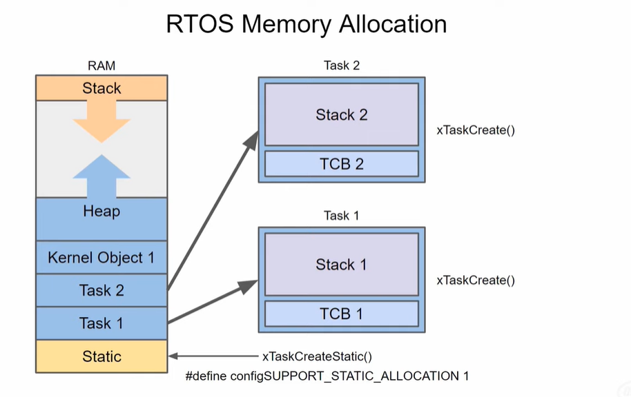

While writing code for an RTOS is memory management undestanding where data stored in memory will help us stack overflows and memory leaks.

```C
int global_variable;
static in static_variable;

void someFunction(int some_argument) {
    static int local_static_variable;
    int local_variable;
    int *dynamic_ptr;

    dynamic_ptr = (int*)malloc(32 * sizeof(int));
    //Do something here
    free(dynamic_ptr);
}
```

Your compiler know how much memory is required for global and static variables when it's finished compiling.


> The heap called like the stack it can grow as the program runs and it usually grows toward the stack. The heap is used for dynamic allocation where you the programmer explicitly tells the memory to create space for what you're about to store you would normally do this with a function like malloc. Note that it is required to free up any memory you dynamically allocated when you are done using it if you forget to do so like at the end of a function. You could cause the heap to contniue growing indefinetely. This is knows as a memory leak and sometimes difficult to track down.

> Additionally the heap and stack could run into each other if you let them grow unbounded and start overwriting each other's memory. This is also bad and could cause some nasty undefined effects. There is some protection like **malloc return null** if it cant dynamically create new memory, you might also find that your microcontroller just throws an error and resets.

## Lets look at how freertos allocated memory at run time



. When you create a new task that task is assigned a portion of memory from the heap. That portion is divided up into a task control block or tcb and a stack unique to that task.

. The tcb is a struct that keeps vital information about the task such as the location of the task's stack and the task's priority level.

. The stack is what we saw earlier when caling xTaskCreate() or xTaskCreatePinToCore, we tell the os how much heap to set aside to act as a stack for our particular task. if we dont set aside enough we can start to unintentionally overwrite parts of memory causing undefined behavior or reset the processor.

. Each task we create will automatically set aside a new tcb and stack inside the heap. When we start talking about kernel objects like queues and semaphores these will be stored in the heap as well. Note that there is a way to allocate static memory for tasks and kernel objects in newer versions of freeRTOS. This can be really useful in critical applications like medical devices or satellites where a memory leak could ne catastrophic. To enable this you need to define the configSUPPORT_STATIC_ALLOCATION as one right now. It doesnt seem that esp-idf has this set by default. So we cant use static task out of the box with our esp32.

. Whenever you dynamically allocate memory. Your program will attempt to find the largest contiguous block of heap available and give that to you. If you 're constantly allocating freeing heap. You may end up fragmenting it which could result in it growing toward the stack more quickly even if you have some free spots avaible. Because of that freeRTOS gives you a few heap allocation schemes that you can choose from. When you're including the freeRTOS code in you own build system. You must pick one of these source files as you heap management scheme. 


> **Heap_1** doesnt allow memory to be freed.(doesnt permit memory to be freed) Prior to static allocation support you wanted to use this scheme to make parts of the heap act like static memory.

> FreeRTOS considers **Heap_2** to be obsolete. In favor of **Heap_4** which allows fragmented areas of the heap to be joined together. This helps reduce fragmentation. 

> Note that the normal c malloc and free functions are not thread safe and the time it takes for each to execute cannot be determined at compile time.

> **Heap_3** wraps the malloc and free functions to allow them to be thread safe.
> **Heap 5** is probably the most advanced as it allows non-contiguous sections of the heap to be allocated as a single block i personally see **Heap 4** being used most often or if it's a critical application where the coding standard does not allow for dynamic allocation the programmer will stick to heap 1 or static allocation. I recommend reading about the heap allocation schemes on this free rtos page if you want to know more the esp32 has several different types of ram and as a result the heap allocation scheme is a little more complicated than the one used for vanilla freeRTOS we won't get into the esp32 specific heap allocation scheme here but know you can head to this page in the docs to read more about it what we really care about is making sure we don't run out of stack space in each of our tasks and that we don't run out of total heap 


## EXAMPLE

```C
xTaskCreatePinnedToCore(testTask, "TestTask", 1024, NULL, 1, NULL, app_cpu);
```


```C
void testTask(void *parameter) {
    while(1) {
        int a = 1;
        int b[100];
        for ( int i = 0; i < 100; i++ ) {
            b[i] = a + 1;
        }
        Serial.println(b[0]);
    }
}
```

- Lets start with a pretty big array say which is 400 bytes. We only gave one kb of stack and around 768 bytes of that is overhead. This array should easily take up more stack memory than what we have left. if we run this we might see the output a few times but the processor resets after a few moments.
- This is usually a good indication that we overflowed our allocated stack buffer.


- The stack canary watchpoint refers to the fact that the operating system sets some known values to the last few bytes in stack and checks them periodically. If they changed from those known values then this error is thrown and the processor resets. It's a safety check to prevent a stack overflow and while you can change this error catching behavior i dont recomment doing that for now to fix.

- We know that 768 bytes is required for overhead so any local variables must be added on top of that plus a little extra as a safety net. If you change the stack size of task to 1500 bytes. you will see the program without issue.


- Another think you can do is call the **uxTaskGetStackHighWaterMark(NULL)** with this API you can know how many bytes you have left in the tasks stack. Note that it's reported in words. So you'd want to multiply this by 4 to get the available bytes **(In ESP32 words is 4 bytes)**. If this starts to approach zero you know you're about to overflow your stack and you'll likely trigger that canaryerror and reset.

. We can also watch the total amount of heap memory available to us with the **xPortGetFreeHeapSize()**. Unlike the previous one this gives us total available heap in bytes rather than words. 

- Let's see what happens when we print out the heap size before and after we use malloc to allocate some memory. In vanilla freeRTOS unless you are using the **heap3** scheme you'll want to use **xPortGetFreeHeapSize()** as regular malloc is not thread safe. In esp-idf you can use regular malloc but i'd like to keep this as close to vanilla freeRTOS as possible. 


```C
void testTask(void *parameter) {
    while(1) {
        int a = 1;
        int b[100];
        for ( int i = 0; i < 100; i++ ) {
            b[i] = a + 1;
        }
        Serial.println(b[0]);

        //Print out remaining stack memory (words)
        printf("Remaining Stack Memory %d (words)\n", uxTaskGetStackHighWaterMark(NULL));

        printf("Heap before malloc %d (bytes)\n", xPortGetFreeHeapSize());
        int *ptr = (int*)pvPortMalloc(1024 * sizeof(int));

        for ( int i = 0; i < 1024; i++ ) {
            ptr[i] = 3;
        }

        printf("Heap after malloc %d (bytes)\n", xPortGetFreeHeapSize());

        vTaskDelay(100 / portTICK_PERIOD_MS);
    }
}
```


> we forgot the free memory with ***vPortFree(ptr)** which is also thread-safe. First check to prevent this from happening in the future malloc and **pvPortMalloc** should return null if it's out of heap memory. 


```C
void testTask(void *parameter) {
    while(1) {
        int a = 1;
        int b[100];
        for ( int i = 0; i < 100; i++ ) {
            b[i] = a + 1;
        }
        Serial.println(b[0]);

        //Print out remaining stack memory (words)
        printf("Remaining Stack Memory %d (words)\n", uxTaskGetStackHighWaterMark(NULL));

        printf("Heap before malloc %d (bytes)\n", xPortGetFreeHeapSize());
        int *ptr = (int*)pvPortMalloc(1024 * sizeof(int));

        if ( ptr == NULL ) {
            printf("Not enough heap.");
        } else {
            for ( int i = 0; i < 1024; i++ ) {
                ptr[i] = 3;
            }
        }

        //Free up our allocated memory
        vPortFree(ptr);

        printf("Heap after malloc %d (bytes)\n", xPortGetFreeHeapSize());
        vTaskDelay(100 / portTICK_PERIOD_MS);
    }
}
```
