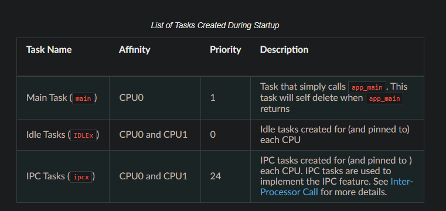
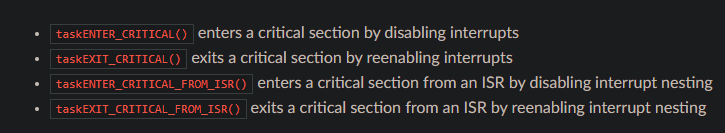
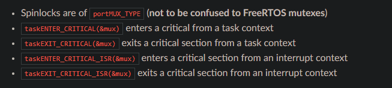

## Overview

> The ESP32 doesnt run Vanilla FreeRTOS. Rather it runs a modified version of FreeRTOS inside its ESP-IDF framework. Most ESP32s you come across will have a dual-core processor and use a symmetric multiprocessing or SMP architecture. This is when you have two or more cores that share memory and other resources. Most modern desktop or laptop microprocessors use an SMP architecture to support multiple cores. 

The original FreeRTOS (hereinafter referred to as Vanilla FreeRTOS) is a small and efficient Real Time Operating System supported on many single-core MCUs and SoCs. However, numerous ESP targets (such as the ESP32 and ESP32-S3) are capable of dual core symmetric multiprocessing (SMP). Therefore, the version of FreeRTOS used in ESP-IDF (hereinafter referred to as ESP-IDF FreeRTOS) is a modified version of Vanilla FreeRTOS v10.4.3. Theses modifications allow ESP-IDF FreeRTOS to utilize the dual core SMP capabilities of ESP SoCs.

- **Tasks and Task Creation:** Use xTaskCreatePinnedToCore() or xTaskCreateStaticPinnedToCore() to create tasks in ESP-IDF FreeRTOS. The last parameter of the two functions is xCoreID. This parameter specifies which core the task is pinned to. Acceptable values are 0 for PRO_CPU, 1 for APP_CPU, or tskNO_AFFINITY which allows the task to run on both.

- **Scheduler Suspension::** Suspending the scheduler in ESP-IDF FreeRTOS will only affect the scheduler on the the calling core. In other words, calling vTaskSuspendAll() on PRO_CPU will not prevent APP_CPU from scheduling, and vice versa. Use critical sections or semaphores instead for simultaneous access protection.

- **Tick Interrupt Synchronicity:** Tick interrupts of PRO_CPU and APP_CPU are not synchronized. Do not expect to use vTaskDelay() or vTaskDelayUntil() as an accurate method of synchronizing task execution between the two cores. Use a counting semaphore instead as their context switches are not tied to tick interrupts due to preemption.

- **Critical Sections & Disabling Interrupts:**  In ESP-IDF FreeRTOS, critical sections are implemented using mutexes. Entering critical sections involve taking a mutex, then disabling the scheduler and interrupts of the calling core. However the other core is left unaffected. If the other core attemps to take same mutex, it will spin until the calling core has released the mutex by exiting the critical section.

- **Task Deletion:**  Task deletion behavior has been backported from FreeRTOS v9.0.0 and modified to be SMP compatible. Task memory will be freed immediately when vTaskDelete() is called to delete a task that is not currently running and not pinned to the other core. Otherwise, freeing of task memory will still be delegated to the Idle Task.


## Symmetric Multiprocessing

SMP (Symmetric Multiprocessing) is a computing architecture where two or more identical CPUs (cores) are connected to a single shared main memory and controlled by a single operating system. In general, an SMP system…

- Two identical cores known as CPU0 (i.e., Protocol CPU or PRO_CPU) and CPU1 (i.e., Application CPU or APP_CPU). This means that the execution of a piece of code is identical regardless of which core it runs on.

> The “PRO_CPU” and “APP_CPU” aliases for CPU0 and CPU1 exist in ESP-IDF as they reflect how typical IDF applications will utilize the two CPUs. Typically, the tasks responsible for handling wireless networking (e.g., WiFi or Bluetooth) will be pinned to CPU0 (thus the name PRO_CPU), whereas the tasks handling the remainder of the application will be pinned to CPU1 (thus the name APP_CPU).


## Tasks
- In an SMP system, tasks need to be assigned a particular affinity. Therefore, ESP-IDF provides a PinnedToCore version of Vanilla FreeRTOS’s task creation functions.
- The PinnedToCore versions of the task creation functions API differ from their vanilla counter parts by having an extra xCoreID parameter that is used to specify the created task’s core affinity. The valid values for core affinity are:
- - 0 which pins the created task to CPU0
- - 1 which pins the created task to CPU1
- - tskNO_AFFINITY which allows the task to be run on both CPUs

> Note that ESP-IDF FreeRTOS still supports the vanilla versions of the task creation functions. However, they have been modified to simply call their PinnedToCore counterparts with tskNO_AFFINITY.

- The anatomy of a task in ESP-IDF FreeRTOS is the same as Vanilla FreeRTOS. More specifically, ESP-IDF FreeRTOS tasks:
- - Can only be in one of following states: Running, Ready, Blocked, or Suspended.
- - Task functions are typically implemented as an infinite loop
- - Task functions should never return

## Deletion

- When deleting a task that is pinned to the other core, that task's memory is always freed by the idle task of the other core(due to the need to clear FPU registers.)
- When deleting a task that is currently running on the other core, a yield is triggered on the other core and the task’s memory is freed by one of the idle tasks (depending on the task’s core affinity)

- A deleted task's memory is freed immediately if..
- - The tasks is currently running on this core and is also pinned to this core
- - The task is not currently running and is not pinned to any core

- Users should avoid calling vTaskDelete() on a task that is currently running on the other core. This is due to the fact that it is difficult to know what the task currently running on the other core is executing, thus can lead to unpredictable behavior such as…
- - Deleting a task that is holding a mutex
- - Deleting a task that has yet to free memory it previously allocated

Best way to implement deleting taks:
- - Tasks self deleting (via vTaskDelete(NULL)) when their execution is complete and have also cleaned up all resources used within the task.

## Preemption

- Users should not assume that the two highest priority ready state tasks are always run by the scheduler as a task’s core affinity must also be accounted for. For example, given the following tasks:
- - Task A of priority 10 pinned to CPU0
- - Task B of priority 9 pinned to CPU0
- - Task C of priority 8 pinned to CPU1

> The resulting schedule will have Task A running on CPU0 and Task C running on CPU1. Task B is not run even though it is the second highest priority task.

- In Vanilla FreeRTOS, the scheduler can preempt the currenty running task if a higher priority task becomes ready to execute. Likewise in ESP-IDF FreeRTOS if the scheduler determines that a higher priority tasks can run on that core, each core can be individually preempted by the scheduler. However, there are some instances where a higher priority task that becomes ready can be run on multiple cores. In this case, the scheduler will only preempt one core. The scheduler always give preference to the current core when multiple cores can be preempted. 
>  In other words, if the higher priority ready task is unpinned and has a higher priority than the current priority of both cores, the scheduler will always choose to preempt the current core. 

- Task A of priority 8 currently running on CPU0
- Task B of priority 9 currently running on CPU1
- Task C of priority 10 that is unpinned and was unblocked by Task B

The resulting schedule will have Task A running on CPU0 and Task C preempting Task B given that the scheduler always gives preference to the current core.

> The Vanilla FreeRTOS scheduler implements time slicing meaning that if current highest ready priority contains multiple ready tasks, the scheduler will switch between those tasks periodically in a round robin fashion.

## Tick Interrupts

- Incrementing the scheduler’s tick count
- Unblocking any blocked tasks that have timed out
- Checking if time slicing is required (i.e., triggering a context switch)
- Executing the application tick hook


> In ESP-IDF FreeRTOS, each core will receive a periodic interrupt and independently run the tick interrupt. The tick interrupts on each core are of the same period but can be out of phase. Furthermore, the tick interrupt responsibilities listed above are not run by all cores:

- CPU0 will execute all of the tick interrupt responsibilities listed above
- CPU1 will only check for time slicing and execute the application tick hook
> CPU0 is solely responsible for keeping time in ESP-IDF FreeRTOS. Therefore anything that prevents CPU0 from incrementing the tick count (such as suspending the scheduler on CPU0) will cause the entire schedulers time keeping to lag behind.

## Idle Tasks
- Vanilla FreeRTOS will implicitly create an idle task of priority 0 when the scheduler is started. The idle task runs when no other task is ready to run, and it has the following responsibilities:
- - Freeing the memory of deleted tasks
- - Executing the application idle hook

> In ESP-IDF FreeRTOS, a separate pinned idle task is created for each core. The idle tasks on each core have the same responsibilities as their vanilla counterparts.

## Disabling Interrupts
- Vanilla FreeRTOS allows interrupts to be disabled and enabled by calling taskDISABLE_INTERRUPTS and taskENABLE_INTERRUPTS respectively.
> ESP-IDF FreeRTOS provides the same API, however interrupts will only disabled or enabled on the current core.

## Startup and Termination
- Unlike Vanilla FreeRTOS, users must not call vTaskStartScheduler(). Instead, ESP-IDF FreeRTOS is started automatically. The entry point is a user defined void app_main(void) function.
- - Typically, users would spawn the rest of their applications task from app_main.
- - The app_main function is allowed to return at any point (i.e., before the application terminates).
- - The app_main function is called from the main task.



> ESP-IDF FreeRTOS does not support scheduler termination. Calling vTaskEndScheduler() will simply cause the application to abort.


## Critical Sections
Vanilla FreeRTOS implements critical sections in vTaskEnterCritical which disables the scheduler and calls portDISABLE_INTERRUPTS. This prevents context switches and servicing of ISRs during a critical section. Therefore, critical sections are used as a valid protection method against simultaneous access in vanilla FreeRTOS.



- On the other hand, the ESP32 has no hardware method for cores to disable each other’s interrupts. Calling portDISABLE_INTERRUPTS() will have no effect on the interrupts of the other core. Therefore, disabling interrupts is NOT a valid protection method against simultaneous access to shared data as it leaves the other core free to access the data even if the current core has disabled its own interrupts.
- For this reason, ESP-IDF FreeRTOS implements critical sections using special mutexes, referred by portMUX_Type objects on top of specific spinlock component and calls to enter or exit a critical must provide a spinlock object that is associated with a shared resource requiring access protection. When entering a critical section in ESP-IDF FreeRTOS, the calling core will disable its scheduler and interrupts similar to the vanilla FreeRTOS implementation. However, the calling core will also take the locks whilst the other core is left unaffected during the critical section. If the other core attempts to take the spinlock, it will spin until the lock is released. Therefore, the ESP-IDF FreeRTOS implementation of critical sections allows a core to have protected access to a shared resource without disabling the other core. The other core will only be affected if it tries to concurrently access the same resource.



> The critical section API can be called recursively (i.e., nested critical sections). Entering a critical section multiple times recursively is valid so long as the critical section is exited the same number of times it was entered. However, given that critical sections can target different spinlocks, users should take care to avoid dead locking when entering critical sections recursively.

## Implementation
In ESP-IDF FreeRTOS, the process of a particular core entering and exiting a critical section is as follows:

- For taskENTER_CRITICAL(&mux) (or taskENTER_CRITICAL_ISR(&mux))
- 1. The core disables its interrupts (or interrupt nesting) up to configMAX_SYSCALL_INTERRUPT_PRIORITY
- 2. The core then spins on the spinlock using an atomic compare-and-set instruction until it acquires the lock. A lock is acquired when the core is able to set the lock’s owner value to the core’s ID.
- 3. Once the spinlock is acquired, the function returns. The remainder of the critical section runs with interrupts (or interrupt nesting) disabled.

- For taskEXIT_CRITICAL(&mux) (or taskEXIT_CRITICAL_ISR(&mux))
- 1. The core releases the spinlock by clearing the spinlock’s owner value
- 2. The core re-enables interrupts (or interrupt nesting)

>  Given that interrupts (or interrupt nesting) are disabled during a critical section, there are multiple restrictions regarding what can be done within a critical sections. During a critical section, users should keep the following restrictions and considerations in mind:
> - Critical sections should be as kept as short as possible
> - - The longer the critical section lasts, the longer a pending interrupt can be delayed.
> - - A typical critical section should only access a few data structures and/or hardware registers
> - - If possible, defer as much processing and/or event handling to the outside of critical sections.
> - FreeRTOS API should not be called from within a critical section
> - Users should never call any blocking or yielding functions within a critical section


```C
portMUX_TYPE myMutex = portMUX_INITIALIZER_UNLOCKED;
taskENTER_CRITICAL(&myMutex);
//critical section
taskEXIT_CRITICAL(&myMutex);
```
