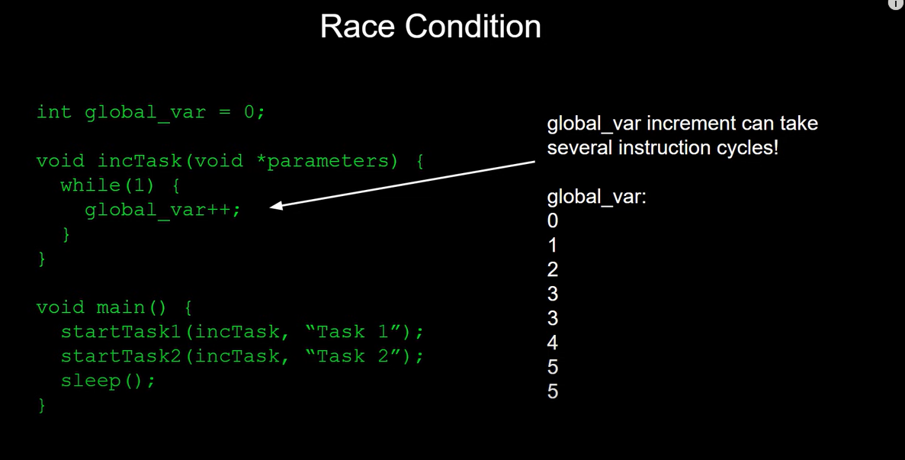
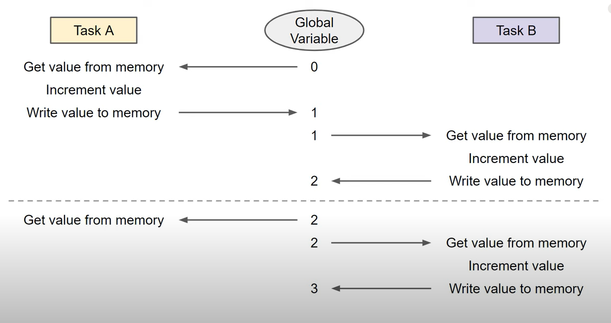
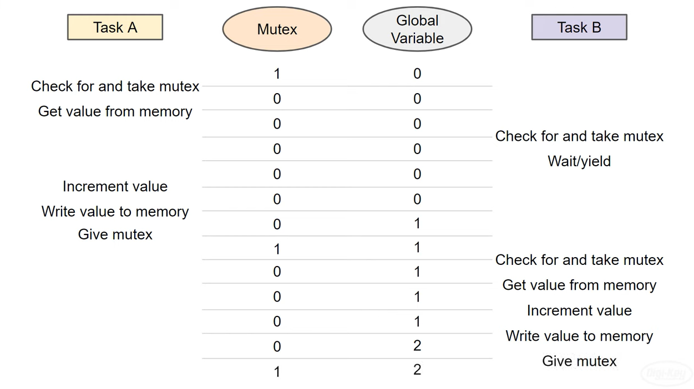

## Overview



This is a classic race condition written in pseudocode and it's a common problem in concurrent programming. We'll dive more into it in this episode. But know that we can run into issues when two or more tasks work with a shared resource like this. Global variable if it takes more than one instruction cycle to read modify and write a shared resource. We can't control when the other threads will interrupt and try to do the same. This can result in some erratic behavior but we can fix it by using some clever tools like semaphores and mutexes.


> We've already seen how queues can be used as a form of inter-task communication to avoid issues with shared resources but what happens if you need to use something like a global variable as a flag or a counter where a queue won't be able to do you much good.




Incrementing a variable in memory like this in most architectures requires a few instruction cycles let's see how this might work in diagram form. We've got our two tasks and a shared global variable which we'll say starts at zero task. A first runs and retrieves the value of the global variable it then increments it which might take one or more instruction cycles depending on your architecture and then it writes the value back to memory Task B does the exact same thing most often this is how we expect incrementing a global variable to happen each time a task runs the global variable increments by one. However a race condition can easily occur if one task interrupts the other for example let's say task A retrieves the value of the global variable from memory it stores it locally while working on it this might be a register cache memory or some other location a context switch happens and Task B now runs interrupting Task A. It retrieves the value of the global variable but because Task A did not finish writing back to it the value is still 2. Task b finishes its job of incrementing the number and writing the value of 3 back to the global variable. It then yields to task A<> Remember that at this point Task A is still holding the value of 2 locally it increments it to 3 and writes 3 back to the global variable. Wait a minute both tasks ran and the global variable only incremented by 1 this time. uh oh This is a race condition. How the global variable gets incremented is dependent on the exact order of execution of instructions in the tasks and since we can't necessarily assume they will run in a particular order as tasks can preempt each other we might run into problems with shared resources.

## Protecting Shared Resources and Synchronizing Threads
- **Queue:** pass messages(data) between threads
- **Lock:** allows only one thread to enter the "locked" section of code
- **Mutex**: Like a lock, but system wide
- **Semaphore**: allows multiple threads to enter a critical section of code


> If we're only running one process in our freeRTOS environment a lock is the same as a mutex. A semaphore is similar to a mutex but it contains a counter that allows a limited number of threads to enter a critical section at a time. In practice a semaphore is used as a way to signal to other threads.


Imagine a small coffee shop in some major city. There's only one restroom and to control access to it the owner places a key in a basket that sits on the counter. The restroom is like our shared resource only one person or thread can access it at a time. The key is analogous to our mutex. You take the key when you wish to use the shared resource the restroom. When you're done you give the key back. If someone else wishes to use the restroom while you're in it they'll see that the key is not there and wait. Once the key is returned they take it and use the shared resource.



A mutex is another shared object that both of our threads have access to and it can be represented as a simple zero or one boolean value. Task A will begin by checking to see if the mutex exists and taking it if so. Note that this action must be atomic meaning no other tasks can interrupt it in the process of checking for and taking the mutex. Some processor architectures have special test and set assembly instructions that allow this to occur in one instruction cycle. If the mutex is available the value is set to 0 and task A is said to have the lock or mutex. It can then perform whatever actions are needed in the critical section. Let's say it starts by copying the global variable value from memory but then Task B preempts it. Task B will want to execute the same critical section but it must first check to see if the mutex is available. Since it is not available the check will fail. At this point Task B can yield to another task or go do something else before checking the mutex again. When the scheduler returns execution to Task A again it can finish whatever it was doing in the critical section. For us that includes incrementing the global variable and writing it back to memory. When it's done with the critical section it gives the mutex back which just means the shared mutex value is set to 1. When Task B runs again it finds that the mutex is available this time so it takes it and executes its critical section. It increments the global variable and writes it back to memory. Other threads may be able to interrupt the process but they cannot access the same global variable as it's protected by a mutex now. When Task B is done it returns the mutex. This mutex acts just like the key to our imaginary restroom only allowing one thread to execute a critical section at a time. 
 

```C
#include "stdio.h"
#include "freertos/FreeRTOS.h"
#include "freertos/task.h"
#include "freertos/semphr.h"
#include "string.h"

static SemaphoreHandle_t xMutex;

void task1(void* vParam) {
    for ( ;; ) {
        if ( xSemaphoreTake(xMutex, 500) == pdTRUE ) {
            printf("Task1 took xMutex \n");
            vTaskDelay(1000 / portTICK_PERIOD_MS);
            printf("Task1 giving xMutex \n");
            xSemaphoreGive(xMutex);
            printf("Task1 gave xMutex \n");
        } else {
            printf("Task1 can't take mutex\n");
        }
    }
}

void task2(void* vParam) {
    for ( ;; ) {
        if ( xSemaphoreTake(xMutex, 500) == pdTRUE ) {
            printf("Task2 took xMutex \n");
            vTaskDelay(1000 / portTICK_PERIOD_MS);
            printf("Task2 giving xMutex \n");
            xSemaphoreGive(xMutex);
            printf("Task2 gave xMutex \n");
        } else {
            printf("Task2 can't take mutex\n");
        }
    }
}

void app_main() {
    xMutex = xSemaphoreCreateMutex();
    xTaskCreatePinnedToCore(task1, "task-1", 1700, NULL, 10, NULL, 1);
    xTaskCreatePinnedToCore(task2, "task-2", 1700, NULL, 10, NULL, 1);
}
```

> In a program like the one above:
> - If the priorities of the tasks are equal, after the semaphore is given, it immediately happens contex switch.
> - If the priority of one task is higher than the other, it will not allow the other task to run at all.
