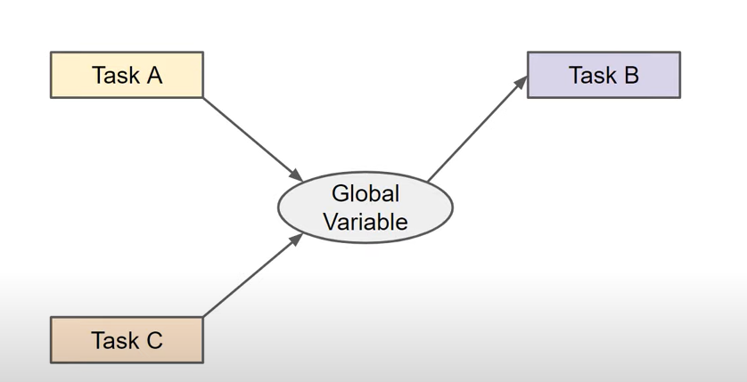
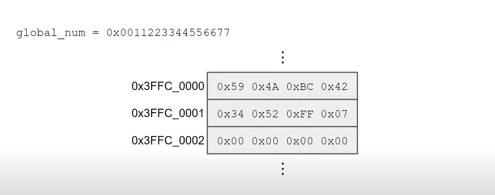
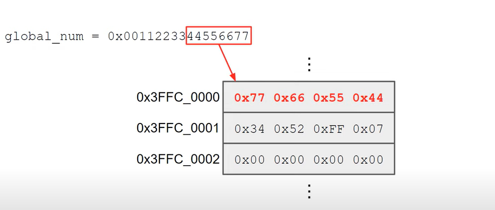
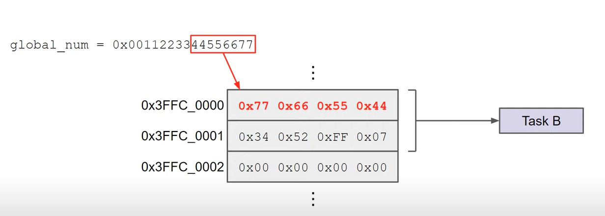
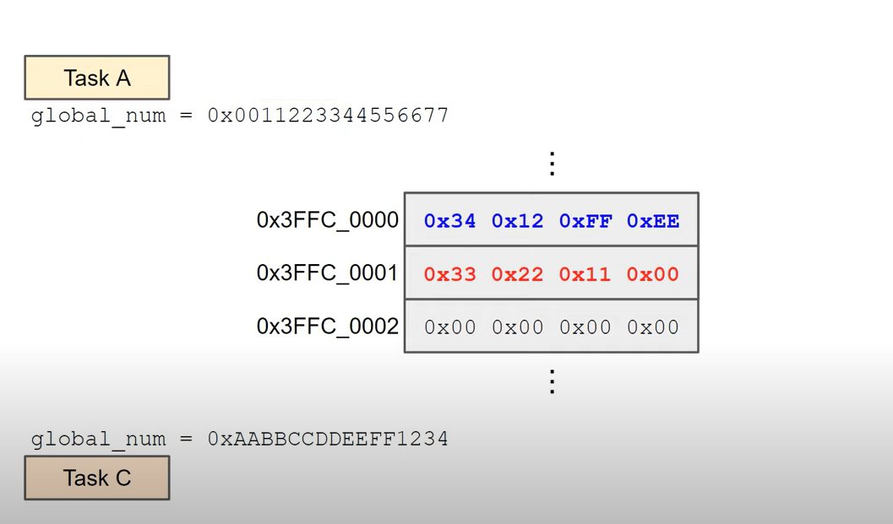
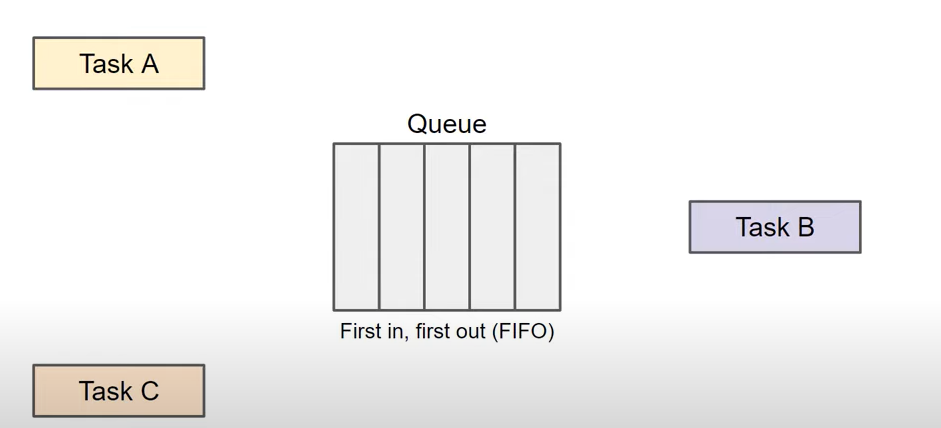
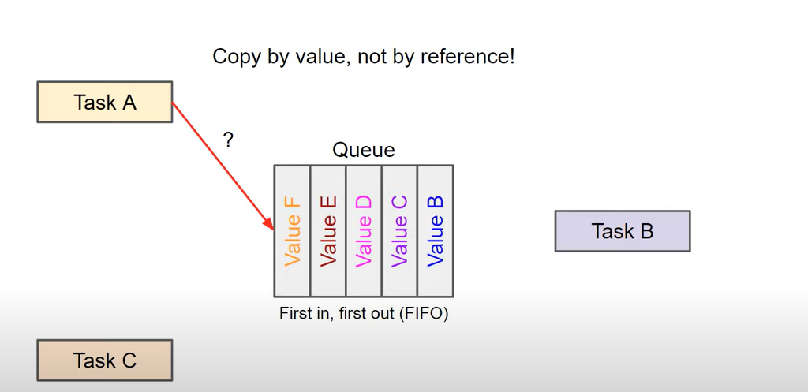

> Use queue when you need to avoid issues with shared resources in inter-task communication.

When we write a multi-threaded program it looks something like this:


What happens if another thread also wants to send the same kind of information to Thread B. In this scenario it's possible that Task A changes the global variable then Task C changes it again before Task B gets a chance to read it. 



It can get even more sinister than that if you're working with 32-bit data in a 32-bit machine, you can generally read and write numbers to memory in a single instruction cycle. However what if you're
working with something larger than the data width of your memory. Let's look at an example the ESP32's memory is 32 bits wide if we wanted to save a 64-bit number to memory it would require two places in memory and two write instructions Because the ESP32 is little endian it would save the first half of the 64-bit number first like this.



Ideally it would save the second half next in the following memory address but. Let's say that at this moment Task B interrupts us and reads the 64-bit number from memory oh again this 64-bit global variable is not thread safe as we can't guarantee it will be written or read without being interrupted by another Task when Task B tries to read this number half of it will be overwritten giving us garbage data. 



Here's another possible scenario let's say Task A begins writing a piece of data to memory. This can be a multiple word value like in the previous example or several variables that are supposed to be together like a struct. During that writing process Task C preempts Task A and then writes its own values to the same global variable or struct. It overwrites all of the data when it's done Task A picks up where it left off writing the rest of the data. As you can see this creates another problem as the data no longer reflects what either Task A or Task C intended.




There are a few ways to prevent this from happening one way is to use atomic operations which guarantee that certain instructions and memory accesses can be done in a single instruction cycle or without being interrupted. These are often dependent on the availability of certain assembly instructions though. Another way is to use kernel objects to tell other Tasks not to mess with our data. A mutex or semaphore could help here but we'll cover those in future episodes what we want is a queue which allows us to pass uninterrupted messages between Tasks.




It is simple first in first out system. In most embedded applications they usually have global scope so that they can be accessed by all tasks. Now Task A can copy in some data to the queue and it will appear at the front of the queue. As long as we use the built-in kernel functions writing to a queue is atomic which means that another task cannot interrupt it during the writing process. Also note that adding something to a queue is done by value and not by reference that means whenever you save something to the queue the entire contents of that variable struct string or buffer are copied. You can place a pointer into a queue but you'll want to be sure the referenced value is still in scope by the time the pointer is read by the receiving task. FreeRTOS queues are not bound by type so you can ideally copy anything you want to them assuming you've allocated enough memory space for each element. You can keep filling up the queue so long as there are enough elements. Another Task asynchronously reads from the queue at any time. This will remove the first item in the queue and cause all other items to shift forward by one element freeing up another spot for the other tasks to write to. We can set a timeout in the receiving task to wait a specified number of ticks if the queue is empty. If no new tasks are placed in the queue during that time the receive function will return a false status code letting us know that nothing was read. Similarly if the queue is full a sending task can be set to wait a number of ticks before the send function times out with a false status code. Once again this lets us know that a task couldn't use the queue and we can try again or drop the item. That or maybe we just need to make the queue bigger. 



## Standart
```C
xQueueCreate()
vQueueDelete()
xQueueSend()
xQueueSendToBack()
xQueueSendToFront()
xQueueReceive()
```

## Static
There are static queues which means that the basic queues are created in heap memory.
```C
xQueueCreateStatic()
```

> Additionally you should not send or receive items from queue from within an interrupt service routine using these basic functions. That's because interrupts do not depend on the tick timer and shouldnt wait any amount of time for the queue. As a result you should use these special <code>...FromISR</code> functions when working with a queue inside an interrupt service routine.
```C
xQueueSendFromISR()
xQueueSendToBackFromISR()
xQueueSendToFrontFromISR()
xQueueReceiveFromISR()
```

This is the address of the local variable where the queue item will be copied to while it's not necessary i'll cast this address as a void pointer.

As a reminder that it's what the function expects the third parameter is the timeout in number of ticks. the Task will go into the block state for this many ticks while waiting for something to appear in the queue. If we set it to zero then it will return immediately.

Giving us pdTRUE if something was read from the queue or pdFalse if not. 

Next we'll call <code>xQueueSend()</code> giving it the handle to our queue and the address of our counter. Again i'll explicitly cast it as a void pointer. I'll also tell it to timeout after 10 ticks if it can't copy the value to the queue the function will return <code>pdFALSE</code> which we can check. 

> Note that it's generally a good idea to assign one hardware peripheral per Task which means that I should have my print messages task handle all serial input and output and not have serial commands in other tasks.

```C
#include <stdio.h>
#include "freertos/FreeRTOS.h"
#include "freertos/task.h"
#include "freertos/queue.h"
#include "string.h"

typedef struct {
    size_t messageId;
    char message[20];
} xMessage;

const size_t messageQueueSize = 5;
static QueueHandle_t messageQueue;

void task1(void *vParam) {
    xMessage _xMessage = {};
    for ( ;; ) {
        printf("Task-1 Remained stack size in words: %d \n", uxTaskGetStackHighWaterMark(NULL));
        if ( xQueueReceive(messageQueue, (void*)&_xMessage, 100) == pdTRUE ) {
            printf("Message id: %d, message: %s \n", _xMessage.messageId, _xMessage.message);
        }
        vTaskDelay(1000 / portTICK_PERIOD_MS);
    }
}

void task2(void *vParam) {
    xMessage _xMessage = {};
    for ( ;; ) {
        printf("Task-2 Remained stack size in words: %d \n", uxTaskGetStackHighWaterMark(NULL));
        if ( xQueueSend(messageQueue, (void*)&_xMessage, 100) != pdTRUE ) {
            printf("messageQueue is full \n");
        }
        vTaskDelay(1000 / portTICK_PERIOD_MS);
    }
}

void app_main(void) {
    messageQueue = xQueueCreate(messageQueueSize, sizeof(xMessage));
    xTaskCreatePinnedToCore(task1, "task-1", 1700, NULL, 10, NULL, 1);
    xTaskCreatePinnedToCore(task2, "task-2", 1700, NULL, 11, NULL, 1);
    if ( messageQueue == 0 ) {
        printf("Queue couldnt created \n");
    }    
}
```
