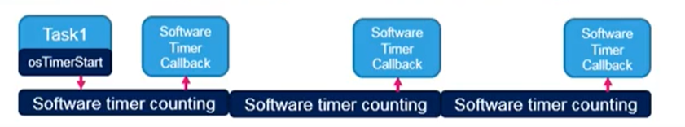
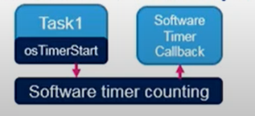

There are two types of the timer events.
- Periodic(execute its callback periodically with autoreload functionality)

- One Pulse(execute its callback only once with an option of manuel re-trigger)

timers are incredibly useful when writing programs they allow us to delay the execution of a function or execute a function periodically sometimes the overhead of a task is too much to do this so we can rely on timers instead rather than waste a hardware timer in a microcontroller we can use timers to accomplish this [Music] doing something periodically on a microcontroller is a very common task this could be blinking an led refreshing an lcd pulling a sensor or sending a pulse to a servo motor often we want to control exactly when this happens let's say we have some periodic function interrupt task a every 220 milliseconds to do something like pull a temperature sensor if we really only had one task we probably don't need an rtos but let's say we've got other tasks that i'm just not showing here there are a number of ways to execute this polling function periodically the most obvious way is to create a separate task and use vtask delay to keep the task in the block state until it's ready to execute again however creating a task just to sample something requires a lot of overhead as we saw a new task in free rtos on the esp32 requires close to one kilobyte another way to accomplish this is to use the x task get tick count in an existing task like task a this function gives you the number of ticks that have elapsed since the scheduler was started which is similar to the millis function in arduino we can periodically check the elapsed time against some timestamp to determine if we need to run our function remember that the tick timer is set to a default of one millisecond so if we need more precision than one millisecond you'll likely need to use a hardware timer however microcontrollers have a limited number of these timers available and your code will not be very portable as it will need to configure the timer and handle events in a manner unique to that architecture finally we have software timers which are available to us at the operating system level free rtos gives us the ability to create such timers that can call arbitrary functions when they expire note that they are dependent on the tick timer so we will not be able to achieve a timer precision more than one tick which is one millisecond in our case these are similar to software interrupts but operate at the task level let's see how that works when we include the free rtos timer library it will create a unique task that runs in the background when the scheduler starts this task is known as the timer service task or the timer daemon it is responsible for maintaining a list of timers and calling the associated callback function when one of them expires note that this task does not continuously run thanks to the list of timers it maintains it can simply block itself and wake up when the tick timer reaches one of those times when that happens we say that the timer has expired and the task will call the associated function this function is known as a callback function as it's passed to the timer as an argument and invoked inside the timer service task because of this the callback function runs at the same priority level as the timer service task we want to treat these timer callbacks in a similar manner as interrupt service routines so we want them to perform their actions quickly and never block as a result you should generally not use things like delay functions or allow for blocking when using cues mutexes and semaphores inside these callbacks you do not want to control this task directly instead freertos gives us a q and some api functions to access that queue we send commands to the timer service task by calling those api functions which place commands on the queue the service task will read commands from the queue and perform the necessary steps to create a new timer start stop restart and so on even though this design does introduce the overhead of having a new task it allows us to have one task that controls many different timers to use timers in free rtos you will want to open the freertos config.h file for the esp32 in arduino this is in the esp32 packages folder hardware esp32 version number tools sdk include free rtos and free rtos scroll down to find the config use timers setting and set it to 1 if it's not set already the esp32 version of freertos includes timer support by default so we won't need to do anything here note that you can also change the other settings such as the timer service task priority command queue length and task stack size if we track these down in the esp32 config file we can see that the timer service task priority defaults to 1 the queue length is 10 and the stack depth is 2 kilobytes remember that this will be in words instead of bytes if you're working in vanilla free rtos next let's take a look at the available api functions just like we do for kernel objects we can create and delete timers we can also start stop and reset individual timers notice that we have a variety of from isr functions if you're sending commands to the timer service task from within an interrupt service routine you'll want to use these from isr functions where available you do not want to block inside of an isr which can happen if the queue is full so these from isr functions won't block if you're unable to send a command to the queue note that you can call x timer git timer daemon task handle to get a handle to the service task it's really not recommended but you could get the handle to do things like raise the priority level of the timers if you want to change the priority level of the timer service task you're probably better off doing it in the config file so that it does not change at runtime that being said the esp32 port of freertos actually has this function disabled by default you'd have to set this include flag or adjust the priority level in the config file if you want the task to run at a different priority let's look at an example to see how to use software timers we'll start with a blank sketch if you're using vanilla free rtos you'll probably have to include timers.h in order to use the software timer api functions it comes included with the arduino esp32 package so we don't need to include it again here we'll stick to just one core again for our demo i'll create a handle to a one-shot timer a one-shot timer will call an arbitrary function after some time period but it will only call it once i'll create my timer callback function it should return nothing and accept a timer handle as a parameter this can be used to identify which timer called the function if multiple timers have the same function as their callback all we'll do is say that the timer expired to the serial terminal as i've been doing i'll create a divider before setup so you know where execution begins in setup let's configure the serial port and print out a welcome message after a brief delay we'll then call x timer create and assign the return value to our handle variable this function requires five parameters the first is a string for the name of the timer just like we do with tasks then we put in the length of the timer remember that this needs to be in ticks so if we want to set something in milliseconds we can divide our milliseconds value by the port tick period ms constant we can't go below one tick which means that we can't create a less than one millisecond timer with this particular free rtos configuration next is the auto reload setting auto reload allows the timer to continually expire and execute the callback much like the periodic example we saw earlier for now let's start with a one-shot timer so we'll set this to pd false the timer id is a pointer to something if we want to create a unique id for the timer we can use it to identify unique timers or we can update this parameter within the callback to remember data between callback calls for now let's just set the parameter to zero we need to cast it as a void pointer even though it's not actually a pointer finally we give it the name of our callback function because the timer uses heap memory to create the necessary structures it's possible x timer create will fail so it's a good idea to make sure we don't have a null pointer for our timer handle before continuing if we do i'll just print out a simple error message assuming the timer could be created we'll wait for another second print out a message saying that we're starting the timers and then actually start our timer using x timer start we need to provide x timer start with the timer handle and a timeout amount recall that commands to the timer task work through a queue which means we need to specify a cue wait time if the queue is full here i'll use port max delay to wait the maximum amount of time if needed this essentially says to wait forever if the queue is full finally i'll delete the setup and loop task so you can see that the timers will work without any other tasks running i'll make sure that nothing is in loop and then upload the program when it's done open a serial monitor you should see our welcome message followed by a starting timers message a second later a second after that you should see the message we set in the callback function and that's it because it's a one-shot timer it will not execute again unless we specifically restart the timer from another task let's add an auto-reload timer to see how it compares we'll add a separate timer handle as a global variable in setup we'll copy the one shot timer create function and make a few changes first we'll set the returned handle to our auto reload timer variable we'll update the name and change the period to 1000 milliseconds next we'll change the auto reload parameter to pd true so that the timer will execute again after expiring i'll change the id to 1 instead of 0 so we can tell the timers apart however i'll leave the callback function to be the same as the one shot timer callback i'll check to make sure neither timer handle is null after being created and start the auto reload timer just after the one shot timer in the callback function i'll now uniquely identify the calling timer to do that we pass the x timer parameter to the pv timer get timer id function which will return us the id we set during creation since it's not a pointer we'll want to cast it to something like an int or unsigned integer then we can compare it to the known timer ids timer id 0 refers to our one shot timer so we'll print a message showing that then we'll add another if statement to check if timer 1 expired that's our auto reload timer so i'll print a unique message here too let's upload this to our esp32 when we run it and open a serial monitor you should see that the auto reload timer expires first after one second followed by the one shot timer a second later however the auto reload timer keeps executing the callback function every second whereas the one shot timer simply stops i hope this helps you understand how to use the two basic timers in freertos and now for your challenge a common example of timers in microcontrollers is the lcd backlight auto dim feature let's pretend that the led on your esp32 is the backlight for an lcd so long as you're using the serial terminal and entering characters which will pretend is a menu on the lcd the led should turn on and stay on however after five seconds of inactivity the led should turn off your job is to echo characters to the serial terminal in a new task turn on the led when these characters are being entered and then use a software timer to turn off the led after five seconds from when the last character was entered here's a hint for you the x timer start function will restart a counter if it's called before the timer has expired on the next episode we'll look at integrating hardware interrupts with rtos tasks good luck and see you then [Music] 
you