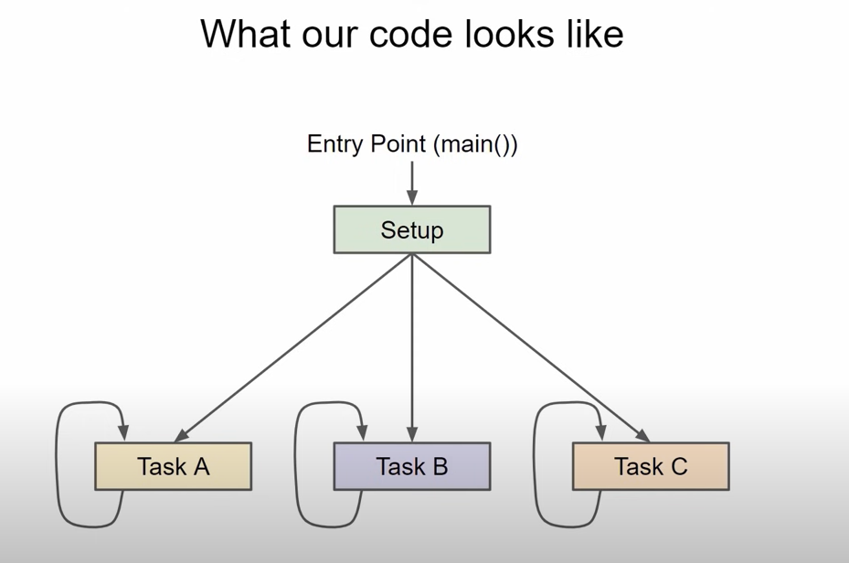
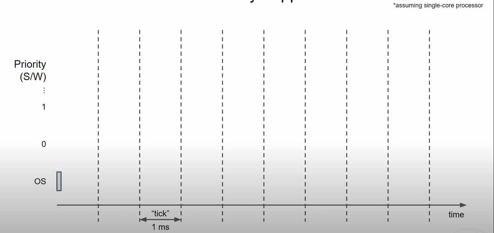
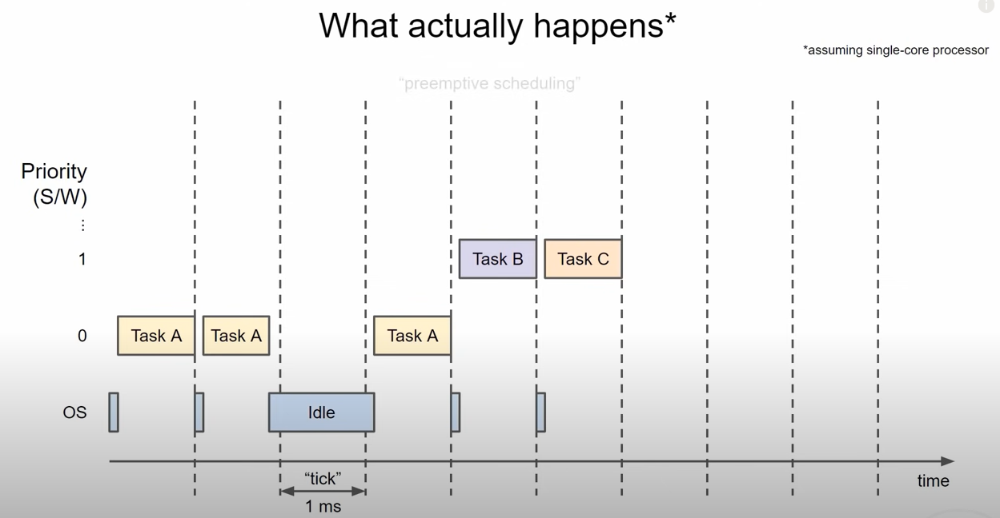
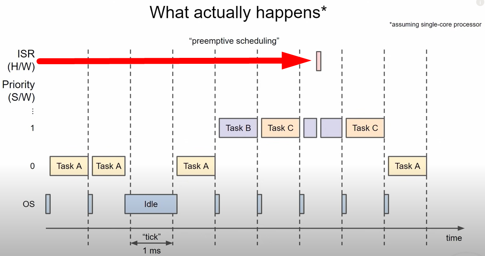
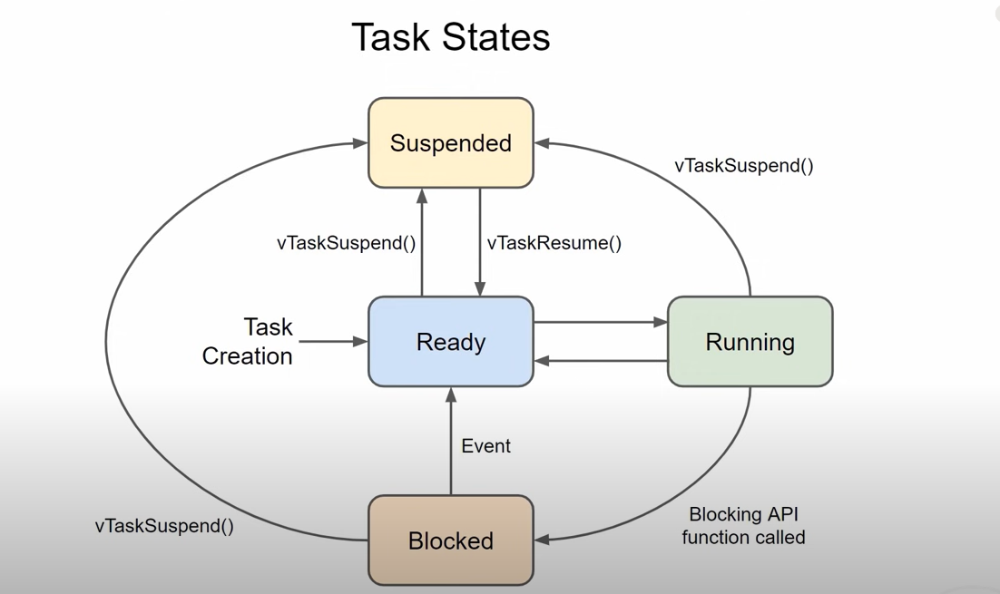

When we write a multi-threaded program it looks something like this:


> let's imagine that we're looking at processor utilization over time which moves from left to right if we only have one core available to us it needs to divide its time among the different tasks that we wrote most RTOS use a form of time slicing where one of the hardware timers interrupts the processor at regular intervals you'll commonly see a time slice of one millisecond in freeRTOS and that's exactly what's going on inside of our esp32 i've listed priority slots as the rows in this diagram and tasks can run in those slots depending on the priority we've given them.



> The operating system is required to run every time slice to figure out which task to schedule next. The timer calls this scheduler task at every interval which is one millisecond in our case.
this interval is also known as a tick. The scheduler looks at the tasks that need to run and chooses the one with the highest priority. Let's say that **task A** has a very low priority and it's the only task that needs to run. So the scheduler chooses it and task a runs for the rest of the time slice. The tick timer then interrupts the task and calls the schedular to run again. **Task A** not finished what it needs to do so the scheduler lets it finish running as there are still no other higher priority tasks. Before this interval is done **Task A** calls the <code>vTaskDelay</code> function for two ticks and enters the **blocked state**. The next time the scheduler is called counts as one of the ticks for that delay. However it still has one more tick to wait and the scheduler has no other tasks in the ready state. So the operating system just idles for one tick. At that point task a's delay is over and is ready to run again. So the scheduler lets it run at some point during this tick tasks B and C enter the ready state these are higher priority tasks but they still must wait for the next tick to run. when the scheduler runs this time it sees that tasks A B and C are all ready to run since B and C are priority one which is higher than A's priority zero they get scheduled to run b and c are equal priority and so the scheduler executes each task in turn in a round-robin fashion b and c will continue taking turns like this so long as they need to run.



> This is known as pre-emptive scheduling because cpu time is taken away from one task task A to run other higher priority tasks. Keep in mind that this is all done in software. We have not talked about hardware interrupts yet. Unless you do something in code to specifically disable hardware interrupts. A hardware interrupt will always have a higher priority over other software running. The only exception to this is that a hardware interrupt may or may not preempt another hardware interrupt service routine that's called nested interrupts and depends a lot on your particular hardware and configuration. It doesn't have much to do with the RTOS so we won't get into it
here. For now i recommend having only one interrupt service routine run at a time and trying to keep them as short as possible. whenever an isr is done running execution will return to whichever task was running once tasks B and C are complete or go into the blocked or suspended state the scheduler will then allow the lower priority task A to run.



> In a multi-core system a scheduler may choose to put some tasks on another core. For example if we let the esp-idf scheduler decide how to allocate tasks between the cores it may allow task B and task C to run at exactly the same time on separate cores. Because this makes some of the examples and demos more complicated. We'll stick to using one core for now. 

> The freeRTOS scheduler maintains a record of what state each task is in. When a task is created it automatically enters the **ready state**. Here the task is telling the scheduler that it's ready to run at any time. The scheduler can choose to run that task only if there are no other higher priority tasks waiting to run. If a task is not run because another task of equal or higher priority was chosen then it remains in the ready state if a task is chosen by the scheduler to run it will enter the **run state** and remain in that state while it is using the processor. If the processor has only one core then there can only be one task in the running state at any given time. The scheduler can move tasks between the ready and running states as needed at each tick. While running a task may call an api function that moves it to the **blocked state**. These api functions can be things like **vTaskDelay()** or waiting for a **queue** or **semaphore**. Tasks in the blocked state do not run on the processor and cannot be selected to enter the running state. Here the task will wait until the unblocking event has occurred like the delay timer expiring or a semaphore being released. The task will enter the ready state and wait to be scheduled for processor time. FreeRTOS has a <code>vTaskSuspend()</code> api function that allows you to put a task into the suspended state. You can call this function from within the task itself or from another task. In the suspended state a task cannot be selected to run just like the block state. However only an explicit call to the <code>vTaskResume</code> function will allow a task to go to the ready state. This is a good way to essentially put tasks to sleep if you don't want to rely on a timer like <code>vTaskDelay</code>. 



> When switching from one task to the next, the scheduler has the job of remembering exactly where the task left off and All of its working variables including values in ram and in the cpu registers. All of this information where the task was in the program instructions and working memory is known as a context. The process of saving it all and restoring another task's context is called **context switching**. 

- Internally, within the FreeRTOS implementation, tasks use two blocks of memory. The first block is used to hold the task's data structures. The second block is used by the task as its stack. If a task is created using xTaskCreate() then both blocks of memory are automatically dynamically allocated inside the xTaskCreate() function. 
- If a task is created using xTaskCreateStatic() then the application write must provide the required memory.
- xTaskCreateStatic() therefore allows a task to be created without using any dynamic memory allocation. xTaskCreateStatic() for a version that does not use any dynamic memory allocation. 
> xTaskCreate() can only be used to create a task that has unrestricted access to the entire microcontroller memory map.

```C
#include "freertos/FreeRTOS.h"
#include "freertos/task.h"
#include "string.h"

static TaskHandle_t task_1 = NULL;
const char message[] = "Hello World";
void task1(void *vParam) {
    size_t _messageLen = strlen(message);
    for ( ;; ) {
        vTaskDelay(500 / portTICK_PERIOD_MS);
    }
    vTaskDelete(NULL);
}

void app_main() {
    xTaskCreatePinnedToCore(task1, "Task 1", 1024, NULL, 2, &task_1, 0);
}
```
