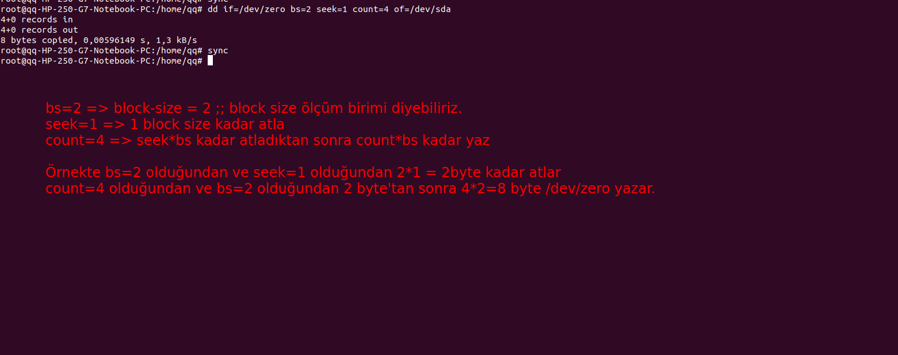
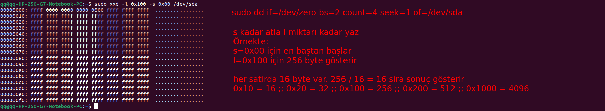

#

## ```dd``` command effects of ```conv=notrunc```
### In the following example, we start out by creating junk.txt of size 1024 bytes. Next, we write 512 bytes to the beginning of it with conv=notrunc. We can see that the size stays the same at 1024 bytes. Finally, we try it without the notrunc option and we can see that the new file size is 512. This is because it was opened with O_TRUNC.

> ### notrunc is only important to prevent truncation when writing into a file. This has no effect on a block device such as sda or sdb.

```
$ dd if=/dev/urandom of=junk.txt bs=1024 count=1
$ ls -l junk.txt
-rw-rw-r-- 1 akyserr akyserr 1024 Dec 11 17:08 junk.txt

$ dd if=/dev/urandom of=junk.txt bs=512 count=1 conv=notrunc
$ ls -l junk.txt
-rw-rw-r-- 1 akyserr akyserr 1024 Dec 11 17:10 junk.txt

$ dd if=/dev/urandom of=junk.txt bs=512 count=1
$ ls -l junk.txt
-rw-rw-r-- 1 akyserr akyserr 512 Dec 11 17:10 junk.txt
```

#

### Effects of notrunc / O_TRUNC III
Okay, for my final test I will use dd on my flash drive directly. I will start by writing 512 bytes of random data, then writing 256 bytes of zeros at the beginning. For the final test, we will verify that the last 256 bytes remained unchanged.

```
$ sudo dd if=/dev/urandom of=/dev/sdc bs=256 count=2
$ sudo hexdump -n 512 /dev/sdc
0000000 3fb6 d17f 8824 a24d 40a5 2db3 2319 ac5b
0000010 c659 5780 2d04 3c4e f985 053c 4b3d 3eba
0000020 0be9 8105 cec4 d6fb 5825 a8e5 ec58 a38e
0000030 d736 3d47 d8d3 9067 8db8 25fb 44da af0f
0000040 add7 c0f2 fc11 d734 8e26 00c6 cfbb b725
0000050 8ff7 3e79 af97 2676 b9af 1c0d fc34 5eb1
0000060 6ede 318c 6f9f 1fea d200 39fe 4591 2ffb
0000070 0464 9637 ccc5 dfcc 3b0f 5432 cdc3 5d3c
0000080 01a9 7408 a10a c3c4 caba 270c 60d0 d2f7
0000090 2f8d a402 f91a a261 587b 5609 1260 a2fc
00000a0 4205 0076 f08b b41b 4738 aa12 8008 053f
00000b0 26f0 2e08 865e 0e6a c87e fc1c 7ef6 94c6
00000c0 9ced 37cf b2e7 e7ef 1f26 0872 cd72 54a4
00000d0 3e56 e0e1 bd88 f85b 9002 c269 bfaa 64f7
00000e0 08b9 5957 aad6 a76c 5e37 7e8a f5fc d066
00000f0 8f51 e0a1 2d69 0a8e 08a9 0ecf cee5 880c
0000100 3835 ef79 0998 323d 3d4f d76b 8434 6f20
0000110 534c a847 e1e2 778c 776b 19d4 c5f1 28ab
0000120 a7dc 75ea 8a8b 032a c9d4 fa08 268f 95e8
0000130 7ff3 3cd7 0c12 4943 fd23 33f9 fe5a 98d9
0000140 aa6d 3d89 c8b4 abec 187f 5985 8e0f 58d1
0000150 8439 b539 9a45 1c13 68c2 a43c 48d2 3d1e
0000160 02ec 24a5 e016 4c2d 27be 23ee 8eee 958e
0000170 dd48 b5a1 10f1 bf8e 1391 9355 1b61 6ffa
0000180 fd37 7718 aa80 20ff 6634 9213 0be1 f85e
0000190 a77f 4238 e04d 9b64 d231 aee8 90b6 5c7f
00001a0 5088 2a3e 0201 7108 8623 b98a e962 0860
00001b0 c0eb 21b7 53c6 31de f042 ac80 20ee 94dd
00001c0 b86c f50d 55bc 32db 9920 fd74 a21e 911a
00001d0 f7db 82c2 4d16 3786 3e18 2c0f 47c2 ebb0
00001e0 75af 6a8c 2e80 c5b6 e4ea a9bc a494 7d47
00001f0 f493 8b58 0765 44c5 ff01 42a3 b153 d395

$ sudo dd if=/dev/zero of=/dev/sdc bs=256 count=1
$ sudo hexdump -n 512 /dev/sdc
0000000 0000 0000 0000 0000 0000 0000 0000 0000
*
0000100 3835 ef79 0998 323d 3d4f d76b 8434 6f20
0000110 534c a847 e1e2 778c 776b 19d4 c5f1 28ab
0000120 a7dc 75ea 8a8b 032a c9d4 fa08 268f 95e8
0000130 7ff3 3cd7 0c12 4943 fd23 33f9 fe5a 98d9
0000140 aa6d 3d89 c8b4 abec 187f 5985 8e0f 58d1
0000150 8439 b539 9a45 1c13 68c2 a43c 48d2 3d1e
0000160 02ec 24a5 e016 4c2d 27be 23ee 8eee 958e
0000170 dd48 b5a1 10f1 bf8e 1391 9355 1b61 6ffa
0000180 fd37 7718 aa80 20ff 6634 9213 0be1 f85e
0000190 a77f 4238 e04d 9b64 d231 aee8 90b6 5c7f
00001a0 5088 2a3e 0201 7108 8623 b98a e962 0860
00001b0 c0eb 21b7 53c6 31de f042 ac80 20ee 94dd
00001c0 b86c f50d 55bc 32db 9920 fd74 a21e 911a
00001d0 f7db 82c2 4d16 3786 3e18 2c0f 47c2 ebb0
00001e0 75af 6a8c 2e80 c5b6 e4ea a9bc a494 7d47
00001f0 f493 8b58 0765 44c5 ff01 42a3 b153 d395
```
