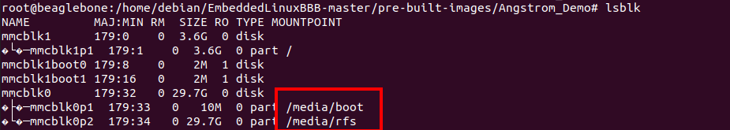
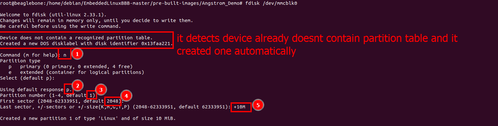
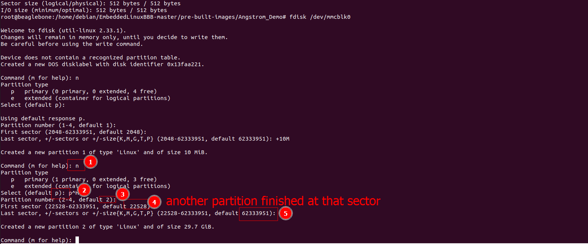
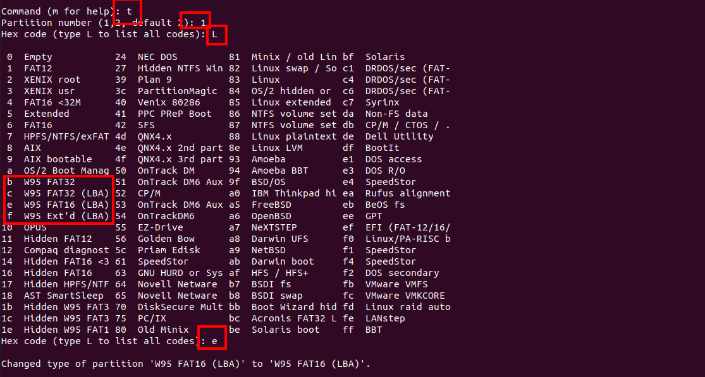
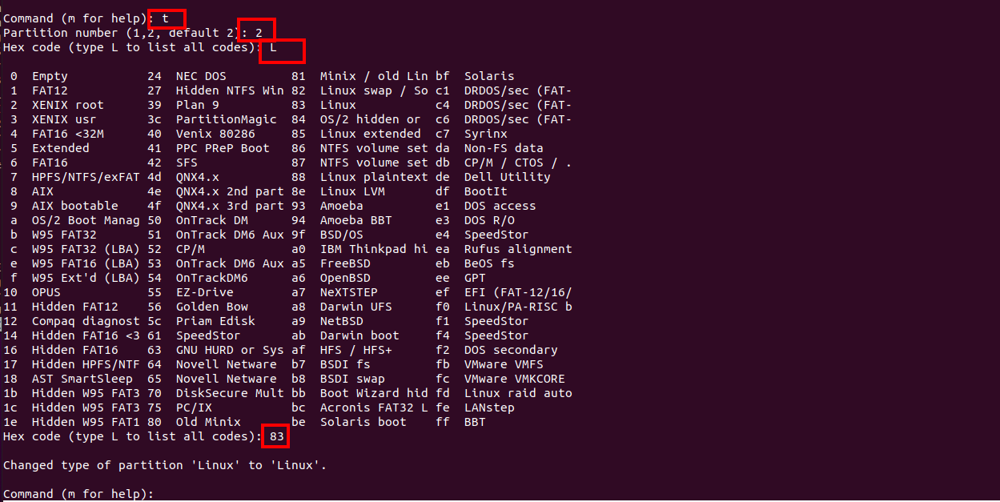
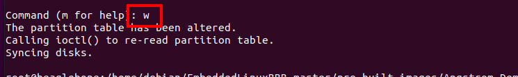
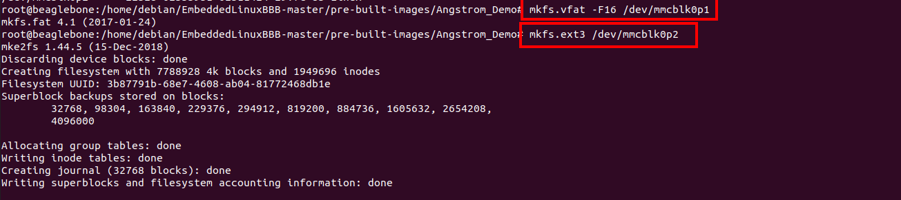
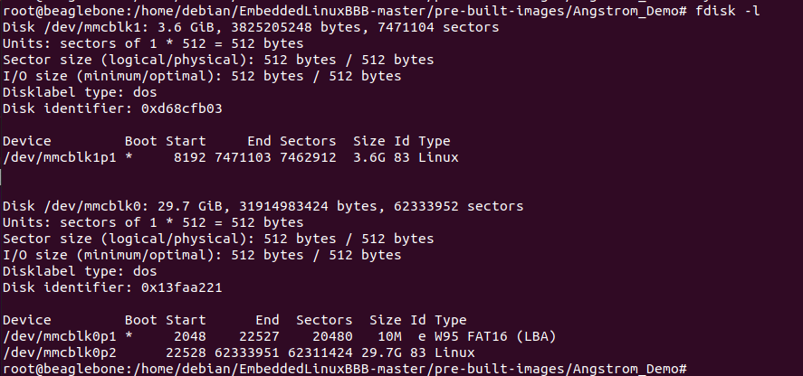

### First of all unmount the device:
```
$ lsblk
....see if the device mounted and
$ umount /media/X
```


### Reset ```partition table``` by(it means device will be wiped completely):
```
$ dd if=/dev/zero of=/dev/X bs=1M count=100
```
#
## ```FAT16 - FAT32``` and ```Ext3```
### Enter ```fdisk``` command
```
$ fdisk /dev/X
```
1) ### Create partition for ```fat16```


2) ### Create partition for ```ext3```


3) ### Update partition type to ```FAT16(LBA)```


4) ### Update partition type to ```Linux```


5) ### Set bootable flag of ```fat16```


6) ### Write to device

#
### Set filesystem type ```mkfs.X``` command

1) ### Set ```fat16``` filesystem
```
$mkfs.vfat -F16 /dev/X
```

2) ### Set ```ext3``` filesystem
```
$mkfs.ext3 /dev/X
```


3)Last check the result:
```
$fdisk -l
```



4) ### ```Sync```
```
$ sync
```

#
### Q: Why do we need to specify partition type in fdisk and later again in mkfs?
### A-1) The ```partition type``` is less specific than the ```filesystem type```. Most ```native Linux``` filesystems use partition type ```83```, for example: all of the ```ext*``` variants, ReiserFS, XFS, and others.
### A-2) ```The partition type``` code that ```fdisk``` puts in the msdos ```partition table``` is only a hint and is pretty much ignored by non Microsoft operating systems.
### A-3) ```The partition type``` is for devices that need to know what type of ```filesystem``` you are putting on that ```partition```. Linux seems to be clever enough to just ignore the type, and knows what the ```filesystem``` is no matter what. However, there are some devices that will only be able to read your disk if the ```filesystem``` type matches the actual ```filesystem``` that you put on the disk. ```mkfs``` creates the actual ```filesystem```. It doesn't know what sort of thing you are putting that ```filesystem``` on, so it can't just guess. You need to tell it exactly what sort of ```filesystem``` you are trying to create so that it knows what to do.


