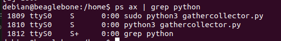
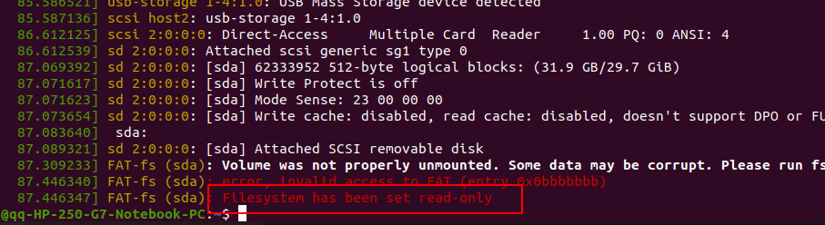

#
## 1) ```sudo python3 x.py &``` creates two process. Why?


## Answer: The shell starts ```sudo``` with the full command line; then sudo (which runs as root because it is setuid root) checks that you're allowed to run ```python3``` like that, and forks and starts ```python3```. So while ```python3``` is running you see both sudo and cp processes.

#
## 2) How to make read-only file system writable?


### Remounting it read-write:
```
sudo mount -o remount,rw '/media/YOUR_PATH'
```
