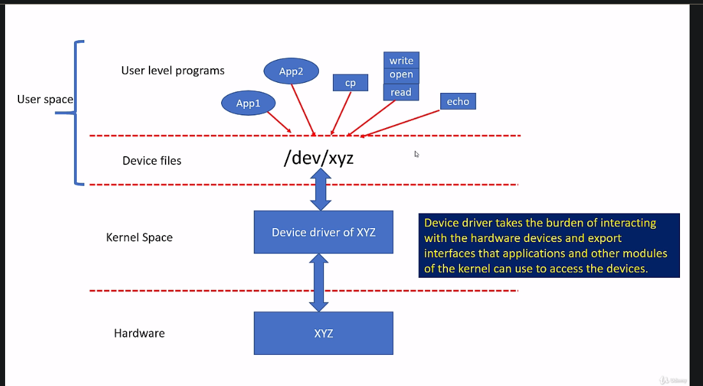
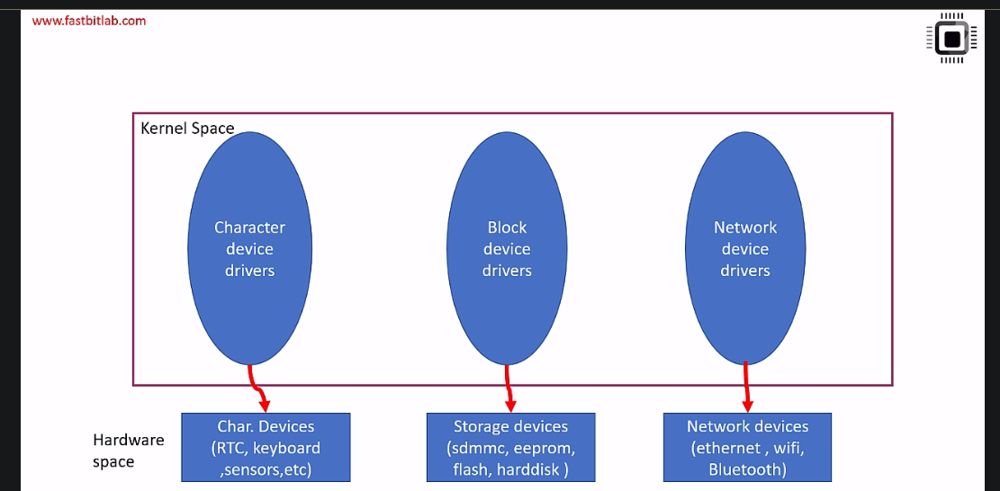
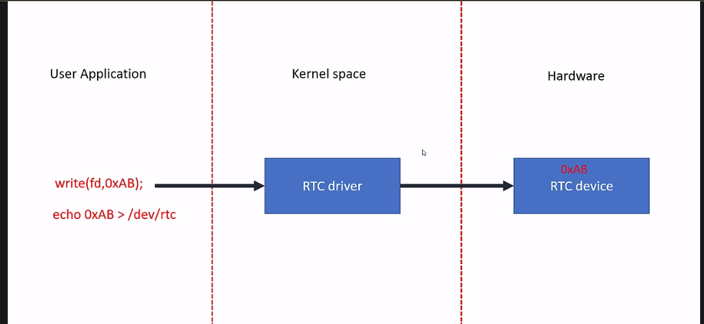
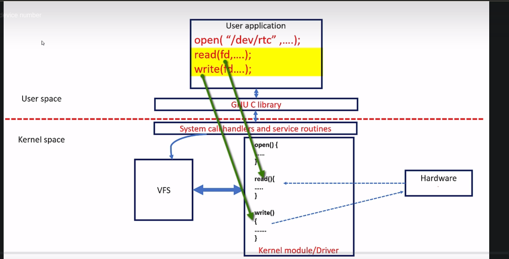
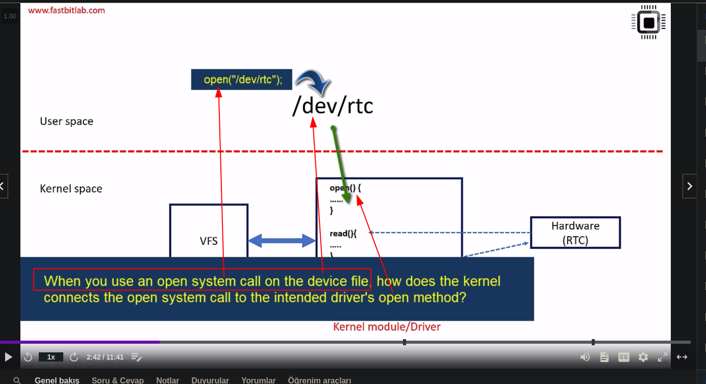
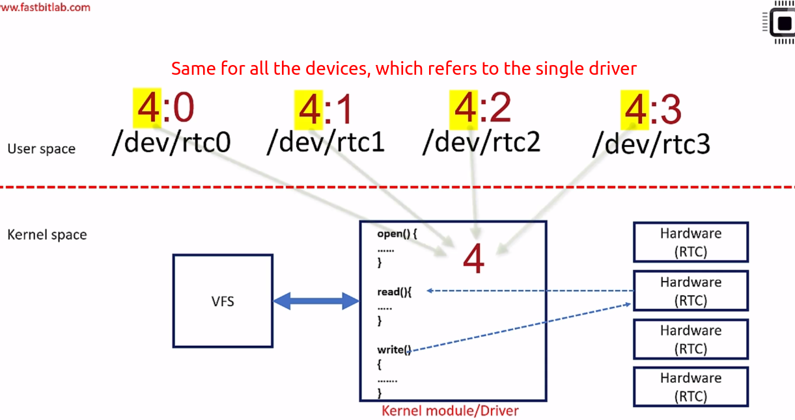
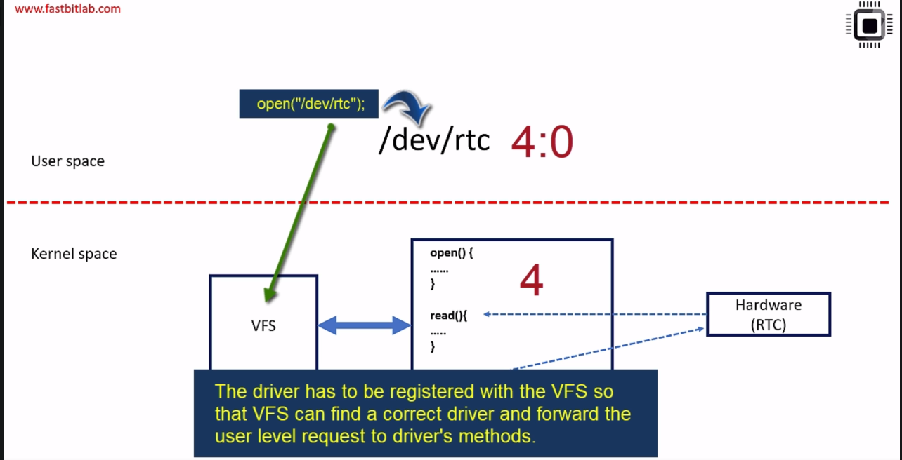
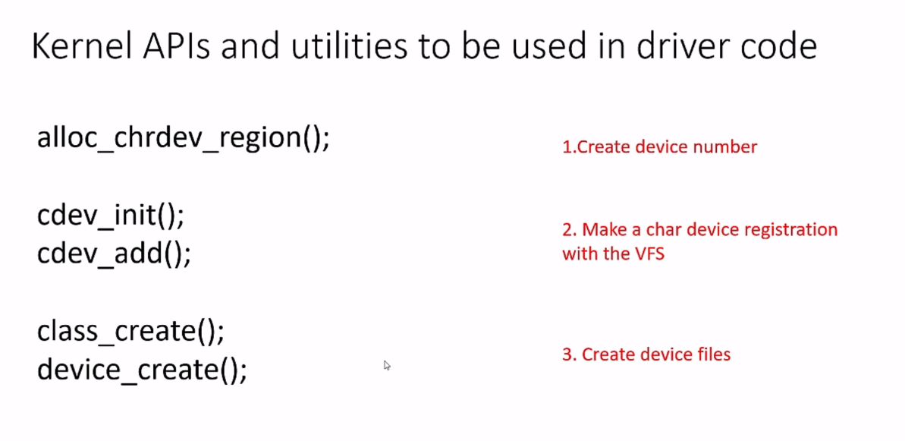
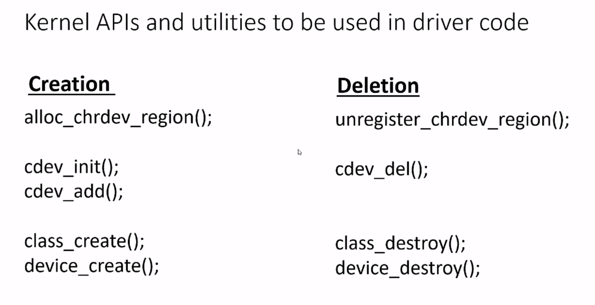
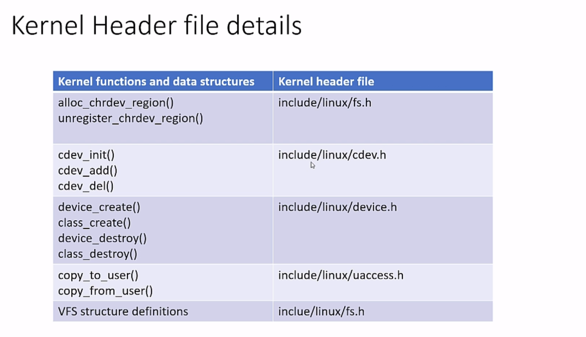

# Introduction

* A device driver is a piece of code that configures and manages a device.
* A device driver knows how to configure the device and knows how to send the data and also knows how to process the requests which originate from the device.
* When the device driver code is loaded into the operation system such as Linux, it exposes interfaces to the user-space so that the user application can comminicate with the device.
* The device driver code also abstracts various hardware details from the user-space applications.
* The user applications can just use the traditional system calls such as open, write, read to talk to the device. But those system calls are carefully handled by the driver code to touch various registers of the device.
* The kernels job here is to connect the system calls to the drivers system called implementation methods.

Let's say, there is a device xyz and when you load a driver of that device, then that device driver exposes the interfaces to the user-space. So that the user-space applications can communicate with the device. The kernel or the operating system doesn't know how to
handle a device. Because, a device has various configuration registers, it has various configuration values which needs to be program to the hardware. Also the kernel doesn't know how to handle the interrupts generated by the hardware. That's a reason why you should load a device driver. 

In Linux, we access the device by using a file access technique. For example, let's consider this is a RTC device. What you do with a RTC device? So, you read data and time information from the RTC or you write into the RTC if you want to configure it. Basically, we do read-write operations on a device. That's why, the device driver has to create a device file interface at the user's space, so that user level programs can communicate with the hardware, using a traditional file access system calls such as open, close, read, write, etc..

> So, here the job of the kernel is to connect system call execution from the user-space to the driver's system call handler methods. That will be taken care by the kernel.

And we are going to understand that as we make a progress in the section.

There are various categories of Linux device drivers. There are character drivers which take care of character devices, there are block drivers which take care of block devices such as storage devices, and there are network device drivers which take care of network devices. 

Character driver accesses data from the device sequentially.i.e., byte by byte (like a stream of
characters) not as a chunk of data. Sophisticated buffering strategies are usually not involved in char drivers. Because when you write 1 byte, it directly goes to the device without any intermediate buffering, or delayed write back, or there is no a dirty buffer management as in block drivers. Some of the examples of char devices are sensors, RTC, keyboard, serial port, parallel port, all these are character devices and you need character drivers to manage these devices.

> But this is not the case in a block drivers. For example, let's say you have a memory device such as SDMMC card. So, the SDMMC specification or the design doesn't allow you to a write data byte by byte. You either have to write in chunks such as a 512 bytes, or 1024 bytes. What are block drivers? The device which handles data in chunks or blocks is called a block device.Block drivers are more complicated than char drivers because the block drivers should implement advanced buffering strategies to read and write to the block drivers, and the disk caches are also involved. Examples are mass storage devices such as hard disks, SDMMC, Nand flash, USB camera, etc..

In the previous slide, I said that, the driver has to create some a interfaces at the user-space. So, that the user level programs can use that interface to communicate with the hardware. Those are called as **device files**. Most of the devices are accessed as a file in Uinx/Linux system. A device file is a special file or a node which gets populated in /dev directory during kernel boot time or device/driver hot plug events. When you boot your Linux kernel, the /dev directory is automatically it will get populated with device files, which are a generated from various drivers of the kernel.

There is a special program in user level called **Udev**, which actually populates this /dev directory with various a device files. **Udev** is the device manager for the Linux kernel. It dynamically creates or removes device node files at boot time in the /dev directory for all types of devices. **Udev** is part of **systemd** as you can see by view

> When the user space app wants to talk to the hardware, it uses system calls such as open, write, read etc.

And when the user that application uses read and write system calls, those system calls must connect to the read and write implementations or methods of your driver.

We have to understand how to establish such connections from userspace to the device drivers. And the drivers read and write functions or methods will then forward data to the hardware or it will read data from the hardware. The read method of the driver will read from the hardware and it should submit data back to the user, and the write method of the driver should accept data from the user space, it should write the data to the hardware. 

> If you're wondering how these a user space system calls will get connected to the driver system call implementation methods, this is taken care by the VFS (that is virtual file system) of the kernel. That means, our device driver has to get registered with the VFS by using virtual files systems kernel APIs. 

# Device Numbers

- **How does that connection is established?** To establish the connection the kernel uses something called "Device number".

Let's assign a number to this driver, let's say 4. And 0 here is a device instance. There could be multiple device files, all are handled by the same driver. For example, there could be 4 RTC devices. All are handled by a single RTC driver. In that case, there could be 4 device files. Like **dev/rtc0, rtc1, or 1, or 3,** like that. In this case, the device numbers could be 4:0, 4:1, 4:2, or 4:3.

> When user level program uses an open system call on this device file.The system call will first handled by the virtual file system, that is VFS in the kernel space. So, the VFS get's the device number and compares it with it's driver registration list. That means, this driver has to get registered with the VFS using the **device number**. That what we call as character device add, known as CDEV_ADD.

> So, the VFS compares the device number of the device file with the drivers list and picks the correct driver and connects the user requests to the file operation methods of the selected driver.

Basically, what you should be doing here is, you should be using kernel APIs and kernel utilities in order to a request various services from the kernel. Now, to create a device number you just have to use a kernel API <code>alloc_chrdev_region()</code>. So, you have to use <code>alloc_chrdev_region()</code>

Whenever you load a module, so these creation a services must be executed and your driver must be ready to accept a system calls from the user space program. That's why, it makes sense to do this creation process in the module initialization function. When you remove the module, so it's better you delete all those a resources what you requested from the kernel.Otherwise, it will simply consume a resources of the kernel. That's why, let's say, if you use <code>unregister_chrdev_region()</code>, it will delete the device number which is allocated for your module, that it can reused for some other module.

When you use all these a kernel functions and data structures, you should be using appropriate kernel. Even if you are using any data structures of the VFS such as file operation structures, a cdev structures, a file structure, so which will be exploring in later videos, you should be using a fs.h.

