# Device number

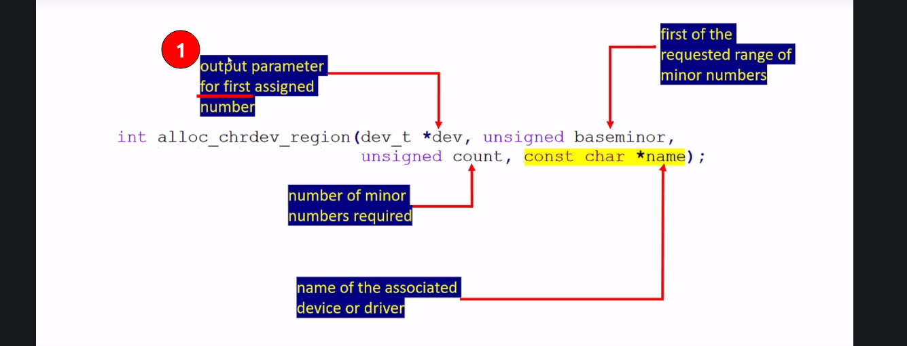
> Name: This is just a name you give for the range of a device numbers.

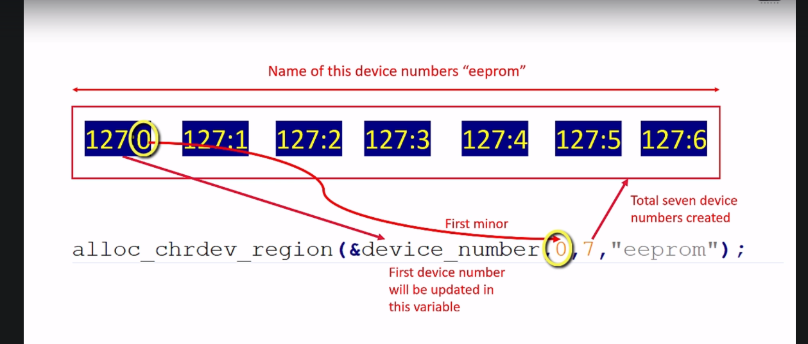

- The device number is a combination of major and minor numbers.
- In linux kernel, dev_t(typedef of u32) type is used to represent the device number.
- Out of 32 bits, 12 bits to store major number and remaining 20 bits to store minor number.
- You can use the below macros to extract major and minor parts of <code>dev_t</code> type variable
```C
dev_t device_number;
int minor_no = MINOR(device_number);
int major_no = MINOR(device_number);
```
> You can find these macros in <code>linux/kdev_t.h</code>
- If you have, major and minor numbers, use the below macro to turn them into <code>dev_t</code>
=> <code>MKDEV(int major, int minor);</code>

# Character Device Registration

How many devices we are handling?</br>
- There's only one device.
- One sudo character device.
- That's why, you have to call cdev_add() one time.
- That would make a character device registration with a VFS.This registration is very important, otherwise the user level system calls will not get connected to the file operation methods of the driver. As you may be guessing for this cdev_add() you have to mention the drivers file operation methods. With that you have to register.

cdev_init is used to initialize a cdev structure. It has got two input arguments, look at the second argument. That is a file_operations. By using this pointer, you have to mention your driver's file operation methods or system call handler's. Like system call handlers for open, read, write, seek etc..

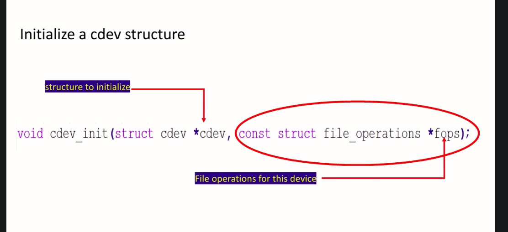

> Since we are handling only one device, we should create a one variable of type <code>struct cdev</code>.

```C
struct file_operations eeprom_fops;
struct cdev eeprom_cdev;

cdev_init(&eeprom_fops, &eeprom_cdev);
```
> If you are managing a 10 devices, then you may have to create 10 cdev variables. But, in this case, we are handling only one device

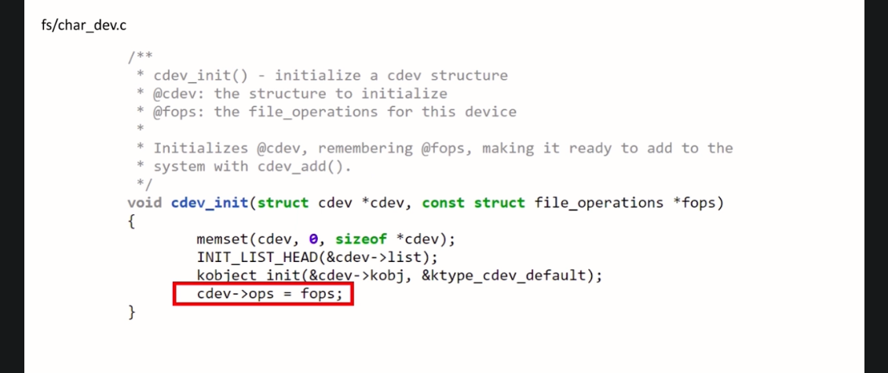
> So, now the cdev_init is a kernel API, which is implemented in char_dev.c. You can see here, cdev has a field called 'ops', that is operations. And cdev_init() function just initializes that field to this pointer what you send here.

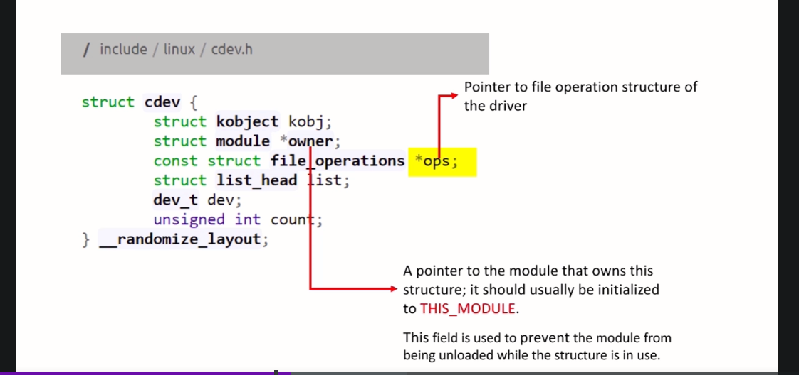
> This is a cdev structure actually. You can see that, the cdev structure has this field 'ops'. This is a pointer to file operation structure of the driver. So, the cdev_init() just initializes this field.

> And after that, in this cdev structure you have to initialize one more field, that is module owner field. This field should be initialized with a pointer to the module that owns this structure. It should usually be initialized to a macro called <code>THIS_MODULE</code>. This field is used to prevent a module from being unloaded while the structure is still in use. <code>THIS_MODULE</code> is used to identify the current module which own this structure. 

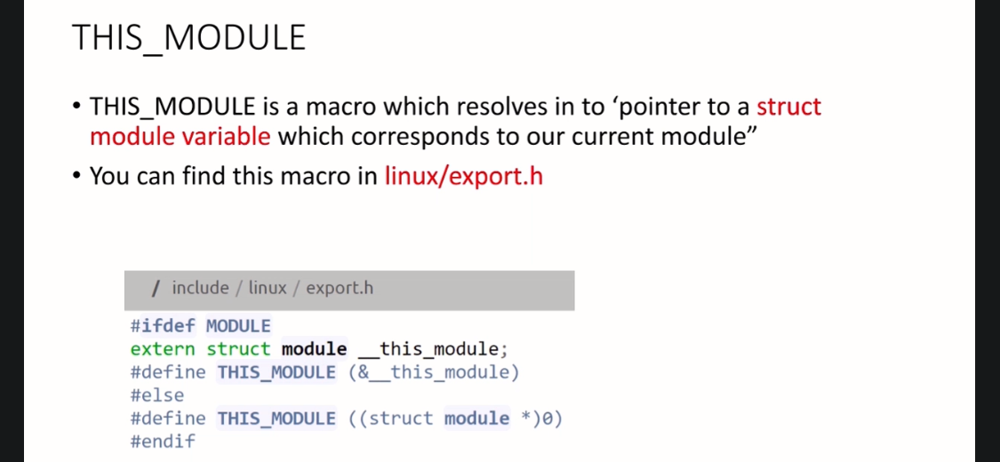

Look at that macro. That macro is nothing but an address. An address to this variable of type struct module. That's it.

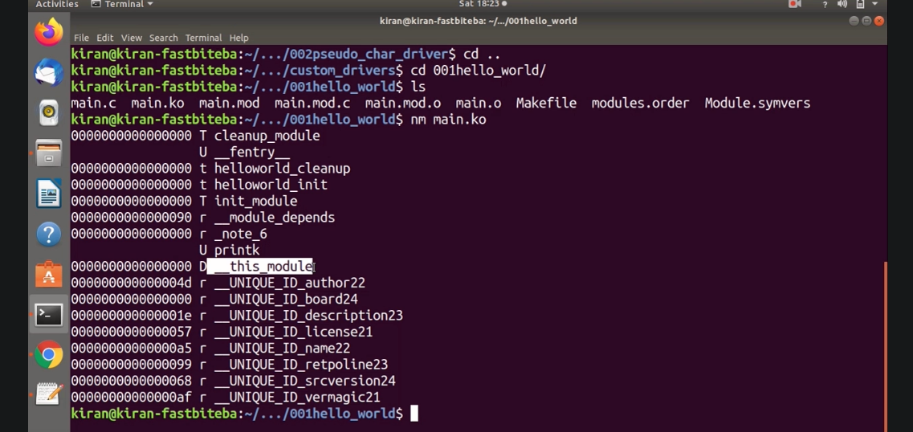
> __this_module gets added when we compile our kernel.

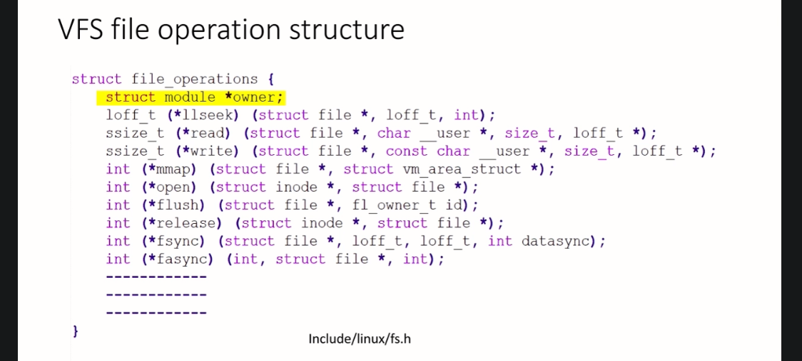
> Here it is. The file operation structure, this structure definition you can find in linux/fs.h. VFS file operation structure and it has various member elements. And look at the first member elements, that is struct module owner. This again needs to be initialized with the macro THIS_MODULE.


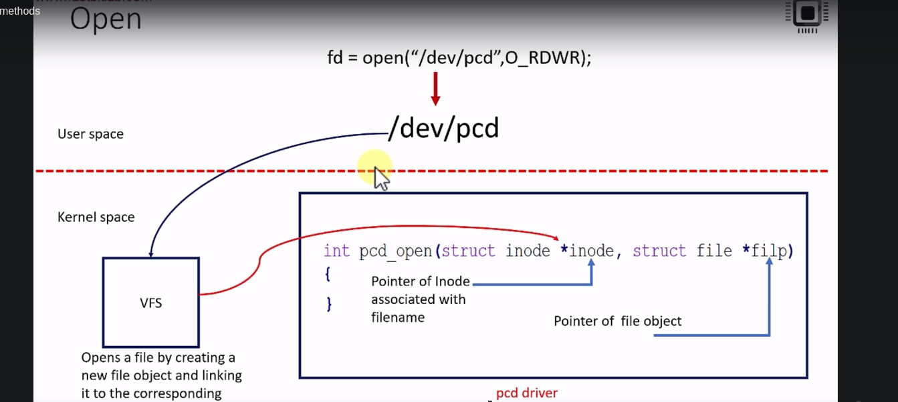

From user level, the control is first passed to the kernels VFS subsystem. And from the VFS subsystem, the control is passed to the appropriate drivers open method.  So, when the VFS receives open request on a device file or on a regular file, what VFS does is, it opens a file by creating a new file object and linking it to the corresponding inode object.

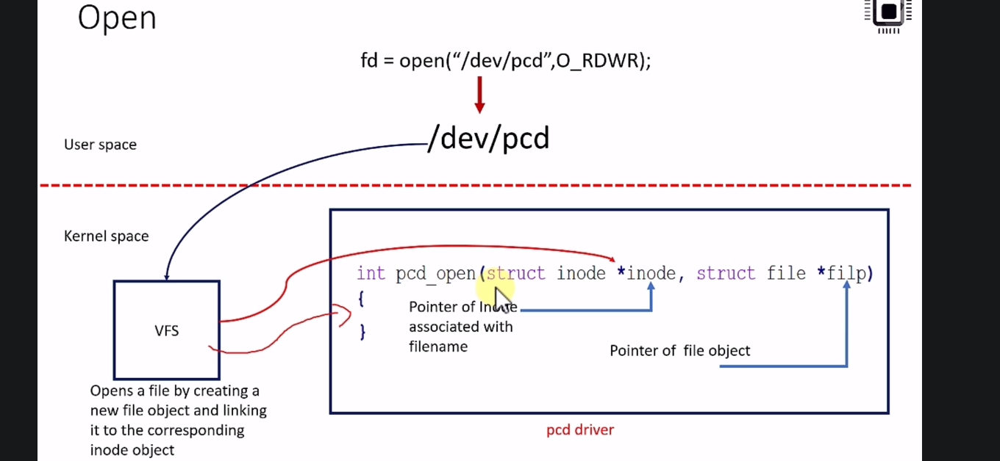

So, the open system call execution is control is first passed to the VFS and the VFS finds the appropriate driver, and it calls the open method of the driver. When it calls the open method it passes two arguments. The first argument is pointer of Inode associated with file name, the device file name. And the second argument what it passes is a pointer of file object.

## Struct Inode and Struct File

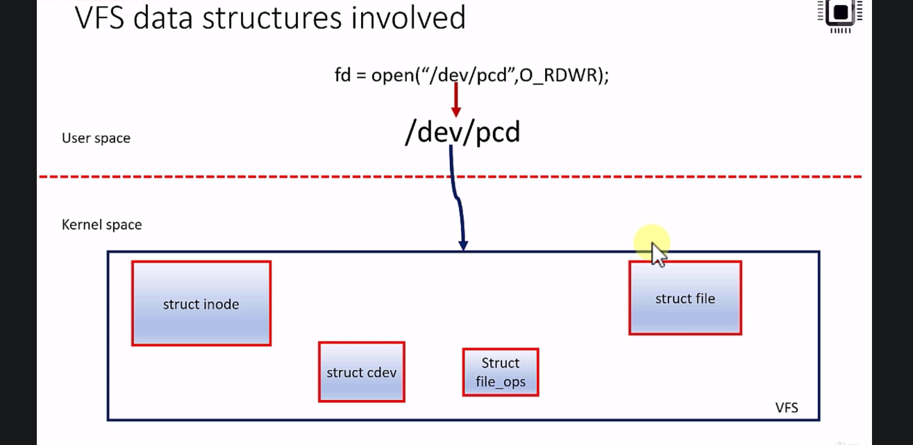

During file operation of a regular file or a device file, there are various VFS data structures involved. The important data structures involved are **struct inode, struct cdev, struct file operations, and struct file**. You may be a familiar with this, right? **Struct cdev**, which represent a character device and we registered this **struct cdev** using **cdev_add**. While registering the **cdev**, we initialize the cdev's file operation with our drivers file operation methods. **Cdev** has a field, which holds the pointer to this a file operation variable what we created in the driver file.

Apart from these two, a these two are another two important data structures a which are involved during file access, whether it could be a normal file or a device file.

- Unix makes a clear distinction between the contents of a file and the information about the file.

## Inode

- An inode is a VFS data structure(**struct inode**) that holds general information about a file. If you want to know exactly what are the general information about the file, you should explore the member elements of the inode.
- Whereas VFS 'file' data structure(struct file) tracks interaction on an opened file by the user processes.
- Whereas **struct inode** holds some general information about a file like file name, the inode number, and other details.
- Each Inode contains all the information needed by the file system to handle file.
- Each file has its own inode object, which the file system uses to identify the file. 
- Each inode object is associated with an inode number, which uniquely identifies file within the file system.
- Basically, the VFS identifies a file using an inode number, so not using its's filename.
- You could doesn't matter whether you use the same file today or you may rename the file tomorrow, doesn't matter what happens to the file, but unless it is deleted, the VFS always identifies a file using it's inode number.
- The inode object is created and stored in memory as an when a new file gets created, a file could be regular file or a device file.
- That means, whenever you create a file an inode object is created. That means, object of type **struct inode** and it will be placed in the memory.

## File object


- Whenever a file is opened a file object is created in the kernel space.There will be one file object for every open of a regular or device file.
- A file object is of type struct file this is a kernel space a data structure, just like inode. 
- But for every open of a device file or a regular file, a file object will be created.
- That means, if you open the same file, let's say 10 times, then there will be 10 file objects will be created in the memory. There will be one file object for every open of a regular or device file.
- So, the file object stores information about the interaction between an open file and a user process.
- This information exist only in kernel memory during the period when a process has the file open. The contents of file object is NOT written back to disk unlike inode.
- File objects contents will not be written back to the disk remember that. It will get created whenever you open a file and VFS may modify various member elements of this file object, but none of those changes will be written back to the disk. Whenever you close a file, so the file object will be destroyed by the VFS.

> But that is not the case with inode. So, each file has its own inode object, which will be there in memory. And if there is any change in the nodes member elements, then that will be written back to the disk.

This is called by the VFS. And this function you can find in fs/ inode.c. Here, you see the virtual file system passes the device number, right? so the device number of the newly created device file. Look at this code here. And I said, whenever you

create a device file inode object will be created. 

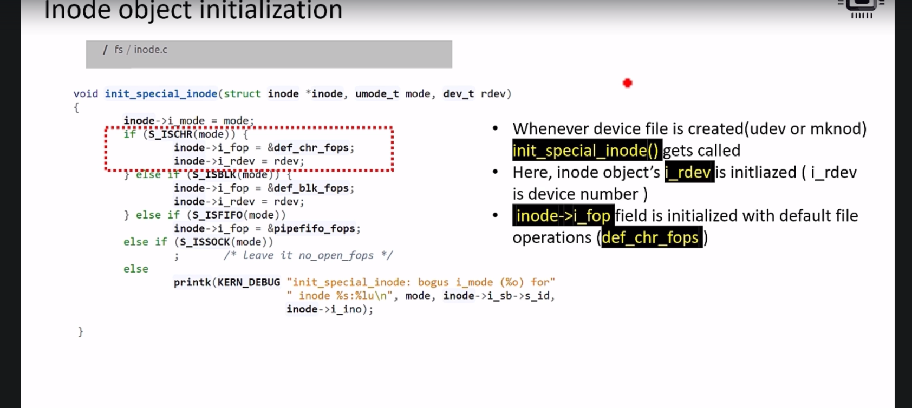

- **inode** : That inode objects address will be passed here. 
- **mode**  :  And the VFS also sends what kind of device file it is. Whether it is a character device file, or a block device file, or a FIFO or something like that. It mentions the mode in this argument. This code decodes the mode. Here, it is checking for ISCHR.(is character?)
- **rdev**  : That is the device number of the newly created device file, which is passed here. That means, now inode is formed and inodes device number field is initialized with the device number of the newly created device file.
- **i_fop** : And after that, inode has one more field called i_fop. So, this field. i_fop is a pointer variable of type struct file operations. And this is initialized to default character file operations. All these things happen when you create a device file.

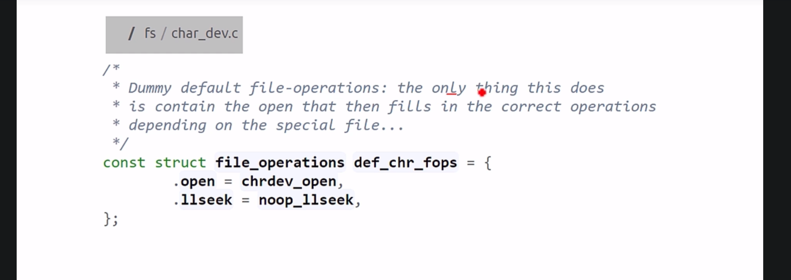

- **chrdev_open** : It is a dummy file operations, which has only open and lseek method.

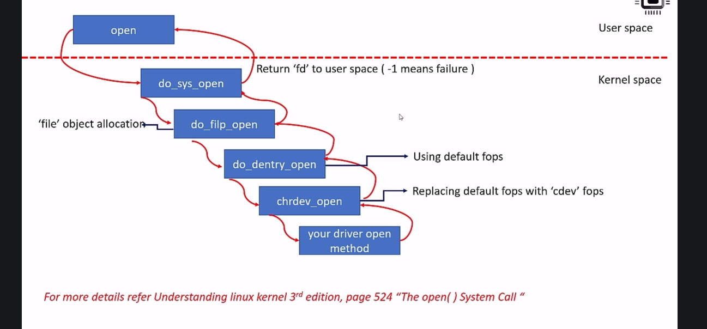
Later when you call the open system call, so all these activities happen. Inode object is there in the memory now. Whenever the user level program executes open system call on a device file, these are the kernel level functions a get involved in processing the open system call.
- It first executes a <code>do_sys_open</code> kernel function in the kernel space.
- that calls <code>do_filp_open</code> function. This is a place where a file object will be created. For every open a file object will be created in the kenel space. That file object creation happens in this kernel function <code>do_filp_open</code>. Because, the 'file' object controls and open file. 
- <code>do_dentry_open</code>. In this function, what happens is, the default dummy file operations will be called. What is default dummy file operation? This one <code>chrdev_open</code>. <code>from chrdev_open</code>, your driver's open method will be called.

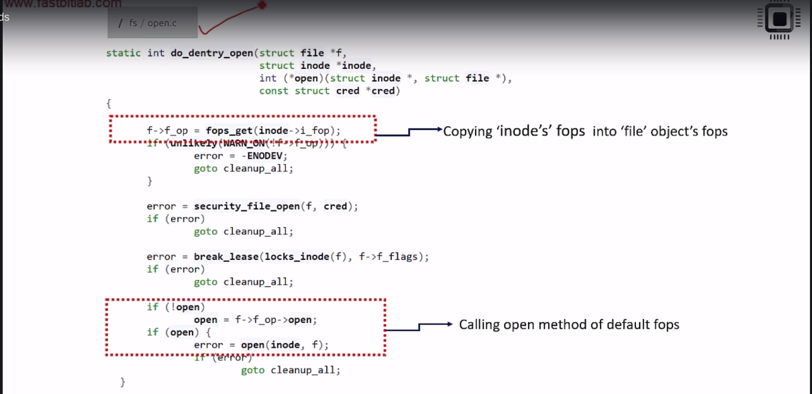

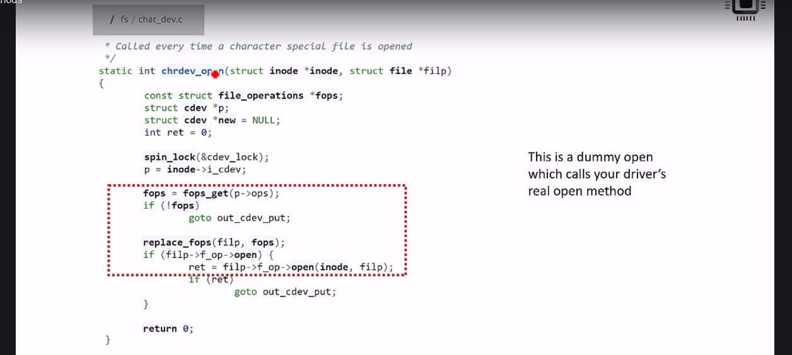

## When device file gets created
- Create device file using udev
- Inode object gets created in memory and <code>inode's i_rdev</code> field is initialized with device number.
- <code>Inode object's i_fop</code> field is set to dummy file operations(<code>def_chr_fops</code>)

## When user process executes open system call
- User invokes open system call on the device file
- File object gets created
- <code>Inode's i_fop</code> gets copied to <code>file object's f_op</code>(dummy default file operations of char device file)
- Open function of dummy default file get s called(<code>chrdev_open</code>)
- Inode object's <code>i_cdev</code> field is initialized with <code>cdev</code> which you added during <code>cdev_add</code>(lookup happens using <code>inode->i_rdev</code>)field.
- <code>inode->cdev->fops</code>(this is a real file operations of your driver) gets copied to file->f_op
- <code>file->f_op->open</code> method gets called(read open method of your driver)

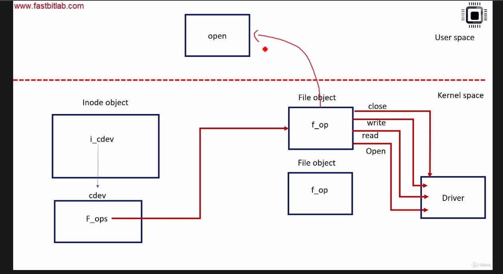
> When you use the open system call on the device file, it returns. Isn't it? What it returns?
> - It returns the file descriptor. That file descriptor is actually a reference to the opened file object. So, reference to this file object is returned as file descriptor. And the subsequent read, write, and close system calls must use this **a fd** as a reference to deal with the assigned file object in the kernel space.
