- ### SOC stands for System on Chip. As the name indicates, a single chip contains most of the essential computing /communication/storage engine of the computing world, like Flash memory, Graphics processing engine, the image processing engine, the USB communication engine, RS232, SPI, I2C engine and much more. The heart of the SOC is a processor.

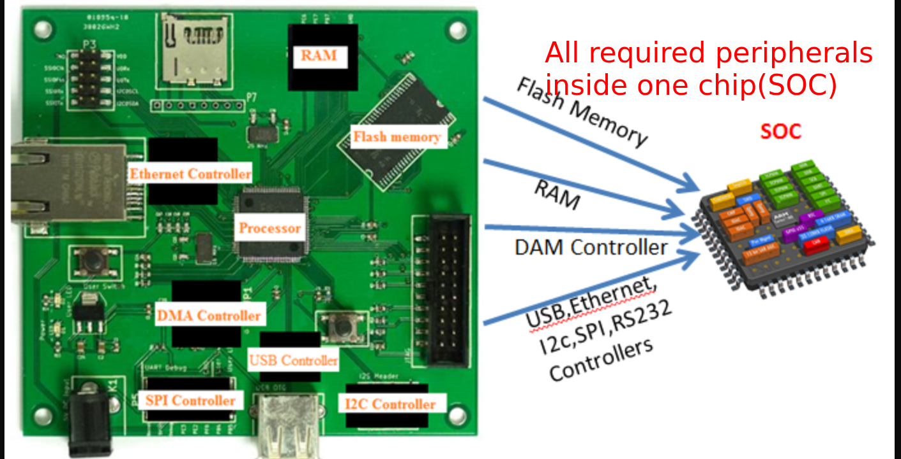

## The AM355x SOC by TI

- ### This SOC is from TI and can run up to the speed of 1GHZ and the SOC is powered by ARM cortex A8 processor. The exact name of the SOC is : AM3358BZCZ100  on REV ‘C’ BBB Board

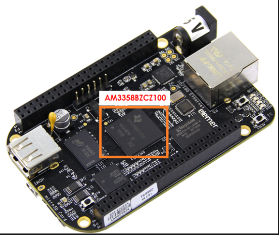

> ### The Technical Reference manual of this SOC can be found here , 
http://www.ti.com/lit/ug/spruh73p/spruh73p.pdf


## Embedded MMC (eMMC)
- ### The board has 4GB of eMMC(embedded Multi Media Controller) memory chip, This is an on-board  memory chip that holds up to 4GB of data in BBB Rev C.

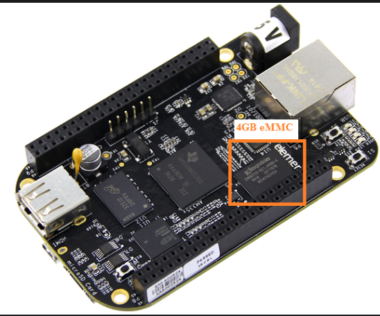


## SDRAM Memory: 512MB DDR3 
- ### This is external Dynamic RAM memory, the board comes with SDRAM Memory: 512MB DDR3. This is on the board and connected to SOC. They claim this memory as, faster and low power RAM memory. During booting the boot images will get loaded to this RAM from other memories and will execute from here. 

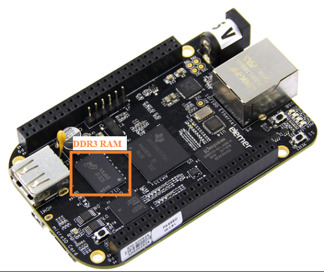

## Serial(UART) pin outs. 

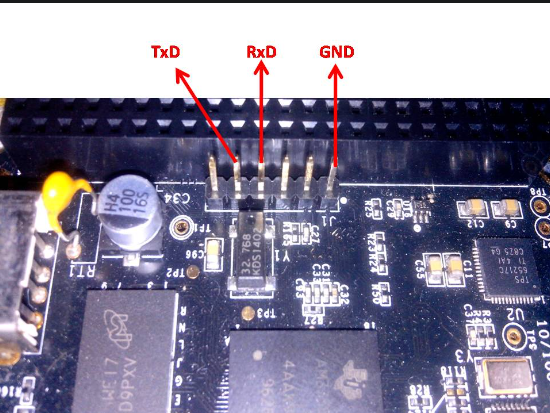


> ### Powering through USB has couple of disadvantages.
> ### 1) You won’t be able to run the board at full speed
> ### 2) You won’t be able to drive the LCD
> ### 3) You will not be able to drive the some Beaglebone capes connected over expansion headers.


> ### NOT Search Google in order to see hardware details of bbb by typing beagle bone black rev c schematic


## Memory Interface

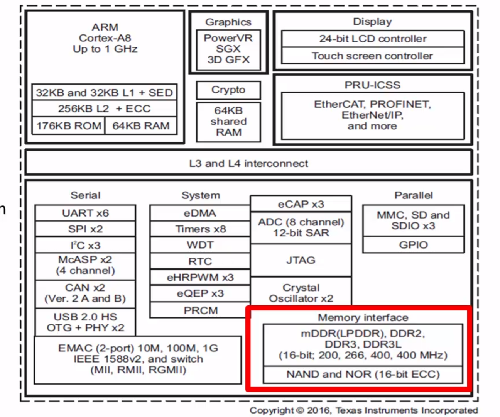

- ### The SOC says that, TI supports memory interfaces for ```NAND```, ```NOR``` types of memory devices. Also it supports connecting the DDR memory devices. 
- ### Below picture shows how you can connect the ```NAND``` or ```NOR``` flash to the SOC.

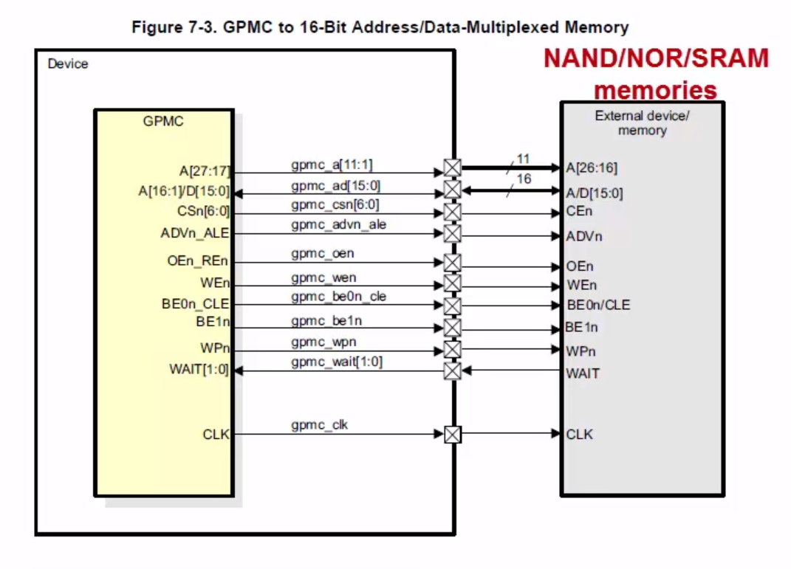

- ### ```GPMC``` means General Purpose Memory Controller and that allows you to connect ```NAND``` or ```NOR``` types of flash devices to the SOC. Also you can use ```DDR controller``` of the SOC to connect the ```DDR SD RAM```

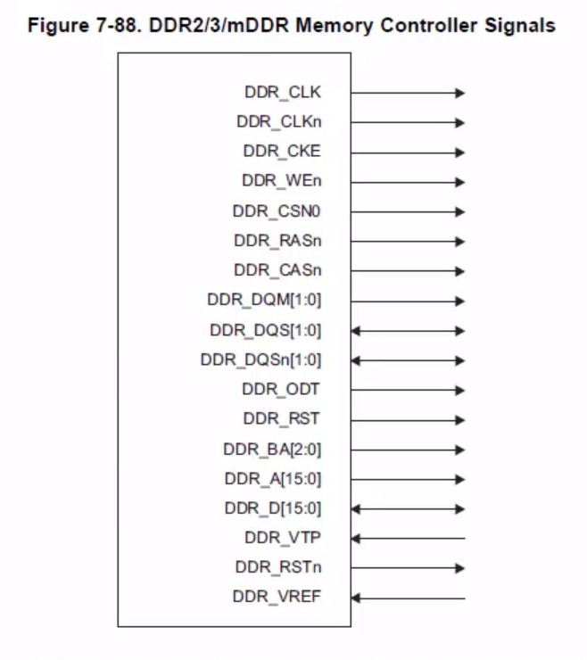

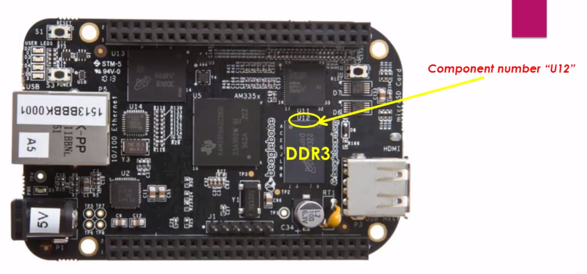

- ### Check which controller used in the board in the schematic:
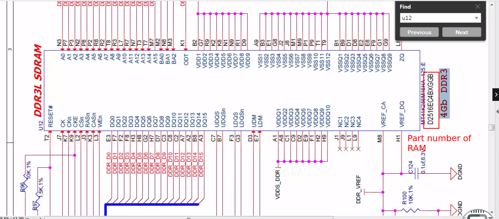

> ### If you want to connect an external static RAM(SRAM) or external NAND Flash or NOR flash, it has to go through the ```GPMC``` connection. But if you want to connect the dynamic RAM, such as DDR2 or DDR3 etc. it has to go through the ```DDR``` controller present in the ```SOC``` also called as ```EMIF```.

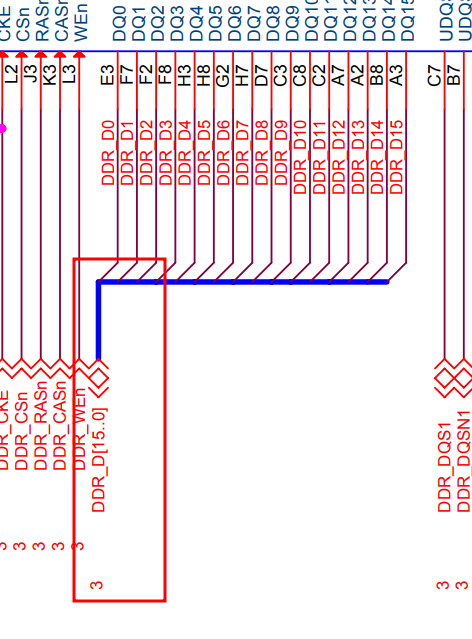
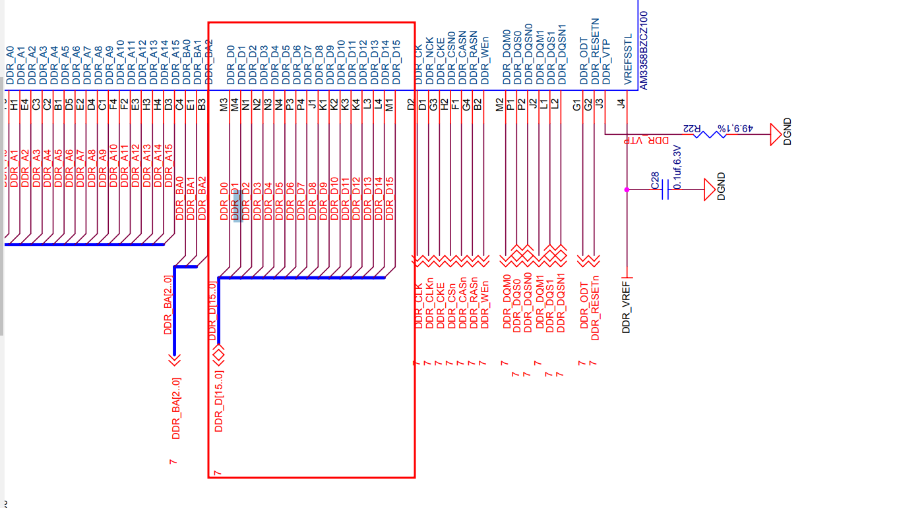


## MMC Interface

> ### There are two ```MMC``` interface on the ```AM335x``` SOC. ```MMC0 and MMC1```

- ### Check which controller used in the board in the schematic:
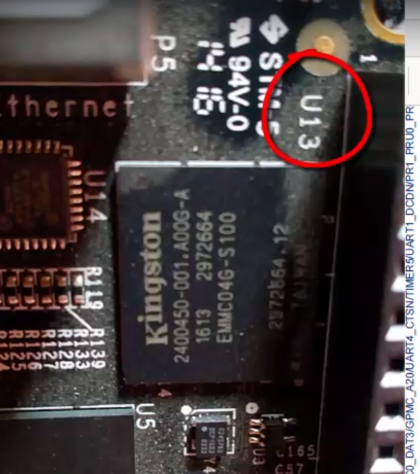

- ### You can see that, ```e-MMC``` memory is interfaced through the ```MMC1``` interface.

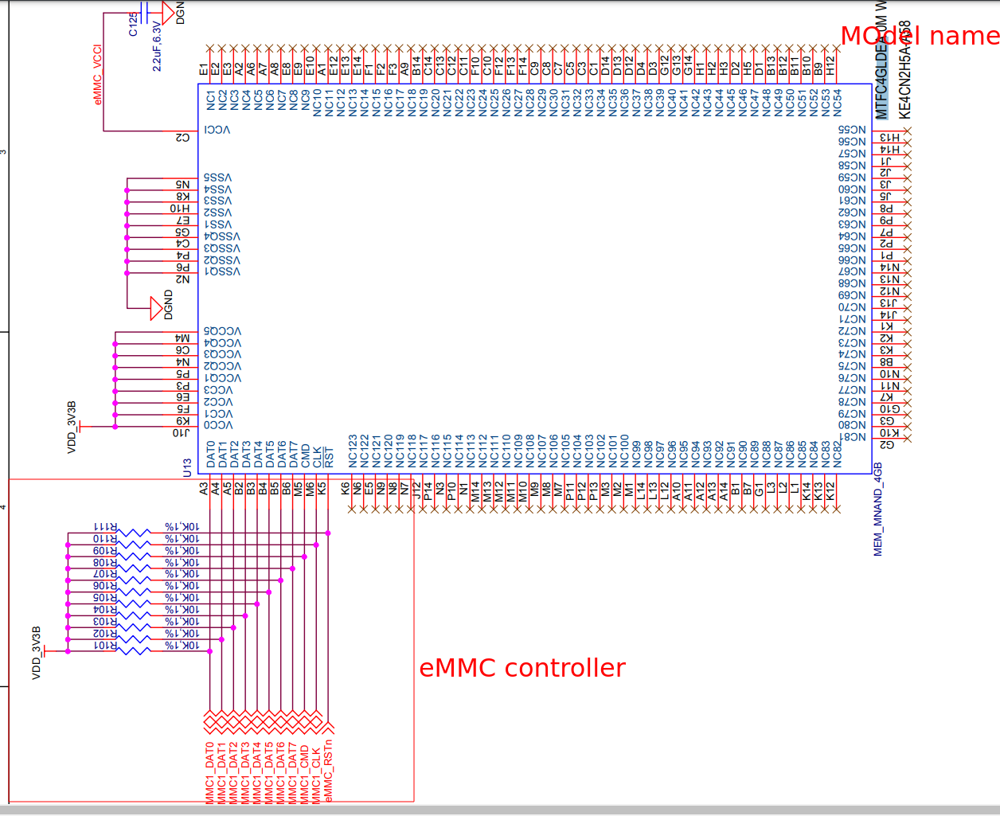


- ### Datasheet of the e-MMC memory and you can see that it operates over the MMC interface. This chip you have to connect to the SOC over the ```MMC``` interface. 
- ### This chip has a built-in ```MMC``` controller which drives the ```NAND``` flash sitting inside the ```e-MMC``` memory.

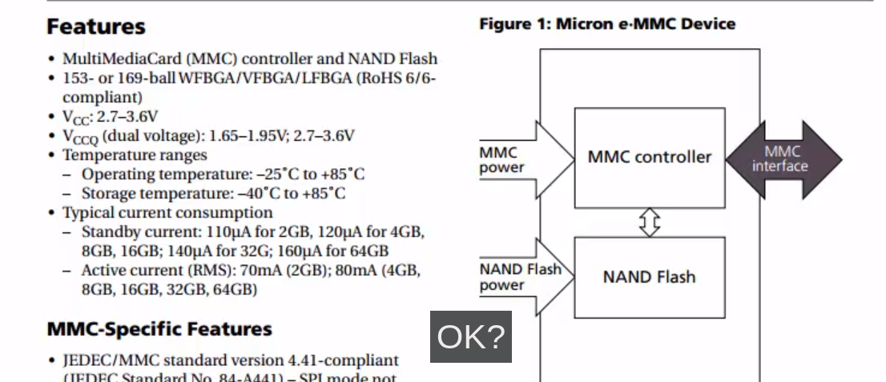


> ## ```MMC0``` interface ==> ```SD Card```
> ## ```MMC1``` interface ==> ```e-MMC```


## Eeprom

- ### A single 4KB EEPROM is provided on I2C0 that holds the board information. This information includes board name, serial number, and revision information.
