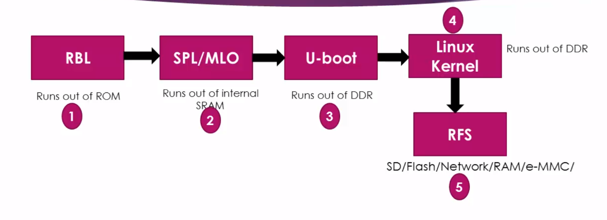

- ### Let's explore what exactly do we need to successfully boot the Linux on the ```ARM``` based hardware such as ```Beagle Bone Black```or any other board which meets the requirements to run the Linux kernel.

- ### To run Linux on this embedded board, we need minimum of 4 software componenets.




## Booting takes place in 3 stages.
#
1) ### - ```RBL; ROM BootLoader;``` Very First piece of code to run on the SOC when you supply the power to the board. This bootloader is written by the vendor and stored in the ROM of the SOC during the production of this chip. You cannot change it.

    - ### The major job of the RBL is to load and execute the second stage bootloader from the internal memory of the SOC. 

    - > ### Runs out of ```ROM```.

### How the second stage boot loader gets loaded by the ROM boot loader?


#
2) - ### ```SPL; Second Stage BootLoader;``` Sometimes it is also called as ```MLO; Memory Loader```. ```SPL``` is also derived from the ```U-Boot``` source code. You will get ```SPL``` out of the ```U-Boot``` compilation

    - ### The job of the ```SPL``` is to load and execute the third stage BootLoader such as ```U-Boot``` from the DDR memory of the board.

    - > ### Runs out of ```internal SRAM```.

#

3) - ### ```U-Boot```

    - ### The job of the ```U-Boot``` is to load and run the Linux Kernel.

    - > ### Runs out of ```DDR```.

#

