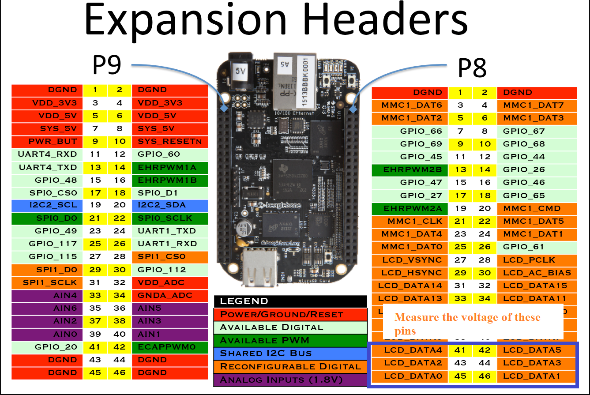

- ### You can boot ```AM335x SOC``` from the following boot sources.
- - ### ```NAND Flash```
- - ### ```NOR Flash(eXecute In place, XIP)```
- - ### ```USB```
- - ### ```eMMC```
- - ### ```SD card```
- - ### ```Ethernet```
- - ### ```UART```
- - ### ```SPI```

- ### That means, you can keep the boot images in any of the above memory or peripheral and you can able to boot this SOC.
#


> ## “SYSBOOT” is one of the register of this SOC and its first five bits decide the boot order .
# 
## Let’s take an example,

### When ```SYSBOOT``` [4:0] = 00000b (This is reserved, you cannot use this configuration)

### When ```SYSBOOT``` [4:0] = 00001b

### After the RESET if ```SYSBOOT``` [4:0] = 00001b , then SOC will try to boot from ```UART0``` first , if fails, then it tries to boot from ```XIP(XIP stands for eXutable In Place memory like NOR Flash)```, if that also fails, then it will try to boot from ```MMC0```, if no success, finally it tries to boot from ```SPI0```, if that also fails, then SOC outputs the error message and stops. 
#
## How SOC decides the boot order? 
- ### The code stored in the “ROM” is called ROM boot loader, this is programmed in to the ROM of the SOC during taping out of the chip, you cannot able to change it, why?? Because its ROM. Read only !!!!
- ### The job of the ROM is to set up the ```SOC clock```, ```Watch dog timer```, etc and also its major job is to load the ```Second Stage Boot Loader```, what we call ```MLO or SPL```.
#
## Now, from where it should load the second stage boot loader?
### For that what ROM code does is, it reads the register ```SYSBOOT[15:0]```, and based on the value of ```SYSBOOT[4:0]``` it prepares the list of booting devices. The register ```SYSBOOT[15:0]``` value is decided by the voltage level on the ```SYSBOOT pins```.

### That is, let’s say, if ```SYSBOOT[4:0] = 00011b```, then boot order will be: ```UART0,SPI0.XIP,MMC0```.
### Some board, will give you the control to change the SYSBOOT[15:0] value by using dip switches like below. 

#
## But in BBB, there are no such dip switches to configure the SYSBOOT pins. BBB has some other circuitry to decide the SYSBOOT pins voltage level

### In BBB you will find this circuitry, (you will find in SRM  , not in TRM):


### Here observe that SYS_BOOT2 is connected to a button S2 of the BBBB ( S2 is the boot button )

### When you simply give power to the board, You will find the voltage level as below.

- ### SYS_BOOT0 = 0V

- ### SYS_BOOT1 = 0V

- ### SYS_BOOT2 =1V

- ### SYS_BOOT3 = 1V

- ### SYS_BOOT4 = 1V

### You can confirm this by measuring the voltage level using Mutlimeter,

### If you have Multimeter, measure the voltage of 45,44,43,41,40 pins of the expansion header P8 of the board you will find ```SYSBOOT[4:0] = 11100.```


### When you press the button ```S2```, ```SYS_BOOT2``` will be grounded , so ```SYSBOOT[4:0]= 11000```
### Great! Now based on S2 (BBB boot button) we got 2 boot configurations
1) ###  S2 Released ```(SYSBOOT[4:0] = 11100)```:
- - ### MMC1 (eMMC)
- - ### MMC0 (SD card)
- - ### UART0
- - ### USB0
2) ### S2 pressed ```(SYSBOOT[4:0] = 11000)```:
- - ### SPI0
- - ### MMC0 (SD card)
- - ### USB0
- - ### UART0

## Boot Sources
#
1) ### ```eMMC Boot(MMC1):```  eMMC is connected over MMC1 interface, This is the fastest boot mode possible, eMMC is right there on your board, so need not to purchase any external components or memory chip. This is the default boot mode. As soon as you reset the board, the board start booting from loading the images stored in the eMMC.
    > If no proper boot image is found in the eMMC, then Processor will automatically try to boot from the next device on the list. 
#
2) ### ```SD Boot:```  If you press S2 and then apply the power, then the board will try to boot from the SPI first, and if nothing is connected to SPI, it will try to boot from the MMC0 where our SD card is found. We can use SD card boot to flash boot images on the eMMC. So if you want to write new images on the eMMC  then you can boot through sd card, then write new images to eMMC, then reset the board, so that your board can boot using new images stored in the eMMC. 
#
3) ### ```Serial boot:```  In this mode, the ROM code of the SOC will try to download the boot images from the serial port.
#
4) ### ```USB boot:```  You may be familiar with this boot mode, that is booting through usb stick!
#
## The ROM Code start-up procedure:


