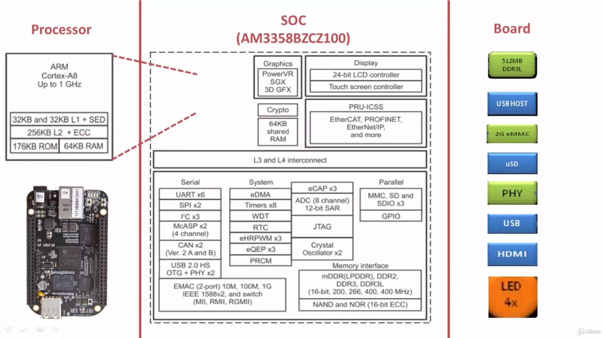
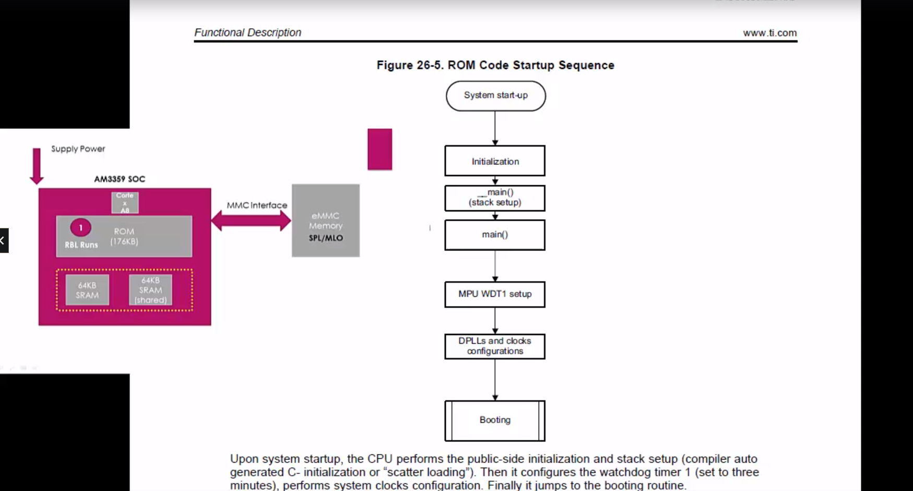

- ### The SOC ```AM335x``` consists of ```ROM```, that is Read Only Memory. The size of this ```ROM``` is very small. It's about only ```176 KB``` enough to hold the ```ROM Boot Loader```. And the SOC also has small ```internal RAM memory```, whose size is just ```128 KB```.

- ### So, when you give power to the ```SOC```, it first undergoes the power on reset. And the ```ROM Boot Loader``` is the first software component to run on the ```SOC```. The ROM code does the initial initializations as per the below flowchart over here. 



- ### First it does the ```stack setup```. Then calls the ```main function``` where first ```Watchdog Timer``` gets initialized. The ```Watchdog Timer``` is actually initialized for ```3 minutes```. That means, if the ```RBL``` could not able to load the ```Second Stage Boot Loader``` within ```3 minutes```,then the watchdog timer will expire and it will ```reset``` the processor.


- ### ```PLL``` stands for ```Phase-Locked Loop```. ```Phase-Locked Loop```is the clock generating engine by using which you can generate wide ranges of clock frequencies for different subsystems of the ```SOC```. For ```the PLL```, you have to give a ```low frequency clock source``` as an input, like a ```crystal oscillator``` and then the ```PLL``` will give you much higher ```output frequency``` which you can use to run your various subsystems of the SOC, like ```processor```, ```display```, ```peripherals```, etc., etc..


- ### During clock initialization, what ```ROM Boot Loader``` does is, it checks the value of ```SYSBOOT 14 and SYSBOOT 15```, and based on the value of ```14th and 15th SYSBOOT``` pin, it decides the ```external crystal oscillator``` value connected to the SOC. 


- ### On the ```Beaglebone black``` hardware, we have ```24 MHz Crystal Oscillator``` connected. You can find it at the bottom of the board whose name is ```Y2```.


- ### So, on our Beaglebone black hardware, the ```SYSBOOT 14th``` pin should be connected to high voltage and ```SYSBOOT 15th``` pin is tied to low voltage. So, if the ```RBL``` reads the value as ```01```, then it decides that ```24 MHz``` clock is connected. Based on this data, it configures the ```PLL engine``` of the ```SOC```.

- ### This TRM document says that, it configures the ```PLL``` to deliver ```500MHz``` of clock frequency to the ```Cortex-A8``` processor. That's the power of ```PLL```; it just takes ```24MHz``` as input and produces much ```higher clock frequency```. So, after the ```clock inits```, the ```cortex A8``` should be running at ```500MHz.```


> ### And please note that, you can not make the ROM boot loader to change these clock frequencies. This is fixed. Suppose, if you want to clock your MPU at ```300MHz``` instead of say ```500MHz```, you can only do that in the ```Second Stage Boot Loader``` where you can bring down the clock frequency to ```300MHz```. So, because the ```ROM boot loader``` is loaded into the SOC during taping out of the chip. So, ```you cannot change it```. So, the ```Second Stage Boot Loader``` is the phase where you can reconfigure the ```PLL``` to produce the frequencies which you like.

- ### After that, the ```RBL``` goes for the ```booting```. ```Booting``` here means, now it wants to load the ```Second Stage Boot Loader``` found in the ```external memory``` or ```peripherals```. It will go through all the boot list and the loop is exited if a ```valid booting image``` is found and executed or upon the watchdog expiration. What's the ```Watchdog``` expiry time?? It's 3 minutes, right? So, ```RBL``` must load and execute the ```Second Stage Boot Loader``` within 3 minutes.


- ### Let's say it finds the ```Second Stage Boot Loader``` on the ```e-MMC memory``` of the board. Then the ```ROM``` code copies the ```MLO/SPL``` to the ```internal RAM``` of the ```SOC```. The MLO or SPL will have its own image header.


- ### The ```RBL``` first reads the ```image header of the MLO```. From the image header, it will get 2 important information. One is the ```load address``` and another one is the ```total size of the MLO```. So, the ```RBL``` will load the ```MLO``` to the ```internal RAM address``` indicated by the ```image header``` of the MLO. After this stage, ```RBL's``` job is almost over. Finally execute ```MLO``` stored in the internal ```RAM```.
