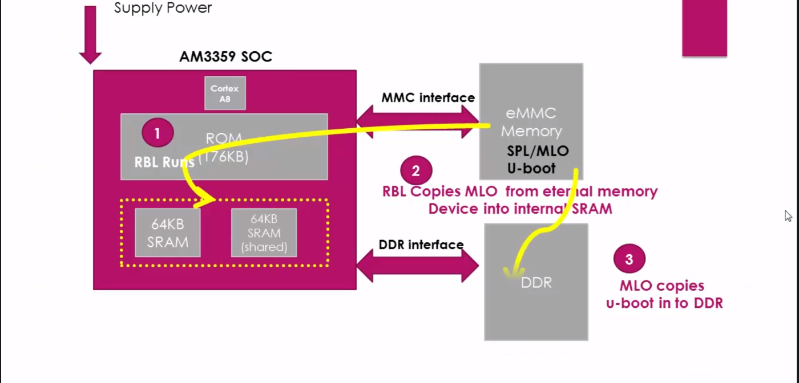
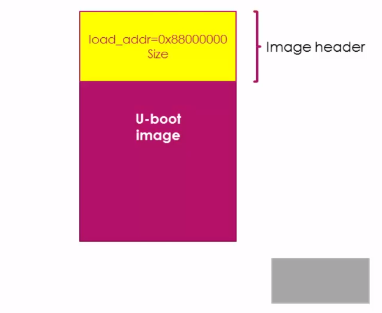

- ### ```MLO``` initializes the processor to a point that the ```Third Stage Boot Loader``` or ```U-Boot``` can be loaded into the ```external RAM```, that is ```DDR memory```.


- ### Some of the key work done by the ```MLO``` are:
- - ### it does ```UART console initialization``` to printout the debug messages.
- - ### It will reconfigure the ```PLL``` to the desired value. If it doesn't like, the initialization done by the ROM boot loader.
- - ### Initialize the ```DDR memory registers``` to use the ```DDR memory```, because, ```MLOs``` job is actually to load the ```Third Stage Boot Loader``` such as the ```U-Boot``` into the ```external DDR memory```.
- - ### ```The MLO``` does some muxing configurations of boot peripherals
> ### ```Pin muxing```: To keep the pin count low, multiple functionalities are brought out on a single pin. For example a pin can be used for different functionalities like ```SPI, I2C, Ethernet, USB, MMC, etc.```
- - ### if ```MLO``` is going to get the ```U-Boot``` from the ```MMC0 or MMC1``` interfaces lets say, then it will do the ```mux configurations``` to bring out ```the MMC0 or MMC1``` functionalities on the pins, and it will also do the ```MMC peripheral related initialization```. Then it copies the ```U-Boot image``` into the ```DDR memory``` and then it passes control to it. 



- ### ```U-Boot``` also will have its own image header which indicates the load address and the size of the image. ```The MLO``` loads the ```U-boot``` to the address as indicated by the U-Boot image header.



> ### MLO will not load the third stage boot loader like U-Boot to the internal RAM of the SOC. Why? Because, the internal RAM is only of 128KB. U-boot obviously will not fit there. So, it copies it to the DDR memory which is external to the SOC.

> ### Can we avoid using ```MLO or SPL``` by making ```RBL``` directly loads the ```U-Boot``` in to ```internal SRAM```? Why we need ```MLO or SPL```? The answer is the size of the ```internal RAM``` in ```AM335x``` is 128KB. Out of which some ```1KB``` of memory is considered as ```secure memory``` which cannot be used. And also some space is reserved for the purpose of ```stack``` and ```heap related activities```. So, the available space will be lesser than the ```128KB```. So, that means, you have to squeeze in the ```U-Boot image``` to less than ```128KB``` in order to store it into the ```internal RAM``` of the SOC. But, by considering all the required features of the ```U-Boot```, it's almost not possible to reduce the ```U-Boot image``` to less than 128KB.

> ### And another interesting question is, can we use ```RBL``` to load the ```U-Boot``` directly into ```DDR memory``` of the board and skip using ```MLO or SPL```?
> - ### The reason why ```ROM boot loader``` of the ```AM335x SOC``` cannot load ```U-Boot``` directly to ```DDD3``` by skipping ```SPL``` is, ```ROM code``` won’t be having any idea about what kind of ```DDR RAM``` being used in the product to initialize it. ```DDR RAM``` is purely product/ board specific.

> - ###  Let’s say there are 3 board/product manufacturing companies X,Y,Z. X may design a product using AM335x SOC with ```DDR3```. In which lets say ```DDR3 RAM``` is produced by microchip. Y may design its product using AM335x SOC with ```DDR2``` produced by ```Transcend``` and Z may not use ```DDR memory``` at all for its product. So, ```RBL``` has no idea in which product this chip will be used and what kind of ```DDR``` will be used, and what are ```DDR tuning parameters``` like ```speed```, ```bandwidth```, ```clock augments```, ```size```, etc. Because to ```read ( or write)``` anything from/to ```DDR RAM``` , first, the ```tuning parameters``` must be set properly and ```DDR registers``` must be initialized properly . Every different manufacture will have different parameters for their ```RAM```. So, that’s the reason ```RBL``` never care about initializing ```DDR controller``` of the chip and ```DDR RAM``` which is connected to chip. ```RBL``` just tries to fetch the ```SPL``` found in ```memory devices``` such as ```eMMC``` and ```SD card``` or ```peripherals``` like ```UART,EMAC,etc.``` And in the ```SPL/MLO```, you should know, what kind of ```DDR``` is connected to your product and based on that you have to change the ```SPL code``` , rebuild it and generate the binary to use it as the ```third stage boot loader```. For example the ```Beaglebone black``` uses ```DDR3 from Kingston``` and if your product uses ```DDR3 from transcend```, then if the ```turning parameters``` are different then you have to change the ```DDR``` related header files and the ```tuning parameter macros of the SPL``` , rebuild and generate the binary . 


