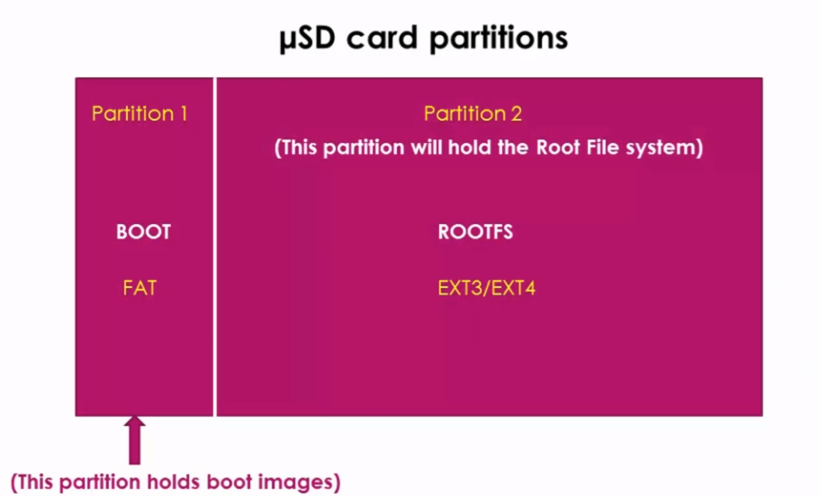
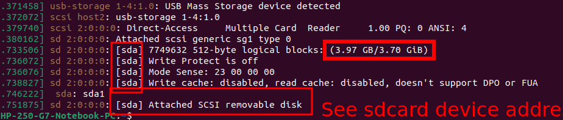
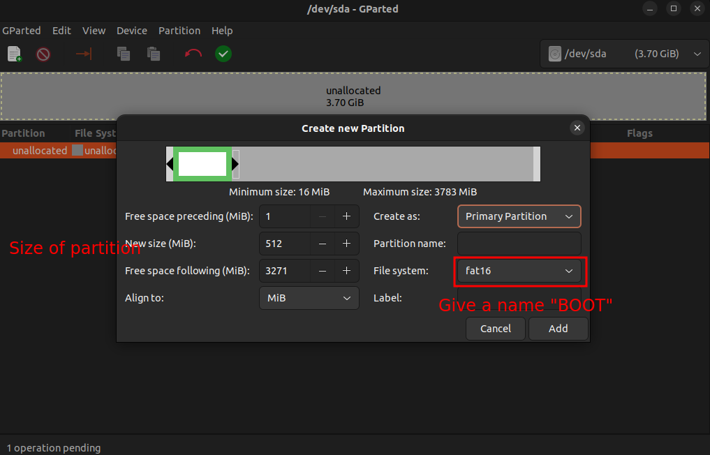
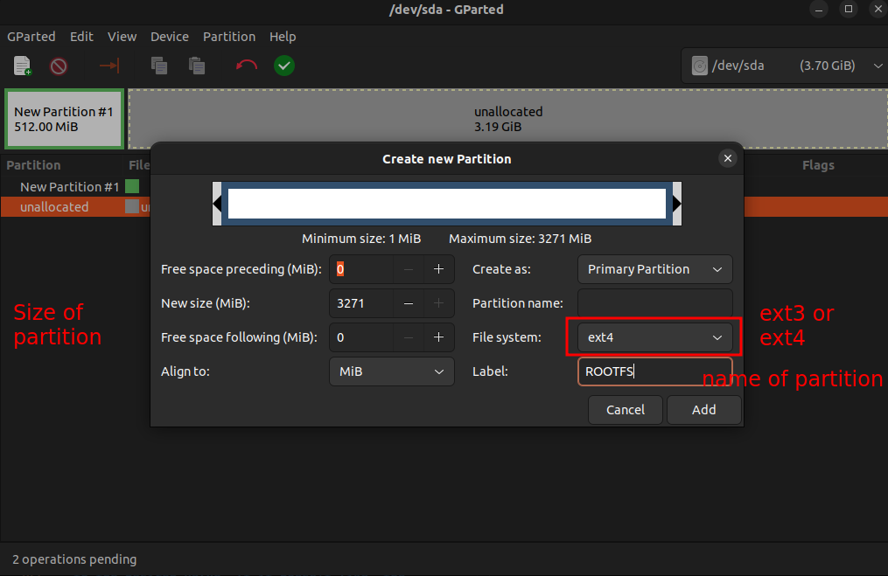
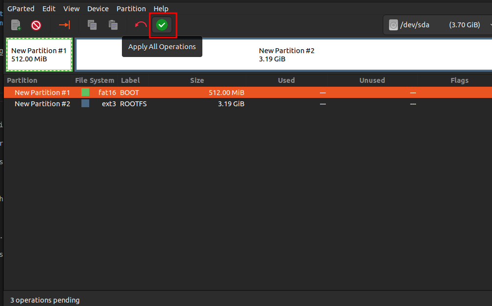
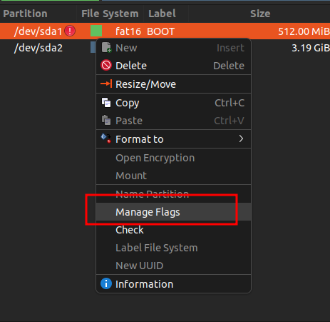
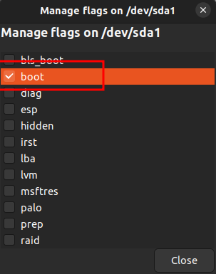
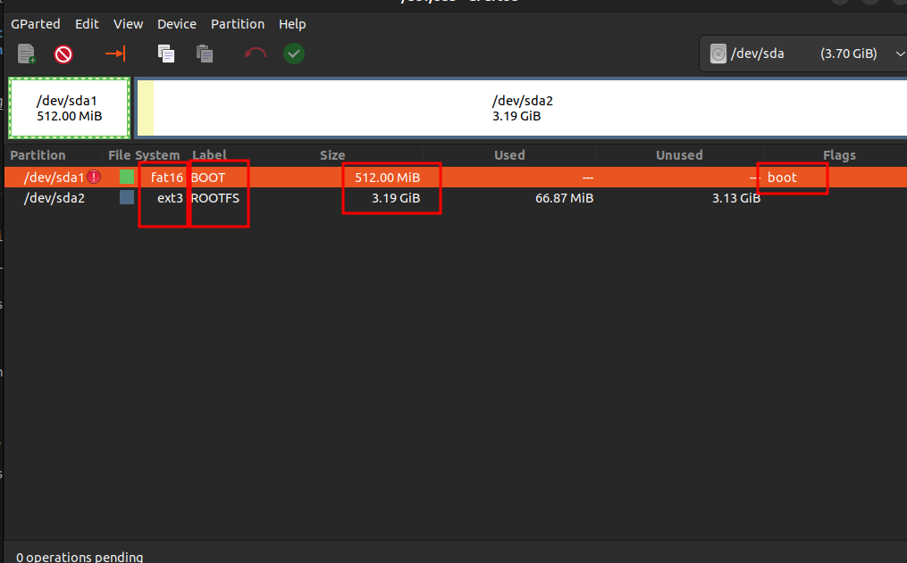
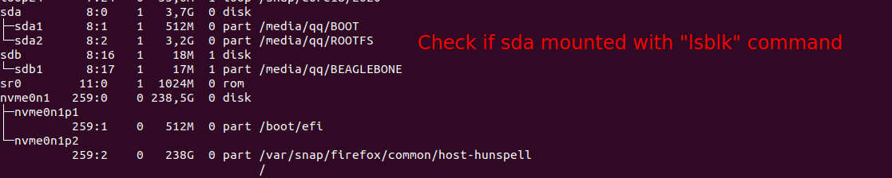

- ### You have to partition that card into two. One partition must be of type ```FAT``` filesystem and another partition should be of type ```EXT3```. ```EXT3``` and ```EXT4``` are Linux native file systems. 



#
- ### STEP 1

#

#
- ### STEP 2

#

#
- ### STEP 3

#

#
- ### STEP 4

#

#
- ### STEP 5

#

#
- ### STEP 6

#

#
- ### STEP 7

#

#
- ### STEP 8: Check sdcard alread mounted

#


#
- ### STEP 9: If not *```mounted```*
- - ### Create a directory
```
$ sudo mkdir /media/qq/BOOT
```
- - ### Mount
```
$ sudo mount /dev/sda /media/qq/BOOT
```
#


#
- ### STEP 10: Copy ```MLO``` and ```u-boot.img``` to ```BOOT``` partition
- - ### Copy Command
```
$ cp MLO-beaglebone-2013.04 /media/qq/BOOT/MLO
$ cp u-boot.img /media/qq/BOOT/u-boot.img
```
- - ### Sync
```
$ sync
```
#

