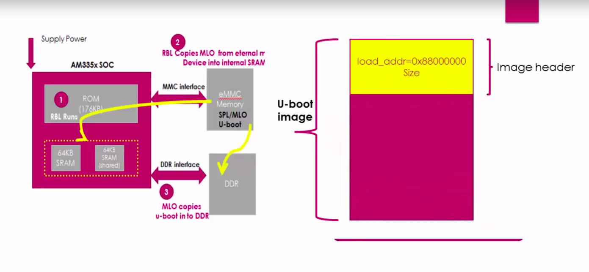
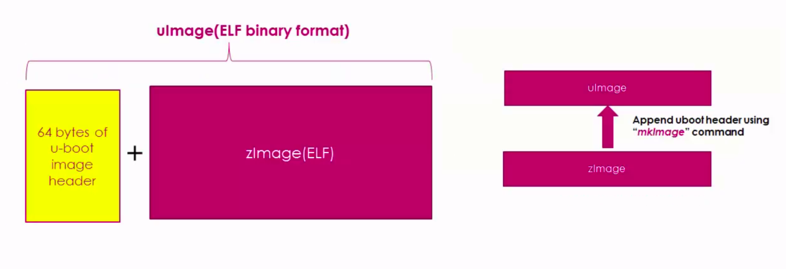
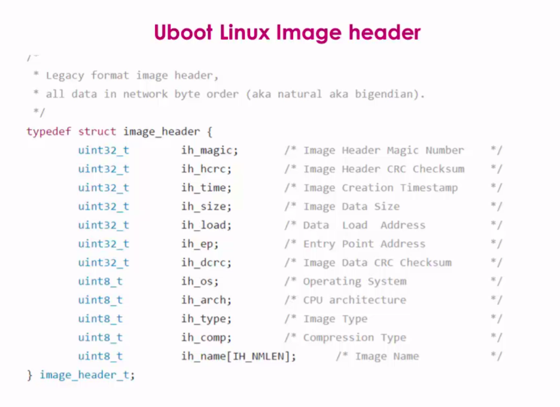
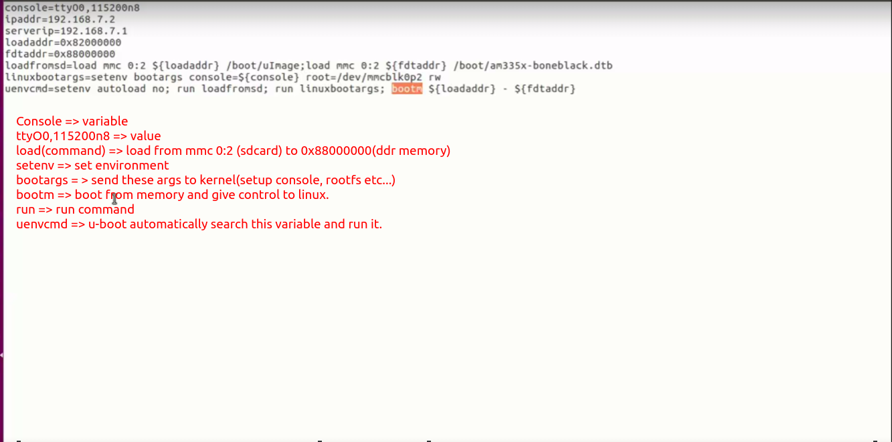
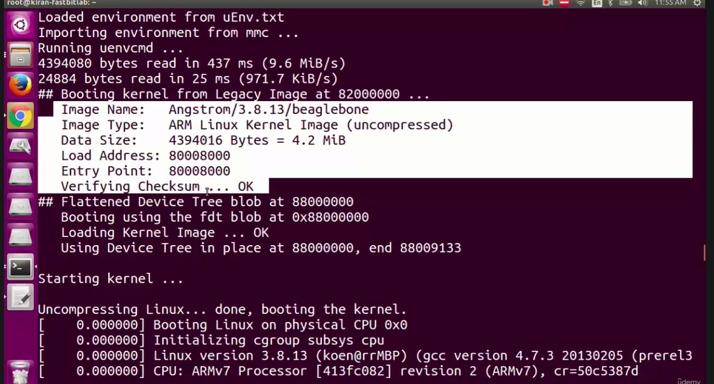
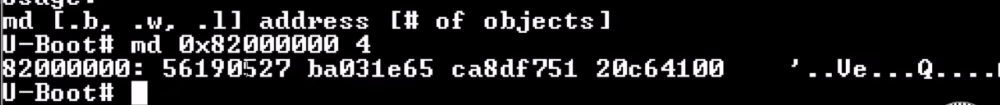
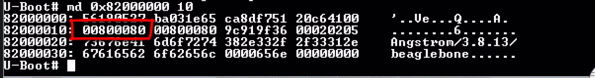
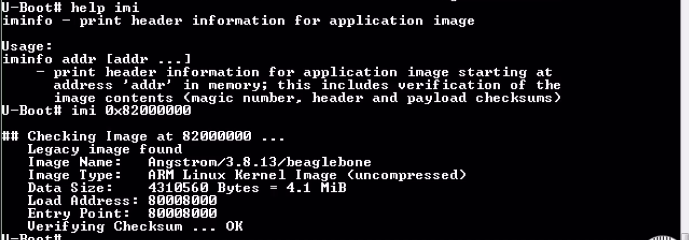

- ### The load adress and size of ``` U-Boot``` is indicated by the image header of the ```U-Boot``` header. 



### ```U-Boot``` does:
- ### Many hardware initializations which are required for Linux to boot on the board successfully.
- ### Initializes some of the peripherals like ```I2C, NAND Flash, Ethernet, Uart, USB, MMC interfaces``` etc... Because ```U-Boot``` supports loading kernel from all these peripherals.

- ### The major job of ```U-Boot``` is to load the Linux kernel from various boot sources to the ```DDR``` memory. The boot sources could be ```USB, eMMC, SC Card, Ethernet, Serial Port```


### you should provide one file called uEnv.txt, which consist of environmental variable values of the u-boot, which directs ```U-Boot``` how to behave.

### ```U-Boot``` always looks for uImage. uImage is nothing but zImage plus ```U-Boot``` header. ```zImage``` is elf binary format of the Linux kernel and if you append the ```U-Boot``` header to it, it's called uImage.



### This is the image header which ```U-Boot``` expects on top of the ```zImage```. Total bytes 64.








## Reading U-Boot header information of the ```UImage``` manually


### 1) Load the ```UImage``` from Memory Device(Sdcad/eMMC) into the ```DDR``` memory of the board.
### 2) Use the memory dump command of ```U-Boot``` to dump header information.


```
U-Boot# load mmc 0:2 0x82000000 /boot/uImage
4310624 bytes read in 520ms (7.9 MiB/s)
```

```
U-Boot# help md
md - memory display

Usage:
md [.b, .w, .l] address [# of objects]
```

### Read 4 words. It is little endian. 
### First one is ```ih_magic``` which is equal to ```0x27051956```
### Second word is checksum which is equal to ```0x651e03ba```
### Fourth word is image data size which is equal to ```0x0041c620```



### You can check the date size of image + 64(image header size)
```
0x0041c620 = 4310560 + 64 = 4310624 (Same as read bytes)
```

### Load adress is: 0x00800080
### You can also see image name ```Angstrom/3.8...```


### Or by simple use ```imi``` command.

