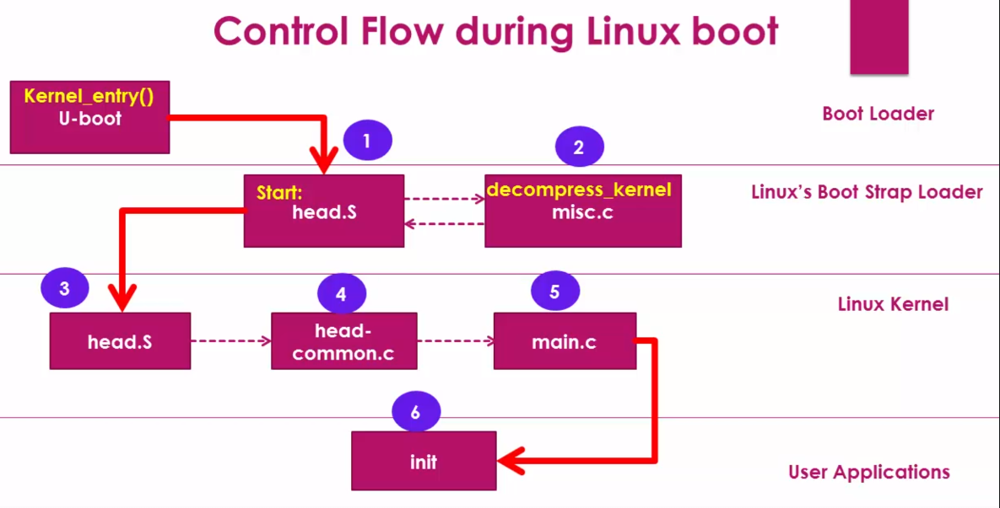

> Hands off control: Kontrolü bırakmak

## Let see, how exactly ```U-Boot``` hands off the control to the ```Linux kernel```.

- ### ```U-Boot``` hands off the control to the ```head.s``` file in the ```Bootstrap Loader``` of the Linux.
- ### Then, the ```head.s``` calls ```miscellaneous.c (misc.c)``` file. That also belongs to the ```Bootstrap loader``` to uncompress the compressed image.
- ### Then the control comes to another ```head.s``` file of the ```Linux kernel```.
- ### From ```head.s``` file of the ```Linux kernel```, the control comes to the ```main.c``` file of the ```Linux kernel```, and from ```main.c``` file, the first application of the Linux kernel that is ```init``` is launched.


#
## How ```U-Boot``` hands off control to the ```BootStrap Loader``` of the Linux kernel?


> ### Check ```U-Boot``` source code => ```arch/arm/lib/bootm.c```
- ###  ```kernel_entry``` is a variable which is capable of holding a pointer to a function. ```kernel_entry``` is initialized to images. Under that there is a member called ep, that is entry point.This function pointer is initialized to address, which is nothing but Linux entry point.

### Search ```bootm_headers_t``` structure.


- ### ```images->ep``` holds entry point of the ```kernel```.


#


- ### ```images->ft_addr```;


#
### Dereferencing ```kernel_entry```;


### This is a point where the U-Boot is actually handing off control to the Linux kernel's bootstrap loader. ```kernel_entry``` function actually calls the start routine in the head.s file of the bootstrap loader.


#
## Check ```head.s``` located in ```arch/arm/boot/compressed/head.s```


- ### This is a place where the control comes from U-boot to the bootstrap loader of the Linux kernel


- ### You can see these two lines of code where it is actually saving the architecture ID that is nothing but the machine id and the dtb address. It is actually saving it to register ```r7``` and ```r8```.

- ### If you go back to ```U-boot``` when we dereference the entry point address, we also send three arguments, isn't it? so, the first argument is stored in ```r0```, that is in the register ```r0```.So, the second argument is stored in the register ```r1``` and the third argument is stored in the register ```r2```.

- ### After that  the head.s file of the bootstrap loader calls the misc.c file in order to decompress the kernel.


# 
- ### The control after that will be passed from ```head.s``` of the bootstrap loader to another ```head.s``` of the Linux kernel located in /arch/arm/kernel```.



> ### This ```head.s``` is actually architecture specific code. It's not depending upon any SOC family. It's a generic ```startup code``` for ```arm processors```. 
> - ### It does arm specific initialization such as ```instruction``` and ```data cache initialization```, ```exception an interrupt setup```, and other ```low level initialization```, which are required for the successful boot of the ```Linux kernel image```.


> ### The uncompression and relocation of the ```Linux kernel``` image is not the responsibility of the ```U-Boot```. It's the responsibility of the ```bootstrap loader``` which is glued to the ```Linux kernel image```.

> ### There are two files of the same name ```head.s```. One belongs to the ```bootstrap loader``` and another one belongs to the ```Linux kernel``` Both are ```architecture dependent```. In this case the architecture is ```ARM```. 
