> Hands off control: Kontrolü bırakmak

## Lets check ```Linux Kernel```


### Open ```head.s``` located at ```arch/arm/kernel/head.S```

```
/*
 * Kernel startup entry point.
 * ---------------------------
 *
 * This is normally called from the decompressor code.  The requirements
 * are: MMU = off, D-cache = off, I-cache = dont care, r0 = 0,
 * r1 = machine nr, r2 = atags or dtb pointer.
 *
 * This code is mostly position independent, so if you link the kernel at
 * 0xc0008000, you call this at __pa(0xc0008000).
 *
 * See linux/arch/arm/tools/mach-types for the complete list of machine
 * numbers for r1.
 *
 * We're trying to keep crap to a minimum; DO NOT add any machine specific
 * crap here - that's what the boot loader (or in extreme, well justified
 * circumstances, zImage) is for.
 */
```

### If you read these comments you can make out something.
- ### This is normally called from the ```decompressor code```. That means, from the ```bootstrap loader```, which actually did the ```decompression of the kernel``` and triggered the execution of the ```decompressed kernel```.

- ### ```MMU``` is off. That means, ```no virtual addressing``` being enabled. Because, we are still in the initialization phase of our hardware.

- ### ```D-cache``` is off. ```I-cache``` of the processor is also off. The register ```r0``` contains 0 and the register ```r1``` must contain the value of the machine id. Every board will have unique machine id. The ```r1``` must contain that. Because, this file uses the machine id to carry out the machine specific initialization and the register ```r2``` will hold the address of the device tree binary which is present there on your RAM.


#
### So, now let's explore some of the important sub routines called by this file. 

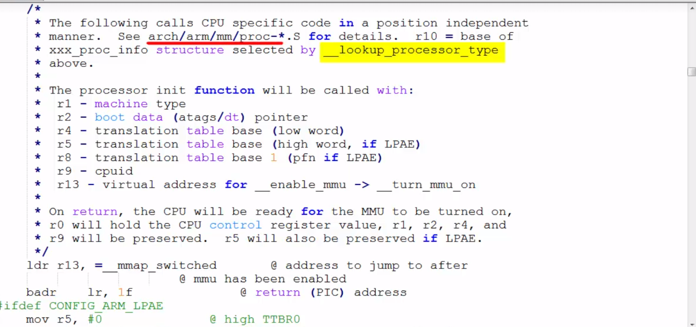

### This call will search for the processor architecture present on the board. After knowing the processor type, then it calls the appropriate processor specific initialization routines found in the respective processor specific files in the path ```arch/arm/mm```. ```mm``` stands for memory management.

> ### This comment says that on return, the CPU will be ready for the ```memory management unit``` to be turned ON. So, which confirms that all the processor specific calls are made to initialize the ```mmu``` before turning it ON. So, that means, before giving control to the Linux generic code, ```mmu``` initialization and turning on of the ```mmu``` is must. That's the duty of these architecture specific codes.

#
### Let's have a look in arch/arm/mm directory. Here you can see that, every processor has its own processor specific initialization file.

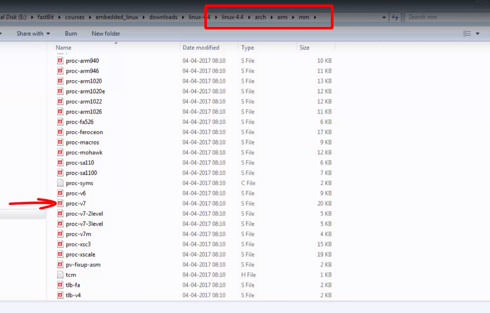

#
### Another important assembly subroutine is enable MMU. So, which initializes the ```page table pointers``` and turn on the ```mmu```, so that the kernel can start running with virtual address support.

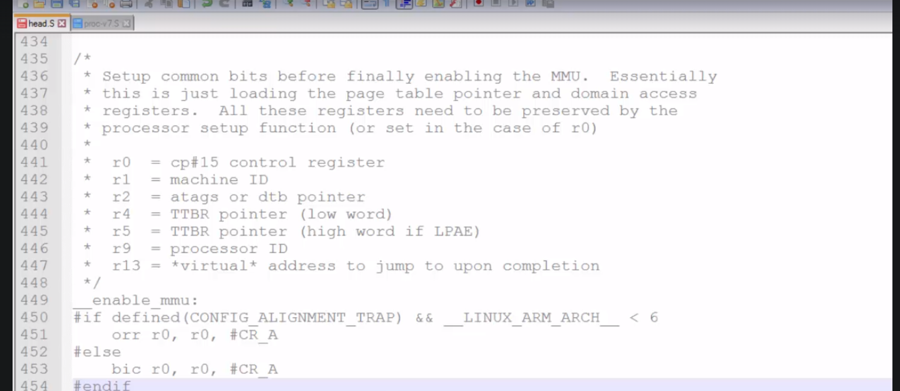


### After that, a function called start kernel is called from the file ```head-common.S``` located in the same path ```arch/arm/kernel```. From here the flow control comes to the file ```main.c``` of the Linux kernel.

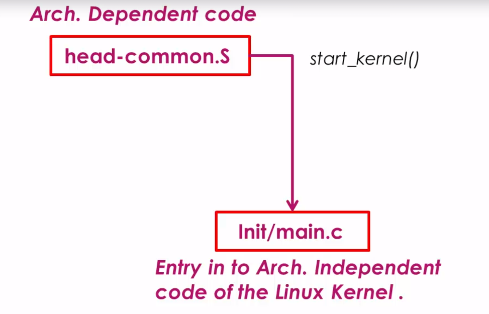


#
## launch of ```INIT```


- ### The functions start kernel is a C function implemented in architecture independent generic file that is ```main.c``` found in this path, ```Init/main.c```.
- ### At this point, all the architecture depending initializations are over, your CPU is ready with the MMU support and Linux is all set to do architecture independent kernel initialization.

### What we have done so far:
- ### First of all, the ```head.s``` belongs to the Linux kernel architecture specific code, mostly it does CPU specific initializations of the SOC. in this case ARM cortex- A8 is the CPU.
- ### If you analyze the code of ```head.s```, it's particularly interested in searching of CPU type like whether it belongs to ARM 9 or ARM 10 or ARM cortex A8, etc.
- ### And once it comes to know about the architecture type, it majorly initializes the ```MMU``` and creates the ```initial page table``` entries and then enables the ```MMU``` of the processor for ```virtual memory support```, before giving control to the ```main.c``` file of the Linux kernel which is the generic one.

### let's go to the function start_kernel in the file ```main.c``` and explore what it does.

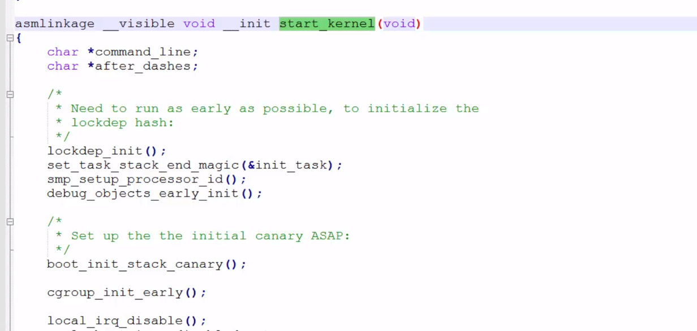
### Does all the startup work for the Linux kernel from initializing the ```very first kernel thread``` , all the way to ```mounting a root file``` system and executing the ```very first user space Linux application program```.

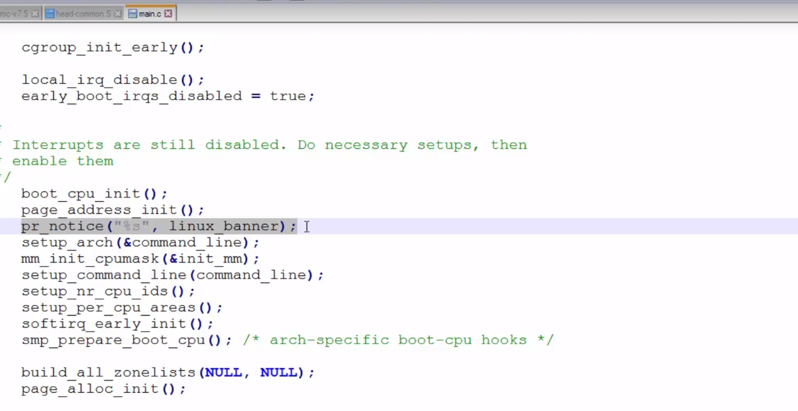

### ```The kernel``` prints the ```linux_banner string```, which you can identify in the log over here. The linux_banner string you can find here in the file init/version.c

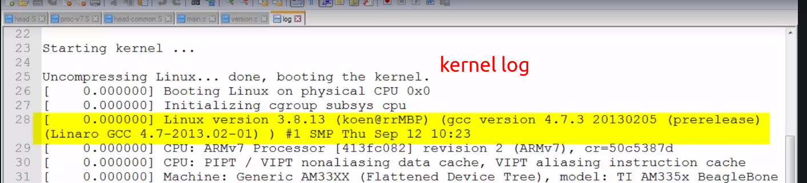

### It actually prints the ```linux version```, ```the compiler version```, ```the date of compilation```, ```the build number```, etc..

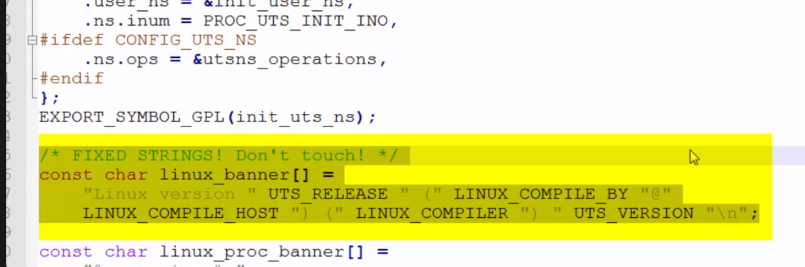


### After that, start ```kernel``` does lots of early initialization of the Linux kernel such as ```extracting the command line arguments``` sent by the ```boot loader```, ```initialization of the console``` to get the ```error messages```, ```Memory management initialization```, ```scheduler initialization```, ```timer initialization```, ```high resolution timer initialization```, ```software IRQ initialization```, etc..

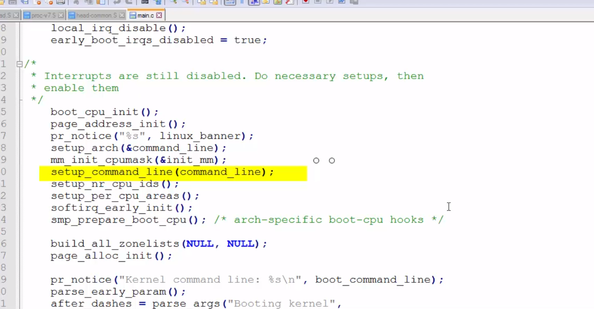


### So, basically it initializes various subsystems of a ```Linux kernel``` before mounting the ```root file system``` and launching the ```very first Linux application```.

### After that, at the end it calls a function called ```rest_init()```. We are very close to launching our first program that is ```init```.

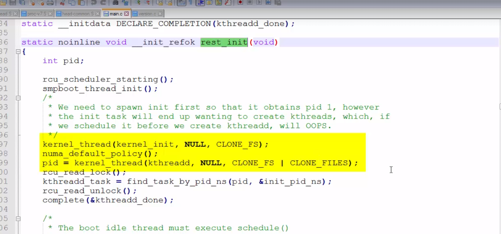

### So, here give attention to these two lines. So, here it is creating 2 ```kernel threads```; one is called ```kernel_init``` and another one is called ```kthreadd```. After that, here, it is starting the ```scheduler``` and then ```kernel``` is going to ```CPU idle loop```. This is actually a ```infinite loop```. That is ```while (1)```.

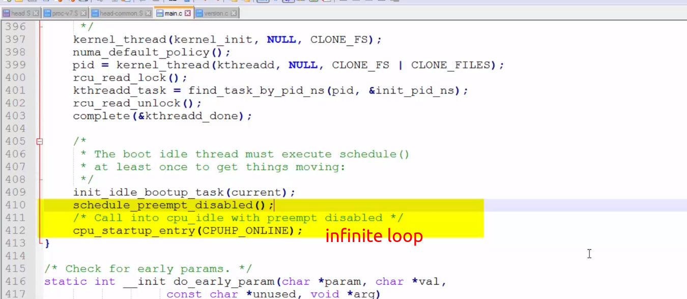

### So, here, take a look into this comments.

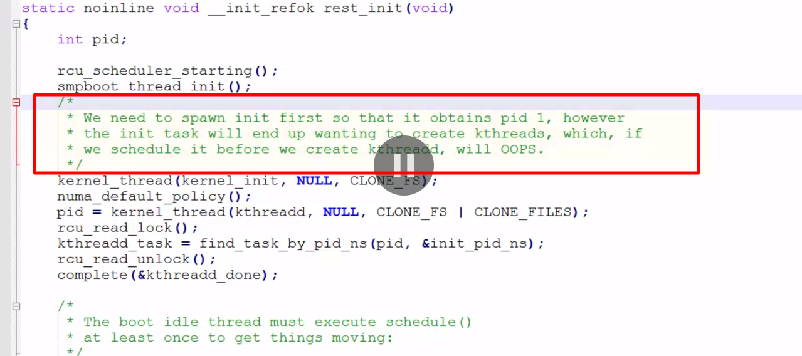

### First they are creating a kernel thread called ```kernel_init```, which will get the pid number ```1``` and then they are creating another kernel thread called ```kthreadd```, which will get the pid number ```2```. So, actually there are ```two kernel threads``` got created. The ```kernel_init kernel thread``` will then execute the very first user application called ```init```. So, that's the reason ```init application``` actually inherits its kernel threads ```pid number```, that is ```1``` and ```kthreadd kernel thread``` is used to spawn ```other kernel threads```.


> ### ```kernel_init``` is a kernel thread which is used to spawn the very first Linux application that is ```init```.
> ### ```kthreadd``` is also another kernel thread which is used to spawn ```other kernel threads```.
#
### let's go to this function kernel_init.

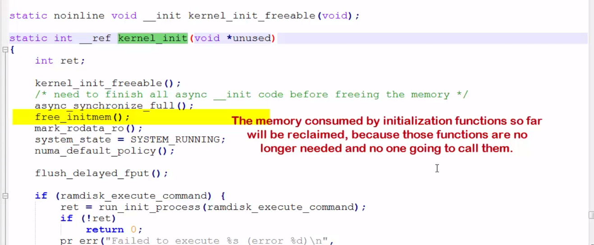


### Once the Linux initialization is done, no one going to call those functions. It's very important to reclaim all those memories. That's the reason you get to this kernel log: ```free_initmem```. This much of memory of the RAM is reclaimed by the kernel.
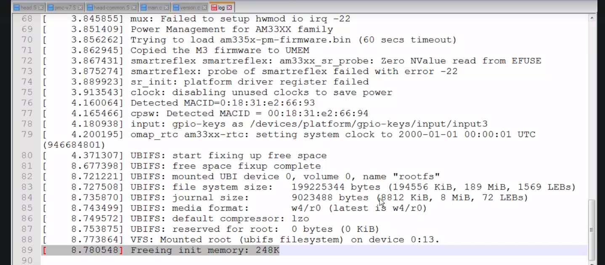


### It tries to run the init application. If this fails, it tries this. If this also fails, then it comes over here, and tries these options one by one. First it tries to execute the program from this location, in the root file system. If it fails to find the init at this location, it tries at other locations. And if no init is found, then it simply executes the shell application which is present in the root file system and just returns. If none of these programs found in these location, then it actually throws an error "no init found", And note that you can also mention the path of the init program by using the Linux command line argument called init.

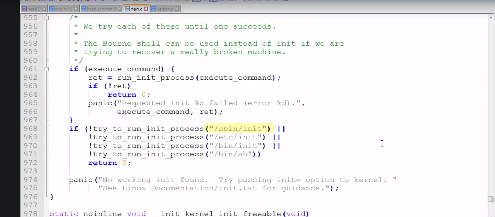
