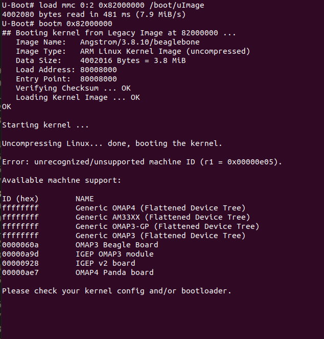

> ### If you just type command ```help``` on the ```u-Boot``` command prompt, the ```U-Boot``` will lists out all the commands which is supported by this version.

- ### ```boot```: boot default, i.e. run ```bootcmd```
- ### ```bootm```: boot application from image from memory.
- ### ```bootp```: boot image via network using ```BOOTP/TFTP``` protocol.
- ### ```printenv```: see all environmental variables.

#
## ```setenv``` and ```printenv```

### You can define env in three ways.
```
U-Boot# serverip=192.168.1.1
U-Boot# setenv serverip 192.168.1.1
U-Boot# printenv serverip
serverip=192.168.1.1 
U-Boot# setenv serverip '192.168.1.1'
U-Boot# printenv serverip
serverip=192.168.1.1 
U-Boot# setenv serverip "192.168.1.1"
U-Boot# printenv serverip
serverip=192.168.1.1 
```

## ```run```
### ```Run``` command execute the values of env.

```
U-Boot# setenv temp1 echo test
U-Boot# run temp1
test 
```

### Also multiple command can be run at once
```
U-Boot# setenv temp2 "echo a;echo b;echo c;echo d"
U-Boot# printenv temp2
temp2=echo a;echo b;echo c;echo d
U-Boot# run temp2
a
b
c
d
```
```
U-Boot# setenv temp3 "echo x;run temp2"
U-Boot# run temp3
x
a
b
c
d
```
```
U-Boot# setenv my_mmc "mmc rescan;sleep 2;mmc list"
U-Boot# run my_mmc
OMAP SD/MMC: 0
OMAP SD/MMC: 1
```
#
## ```boot``` command

### When you execute the commnad ```boot```, it tries to boot the Linux kernel. it actually tried to read the ```uEnv.txt```.


### ```boot``` command just runs the ```bootcmd``` environmental variable. ```bootcmd``` is actually a environmental variable which is actually set of some U-Boot commands. That means number of U-boot commands are actually stored as a value in a ```bootcmd``` environmental variable and your ```boot``` command just executes it. if I change this variable, then the behavior of the ```boot``` command will be changed

### ```load``` is a command which is actually used to load a binary file from a file system. The filesystem could be anything, it cold be fat based file system, it could be ext3/etx4 based file system. The ```load``` command detects automatically the file system and it will try to load from memory devices such as ```eMMC, SDCard, NAND flash etc..```. From those memory devices, it will try to load into the addres given the parameter.


### Lets load the Linux binary image ```uImage``` from the second partition of the on-board eMMC memory into DDR memory!.

> ### ```bootm```: boot application image from memory or boot application image stored in memory.

```
U-Boot# load mmc 0:2 0x82000000 /boot/uImage
4002080 bytes read in 481 ms (7.9 MiB/s)
U-Boot# bootm 0x82000000
```



### The kernel couldn't boot. So, when you typed ```bootm``` from this address, what ```U-Boot``` did was, it actually tried to execute a binary image present at this address, which is nothing but our ```Linux kernel image```. So, that's why, it printed whatever the U-Boot header present on the Linux kernel image. Then it handovers control to the ```Linux bootstrap loader``` and the ```Linux bootstrap loader``` actually thrown a error which says that, ```unrecognized/ unsupported machine ID```, actually it tried to compare the value of ```r1``` with something and it came to know that this is not a correct ```machine ID```. So, that's because, we have not provided the ```device tree binary```. To boot the kernel successfully, you have to tell where exactly the ```DTB``` is stored.


### Load ```dtb``` from the second partition of sdcard into the DDR memory.

```
U-Boot# load mmc 0:2 0x88000000 /boot/am335x-boneblack.dtb
23334 bytes read in 13 ms (1.7 MiB/s)
U-Boot# bootm 0x82000000 - 0x88000000
```


### There is no crush, but Linux is not sending any boot logs. Because the kernel has no idea, which serial port of the board is used for sending the boot logs.

> ### The BBB uses ```UART0``` as the serial debug terminal, which is enumerated as ```/dev/ttyO0``` by the serial driver. 

### Some information has to be transferred from ```U-Boot``` to ```Linux Kernel```. For example, letting the ```kernel``` know about the file system that ```linux``` has to mount, it can be ```network based``` file system or ```etx3``` or ```ext4``` or ```RAM``` based file system. Another example would be from which port Linux will send log messages.

### There is a environmental variable called ```bootargs``` which is used to send boot arguments to the kernel. initially ```bootargs``` is not defined. it is job to create this environmental variable.
> ### Letting the ```Linux``` which port it will send log messages:
>```
> setenv bootargs console=ttyO0,115200
> ```

### It couldn't able to mount the ```rootfs```. There is a kernel panic. We didn't tell any file system type to the Linux kernel. The Linux kernel has no idea where exactly the ```RFS``` that is root file system is present, whether it is present on the USB or whether it is present on the ```network``` or ```ext3``` file system, ```eMMC```, it doesn't know anything. So, that's why, it said unable to mount the ```rootfs```. Now, you have to edit this ```boot arguments``` to include the ```rootfs type```.


### To mount the filesystem which is present at the partition 2 of the ```MicroSD Card``` and give access as read and write by ```rw```.

```
setenv bootargs console=ttyO0,115200 root=/dev/mmcblk0p2 rw
```


#
## Step 1(only terminal)
```
load mmc 0:2 0x82000000 /boot/uImage
load mmc 0:2 0x88000000 /boot/am335x-boneblack.dtb
setenv bootargs console=ttyO0,115200 root=/dev/mmcblk0p2 rw
bootm 0x82000000 - 0x88000000
```
### OR(both, if is used in uEnv.txt file remove boot and add empty line at the end)
```
loadaddr=0x82000000
fdtaddr=0x88000000
setenv bootargs console=ttyO0,115200 root=/dev/mmcblk0p2 rw
setenv loadfromsd "load mmc 0:2 ${loadaddr} /boot/uImage;load mmc 0:2 ${fdtaddr} /boot/am335x-boneblack.dtb"
setenv bootcmd "run loadfromsd; bootm ${loadaddr} - ${fdtaddr}"
boot
```
### OR(only uEnv.txt file)
```
loadaddr=0x82000000
fdtaddr=0x88000000
bootargs=console=ttyO0,115200 root=/dev/mmcblk0p2 rw
loadfromsd=load mmc 0:2 ${loadaddr} /boot/uImage;load mmc 0:2 ${fdtaddr} /boot/am335x-boneblack.dtb
bootcmd=run loadfromsd; bootm ${loadaddr} - ${fdtaddr}

```
### OR(only uEnv.txt file)
```
console=ttyO0,115200n8
ipaddr=192.168.7.2
serverip=192.168.7.1
loadaddr=0x82000000
fdtaddr=0x88000000
loadfromsd="load mmc 0:2 ${loadaddr} /boot/uImage;load mmc 0:2 ${fdtaddr} /boot/am335x-boneblack.dtb"
linuxbootargs=setenv bootargs console=${console} root=/dev/mmcblk0p2 rw 
uenvcmd=setenv autoload no; run loadfromsd; run linuxbootargs; bootm ${loadaddr} - ${fdtaddr}

```


### Save any of the above(except 1) in a file named uEnv.txt. Make sure empty line at the end. Start ```loady``` in ```u-boot```  by typing ```loady``` command on ```u-boot``` terminal and press ```ctrl+a, s```. Select the ```uEnv.txt``` file. To enter directory press double space. To select file press one space.


```
env import -t 0x80200000 <number of bytes readed from file>
```
### Boot
```
boot
```


