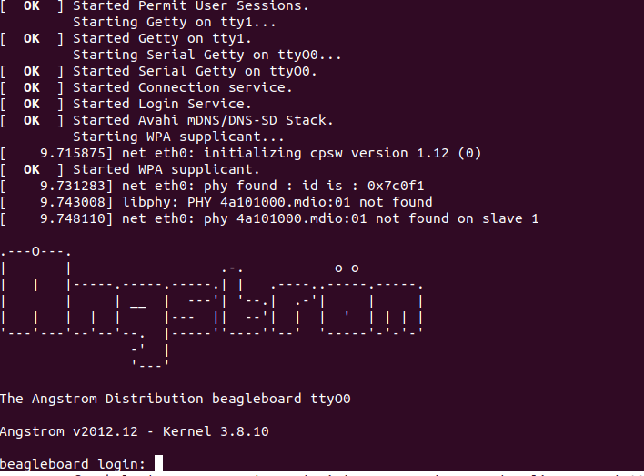

### 1) Clone git repo:
```
$ git clone https://github.com/niekiran/EmbeddedLinuxBBB.git
```

### 2) Prepare Sd card:
=====> Go to /Commands/format_partition.md

### 3) Mount partitions
```
$ mount /dev/mmcblk0p1 /media/boot/
$ mount /dev/mmcblk0p2 /media/rfs/
```

### 4) Copy ```MLO, u-boot.img, uEnv.txt```
> ### File names must be exactly as in the title.
```
$ cp pre-built-images/Angstrom_Demo/MLO-beaglebone-2013.04 /media/boot/MLO
$ cp pre-built-images/Angstrom_Demo/u-boot-beaglebone-2013.04-r0.img /media/boot/u-boot.img
$ cp pre-built-images/Angstrom_Demo/uEnv.txt /media/boot/uEnv.txt
$ sync
```

### 5) Extract ```rfs``` and copy to ```rfs partition```
```
$ cd pre-built-images/Angstrom_Demo/
$ tar -xf Angstrom-systemd-image-eglibc-ipk-v2012.12-beagleboard.rootfs.tar.xz -C rfs
$ cd rfs/...
$ cp -r * /media/rfs/
$ sync
```

### 6) Umount all partitions
```
$ umount /media/boot/
$ umount /media/rfs/
```

> ### Dont forget to press S2 button after power on


