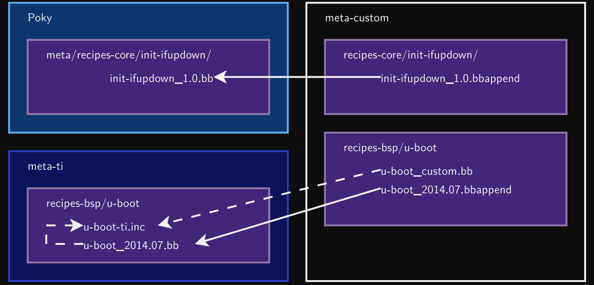

## Extending a Recipe

- It is a good pratice not to modify recipes available in <code>Poky</code>.
- But it is sometimes useful to modify an existing recipe, to apply a custom patch for example.
- The <code>Bitbake</code> *build engine* allows to modify a recipe by extending it.
- Multiple extensions can be applied to a recipe.
- Metadata can be changed, added or appended.
- Tasks can be added or appended.
- Operators are used extensively, to add, append, prepend or assign values.



- The recipe extensions end in <code>.bbappend</code>
- Append files must have the same root name as the recipe they extend.
- - example_0.1.bbappend applies to example_01.bb
- - PN = example ;; PV = 0.1
- It can be used the '%' character as a wildchar to match any number of characters.
- - u-boot_%.bbappend
- Append files are **version specific**. If the recipe is updated to a newer version, the append files must also be updated.
- If adding new files, the path to their directory must be prepended to the
**FILESEXTRAPATHS** variable.
- - Files are looked up in paths referenced in **FILESEXTRAPATHS**, from left to right.
- - Prepending a path makes sure it has priority over the recipe’s one. This allows to override recipes’ files.

## Append file example

FILESEXTRAPATHS_prepend means you have a path please preprend the given path at yours

```
FILESEXTRAPATHS_prepend := "${THISDIR}/files:"
SRC_URI += "file://custom-modification-0.patch \
            file://custom-modification-1.patch \
            "
```

- **Bitbake** allows to use *virtual names* instead of the actual package name. 
- The *virtual name* is specified through the **PROVIDES** variable.
- Several recipes can provide the same virtual name. Only one will be built and installed into the generated image.
```
PROVIDES = "virtual/kernel"
```

## Classes

- Classes provide an abstraction to common code, which can be re-used in **multiple recipes.**
- Common tasks do not have to be re-developed!
- Any metadata and task which can be put in a recipe can be used in a class.
- Classes extension is **.bbclass**
- Classes are located in the **classes** folder of a layer.
- Recipes can use this common code by inheriting a class:
```
inherit <class>
```
- Common classes can be found in **meta/classes**:
- - base.bbclass
- - kernel.bbclass
- - autotools.bbclass
- - autotools-brokensep.bbclass
- - cmake.bbclass
- - native.bbclass
- - systemd.bbclass
- - update-rc.d.bbclass
- - useradd.bbclass

## Base Class
- Every recipe inherits the base class automatically.
- Contains a set of basic common tasks to fetch, unpack or compile applications.
- Inherits other common classes, providing:
- - Mirrors definitions: **DEBIAN_MIRROR, GNU_MIRROR, KERNELORG_MIRROR**
- - The ability to filter patches by **SRC_URI**
- - Some tasks: **clean, listtasks or fetch**
- Defines **oe_runmake**, using **EXTRA_OEMAKE** to use custom arguments.

Note: Bbclass can be writting by using both Python and bash scripts.

## Kernel Class

- Used to build Linux kernel.
- Defines tasks to configure, compile and install a kernel and its modules.
- The kernel is divided into several packages: **kernel, kernel-base, kernel-dev, kernel-modules**.
- Automatically provides the virtual package **virtual/kernel**.
- Configuration variables are available:
- - **KERNEL_IMAGETYPE**, defaults to zImage
- - **KERNEL_EXTRA_ARGS**
- - **INITRAMFS_IMAGE**

## Autotools Class
- Defines tasks and metadata to handle applications using the autotools build system(autoconf, automake, libtool)
- - <code>do_configure</code>: generates the configure script using <code>autoreconf</code> and loads it with standart arguments or cross-compilation
- - <code>do_compile</code>: runs make
- - <code>do_install</code>: runs install
- Extra configuration parameters can be passed with <code>EXTRA_OECONF</code>.
-Compilation flags can be added thanks to the <code>EXTRA_OEMAKE</code>.

```
DESCRIPTIN = "Description..."
HOMEPAGE = "www.homepage.com.tr"
PRIORITY = "optinal"
SECTION = "section"
LICENSE = "GPLv3"

SRC_URI = "${GNU_MIRROR}/hello/hello-${PV}.tar.gz"
SRC_URI[md5sum] = "md5sum of file"
SRC_URI[sha256sum] = "sha256sum of file"
LIC_FILES_CHKSUM = "file://x;md5=..."

inherit autotools
```

## Useradd Class

- This class helps to add users to the resulting image.
- Adding custom users is required by many services to avoid running them as root.
- <code>USERADD_PACKAGES</code> must be defined when the <code>useradd</code> class is inherited. Defines the list of packages which needs the user.
- Users and groups will be created before the packages using it perform their <code>do_install</code>
- At least one of the following variables must be set.
- -  <code>USERADD_PARAM</code>: parameters to pass to <code>useradd</code>
- -  <code>GROUPADD_PARAM</code>: parameters to pass to <code>groupadd</code>

```
DESCRIPTION = "useradd class usage example"
PRIORITY = "optional"
SECTION = "examples"
LICENSE = "MIT"

SRC_URI = "file://file0"
LIC_FILES_CHKSUM = "file://${COREBASE}/meta/files/common-licenses/MIT;md5=0835ade698e0bc..."

inherit useradd

USERADD_PACKAGES = "${PN}"
USERADD_PARAM = "-u 1000 -d /home/user0 -s /bin/bash user0"

do_install() {
    install -m 644 file0 ${D}/home/user0/
    chown user0:user0 ${D}/home/user0/file0
}
```
